---
toc:
    depth_from: 1
    depth_to: 3
html:
    offline: false
    embed_local_images: false #嵌入base64圖片
print_background: true
export_on_save:
    html: true
---

# 皮膚疾病

## 外胚層發育不良
Ectodermal Dysplasia
: 兩個以上外胚層來源的構造無

- \style[color:Deepskyblue]{X隱性}
- EDA mutation 
  - NF&kappa;B family 
- 特徵
  - 缺牙、少髮、口乾、無汗
  - 完全缺牙 (anodontia) 少見
  - 眼睛周圍細小、有色素沉澱的皺紋
  - midface hypoplasia
  - 指甲可能出現營養不良和易碎

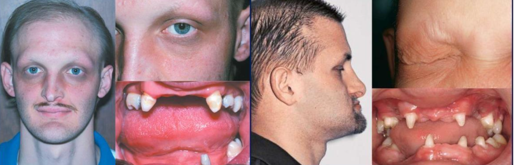

## 角化異常
Disorder of Keratinization

:::info {角質}
5、14: 複層口腔上皮都有

1、6、10、16: 角化

4、13、19: 非角化
:::

|名稱|| 成因 |GLA|特徵 |||
|-|-|-|-|-|-|-|
| White Sponge Nevus^良^   (Cannon disease)|| 體顯性 |兩側的頰黏膜，出生時、孩童早期 |\oneline{
- 口腔黏膜的正常角質化缺陷
- 對稱
- keratin 4 和 keratin 13 表現在上皮的棘狀上皮細胞層
}|
|^|^|^|^|\oneline{
- hyperparakeratosis, acanthosis
- spinous layer 清澈的細胞質
- 表層細胞核周圍嗜酸

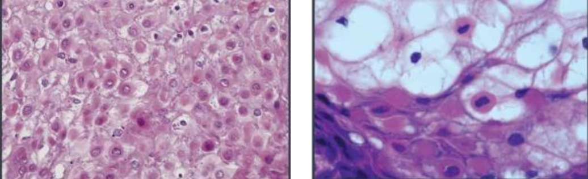
}
| Hereditary Benign Intraepithelial Dyskeratosis^良^  (HBID, Witkop’s disease)||體顯性  `GENE`: 4q35端粒, \style[color: gray;]{NLRP1, M77T}|口腔與結膜黏膜，孩童|\oneline{
- 類似Cannon disease
- 眼睛: 不透明凝膠狀斑塊
- 舌背: 通常沒有影響
- 
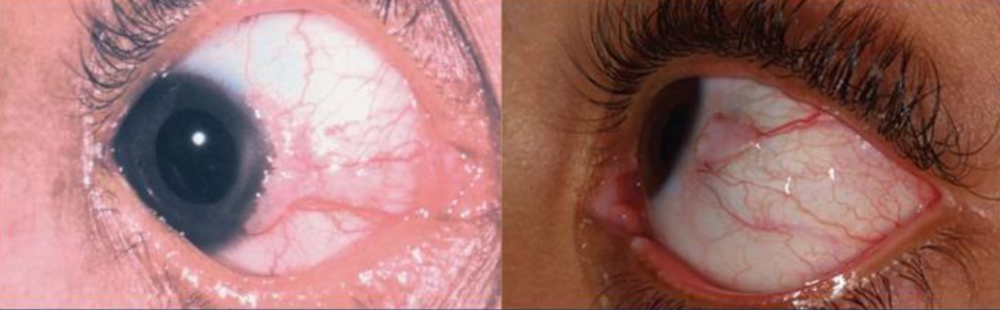
}|
|^|^|^|^|\oneline{
- hyperparakeratosis, acanthosis
- upper spinous layer 局部角化 
- ell-within-a- cell
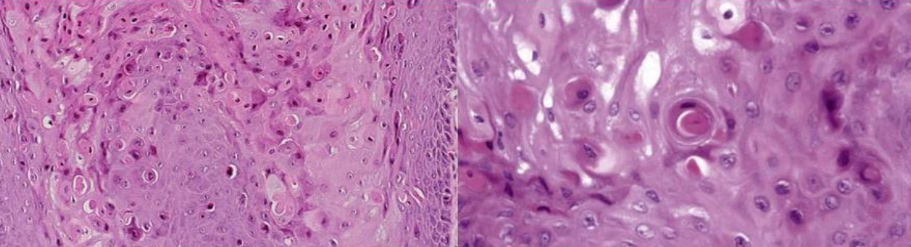
}|
|\style[color:Deepskyblue]{Dyskeratosis Congenita   先天性角化不良}|| \style[color:Deepskyblue]{X隱性}   `GENE`: DKC1 |10y &darr; | \oneline{
- 影響 telomerase
- 再生不良貧血(aplastic anemia)
- 易有惡性變化
- 皮膚網狀的色素過度沉澱
- 指甲會有明顯的萎縮，甚至消失
- 沒得醫
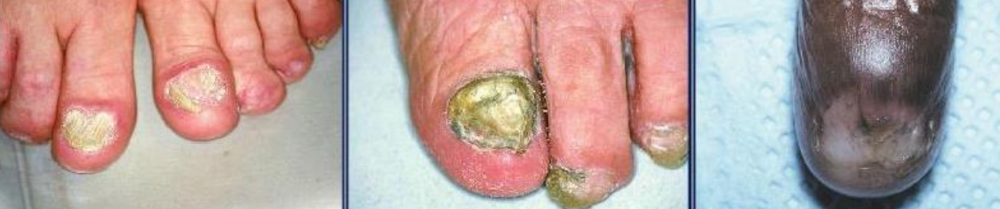
}
|^|^|^|^|\oneline{
- 水泡(bullae) &rarr; 白斑 &rarr; OPMD
}| 
| Hereditary Mucoepithelial Dysplasia^良^  || 體顯性 | -| \oneline{
- 少毛脫髮、畏光、視力明顯受損
- 軟硬顎交界明顯火紅班
- 表徵明顯，但通常沒有症狀(asymptomatic)}|
|^|^|^|^|\oneline{
- minimal keratinization
- 雜亂無章的成熟
- 無明顯的核、細胞多形性

\picBox{ 
 

}

}

### 過度角化

|名稱|| 成因 |GLA|特徵 ||||
|-|-|-|-|-|-|-|-|
|  Pachyonychia Congenita  先天性厚甲症|| 體顯性 | - |\oneline{
- keratin 6a, 6b, 16, 17
- 手掌跟腳掌厚繭、指甲底部累積角蛋白
- 多汗
- 走路會有明顯的疼痛

\picBox{
 
}
} |
|^|^|^|^|\oneline{
- 口內^良^ `GENE`: keratin 6a (KRT6a)
- 如果: Keratin 17 &rarr; neonatal teeth, oral white lesion(1/3)}
|^|^|^|^|\oneline{
- hyperkeratosis, acanthosis
- 斑狀顆粒增生(patchy hypergranulosis)
- 毛囊病變，堵塞
- white spongy nevus 比較: 表皮細胞核旁清澈的

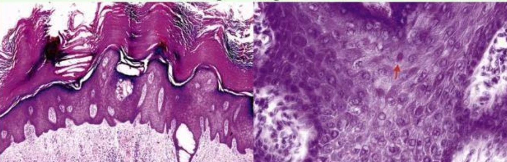
}|
| Papillon-Lefèvre Syndrome || `GENE`: cathepsin C gene |手掌與腳底 | \oneline{
- Cathepsin C: 溶酶體內蛋白酶
- 手掌與腳底的角質化
- 皮膚病灶的治療:維 A 酸類(systemic retinoids)
}|
|^|^|^|^|\oneline{
- PMN 功能不足 &rarr; 嚴重牙周病
- 快速的骨流失 &rarr; floating in air 
- 瀰漫出血與增生性牙齦炎

}|
## 色素相關

|名稱|| 成因 |GLA|特徵 ||||
|-|-|-|-|-|-|-|-|
| Xeroderma Pigmentosum^罕^   著色性乾皮病 || 體隱性，UV損傷修復不能 | 下唇和舌尖(SCC 多)，  很早   (口腔: 20y&darr; ; 非黑色素皮膚癌: 10y&darr;)  | \oneline{
- 容易轉成 SCC, BCC
- 沒得醫
}|
|Peutz-Jeghers syndrome || 體顯性，  抑癌 `GENE`: STK11(LKB1) |兒童早期 | \oneline{
- 雀斑樣(freckle-like): 陽光無關，發生於手部、開口周圍
- 朱紅區、口腔黏膜、舌頭出現 &phi; 1~4mm 的棕色至藍灰色斑點
- 腸息肉(intestinal polyps，良) &rarr; 腸梗塞 &rarr; 大比例發展成胃腸道腺癌
- 60y女性，乳癌的機率高達 50%

- 黑色素細胞無明顯增加，但樹突延長

\picBox{
  

}

}|
| Incontinentia Pigmenti   (色素失調病，Bloch-Sulzberger syndrome )|| \style[color:red]{X顯性}   `GENE`: NEMO (NF&kappa;B Essential Modulator) | 剛出生| \oneline{
- 先天免疫 gg
- CNS (30%)
- 眼睛 (35%): 斜視(strabismus)、眼球震顫(nystagmus)、白內障(cataracts)、視網膜血管異常、視神經萎縮
- 皮膚: 水皰期 &rarr; 疣狀期 &rarr; 色素過度沉積階段 &rarr; 萎縮和脫色階段
- 口腔: 同 EDA mutation 
}|
|^|^|^|^|\oneline{
#### 水皰期
上皮內裂解，內部充滿嗜酸性球

#### 疣狀期
過度角化, acanthosis, papillomatosis

#### 色素過度沉積階段
皮下結締組織 melanin-containing macrophage，即黑色素失調(melanin incontinence)
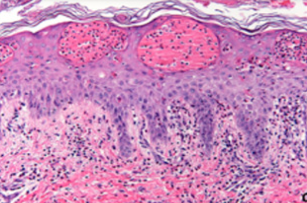
}|

## Hair Follicle & Sebaceous glands

|名稱|| 成因 |GLA|特徵 ||||
|-|-|-|-|-|-|-|-|
| Cowden Syndrome   (多發性缺陷瘤症候群，Multiple hamartoma syndrome) || `GENE`: PTEN (腫瘤抑制，20% 測不到) |\oneline{
- 良性錯構瘤，惡性機率 &uarr;
- 皮膚
  - 小丘疹(<1mm): ==耳口鼻毛囊錯構瘤==
  - ==肢端角化症(acral keratosis)==、掌趾角化病(palmoplantar keratosis)
- Thyroid gland: 甲狀腺腫(goiter)、thyroid adenoma
- 乳房纖維囊, 乳腺癌risk &uarr;
- 消化道錯構息肉
- ==多發性口腔丘疹==: 牙齦、舌背和頰黏膜上皮纖維增生

\picBox{

}

}|
|\style[color: Deepskyblue;]{ Muir-Torre Syndrome }|| DNA mismatch repair 異常， `GENE`: MSH2(90%), MLH1 | 50-60y, AIDS |\oneline{
- 多發性皮膚腫瘤 + 胃腸道惡性腫瘤
- ==皮脂腺瘤(Sebaceous adenoma)==

}|
|^|^|^|^|\oneline{
- 皮脂腺囊腫病變(cystic sebaceous lesions): 缺乏表皮連結
- 角化棘皮瘤樣結構的皮脂腺腫瘤(sebaceous tumors with keratoacanthoma-like architecture)
\picBox{

}
}

## 上皮裂解

Acantholytic Disorder

|名稱|| 成因 |GLA|特徵 ||||
|-|-|-|-|-|-|-|-|
| Keratosis follicularis (Darier Disease) || 體顯性， ATP2A2 mutation &rarr; 細胞內鈣離子幫浦(SERCA2) 異常 &rarr; desmosome 異常 | 10-20y | \oneline{
- 皮膚明顯症狀，口腔輕微
- 多發性紅斑
- keratin 堆積 &rarr; 惡臭
- 指甲出現縱向線條、隆起、疼痛的裂口。
- 口腔: 角化黏膜，平頂丘疹(flat topped papules)

\picBox{

}

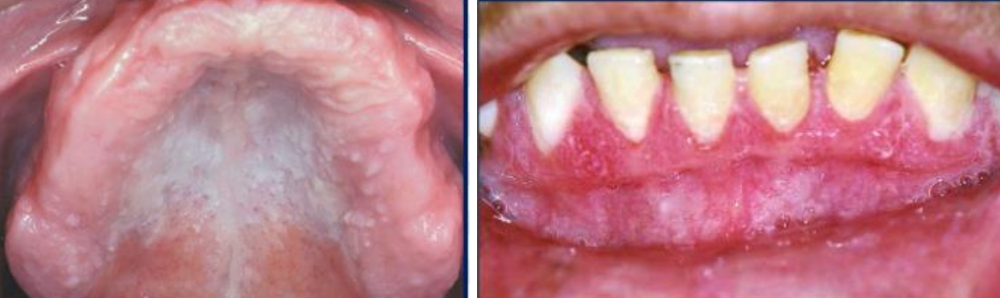
}
|^|^|^|^|\oneline{
- 上皮內裂 (acantholysis)
- Rete ridges 窄長，且呈試管狀。
- 角化不良細胞: corps ronds & grains(類似於穀粒)
- central keratin plug :  keratin 堆積

\picBox{

}
}
| Warty Dyskeratoma   (疣狀角化不良，   Isolated Darier disease) || - | \oneline{
- 皮膚: ==單發==，老人
- 口腔: 角化黏膜，40y&uarr;
}|\oneline{
- 保守性切除，預後良好，沒有明顯的惡性潛能
- 組織病理類似 Darier disease，除了無 corps ronds, grains 型態
}|
| \style[color: red;]{ Pemphigus   天疱瘡} | 自體免疫疾病
|^|vulgaris (PV，常見)|Ab 打 Desmosomes|50y|\oneline{
- 不結疤，眼球不沾黏
- 口腔病變 first come, last go
- Desmoglein 3: 口內
- Desmoglein 1: 皮膚表層
- 大水泡，薄水泡，破水泡
- Nikolsky sign
}
|^|^|^|^| \oneline{
- row of tombstones: 只剩 Basal cell 像 Cleft 突出去
- acantholysis &rarr; Tzanck cell (飄落在Celft 中)
- 上皮細胞之間沉積抗體(IgG, IgM)和補體(C3)
  - 濃度與臨床症狀嚴重度相關

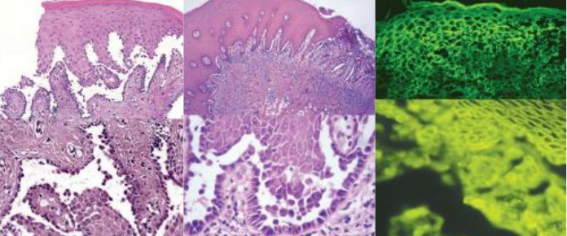
}|
|Paraneoplastic Pemphigus^罕^ (PP)   腫瘤誘導性天疱瘡|| \oneline{
- Lymphoma, Chronic lymphocytic leukemia, ==Castleman disease== 患者
- 異常 IL6 &rarr; T~FH~ &rarr; IL-21 &rarr; Plasma cell
- Ab 打 ==Plakin family== Desmoglein 1, 3

}|| \oneline{
- 天疱瘡症狀
- 突發、多發水泡
- 高致死
- 會出現在手掌腳掌
- 嘴唇出血性結痂 
- 紅斑(erythema), 瀰漫性不規則潰瘍(diffuse, irregular ulceration)
- 阻塞性細支氣管炎(bronchiolitis o bliterans)

\picBox{

}

}|
|^|^|^|^| \oneline{
- Dermis 慢性發炎浸潤
- ==上皮內、下都裂==
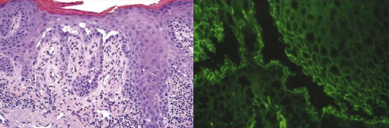
}|

Nikolsky sign
: 水泡邊緣摸一摸,給一個側方力量,水泡會越來越大

## 皮下裂解 
Subepidermal Blistering Disease

### 泡泡龍寶寶

|名稱|| 成因 |GLA|特徵 ||||
|-|-|-|-|-|-|-|-|
|Epidermolysis Bullosa   (大泡性表皮鬆解，泡泡龍寶寶) | 細胞附著蛋白異常 &rarr; 異質性遺傳性皮黏膜水皰病變
|^ | Simplex | keratin 5, 14 | 上皮內裂，輕微 |
|^| Junctional |\oneline{
- laminin-332
- BP180
- α6β4 } |\oneline{
- hemidesmosome 異常，上皮下裂
- 無 laminin-332: 牙齒與上皮交界異常
- IEE 刺激 Dental papilla 出問題 &rarr; odontoblast, ameloblast 分化 &darr;

}| 
|^| Dystrophic type |  collagen 7| \oneline{
#### Dominant (體顯性)
- 輕微，通常不危及生命,但是會造成毀容

#### Generalized Recessive (全身隱性)
- 病發 10~20 年後，皮膚反覆癒合 &rarr; 手套畸形(mittenlike deformity)
- 小口症(microstomia)、舌沾黏(ankyloglossia)
- cutaneous SCC risk &uarr;

}
|^| Kindler syndrome | hemidesmosomal attachment protein,   kindlin-1 | 基底細胞層下方與透明層的界面處裂解 |
| Epidermolysis bullosa acquisita (EBA)|| \oneline{
- 後天，自體免疫
- collagen 7
} |手背|\oneline{
- 類似 Dystrophic type，結疤
- 粟粒疹(Milia)
- 口腔病灶 (50%)

\picBox{

}
}|
|^|^|^|^|\oneline{
- 是溫和、無細胞上皮下囊泡
  - ==無明顯發炎細胞浸潤==
- 切片泡飽和鹽水 &rarr; 上皮裂 &rarr; 人工水泡
- IgG 在 CT 頂

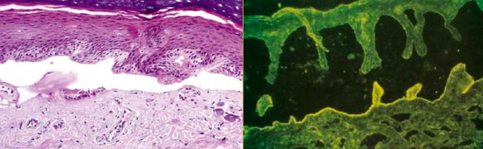
}| 
| Angina Bullosa Hemorrhagica ||創傷、類固醇相關| 軟顎，中年 |\oneline{
- 不會產生疤痕
- 滿血液的表皮下水泡

}

### 類天皰瘡

|名稱|| 成因 |GLA|特徵 ||||
|-|-|-|-|-|-|-|-|
| \style[color: red;]{ Mucous Membrane Pemphigoid   (黏膜類天皰瘡，  Cicatricial pemphigoid，瘢痕性類天皰瘡)}|| \oneline{
- 後天
- 自體免疫: &alpha;6, laminin-332 

} | 50-60y，口腔, 各式黏膜 | \oneline{

- 慢性，很少自限性 (會越來越嚴重)
- 口內堅固 vesicles/ bullae，&alpha;6 型只有口內病灶
- 皮膚結疤，但口內不會 &rarr; 無小口症 
- 脫屑性牙齦炎(desquamative gingivitis)
- 眼球沾黏
- 陰道黏膜損傷 &rarr; 性交疼痛(dyspareunia)

\picBox{
  
  
}
}
|^|^|^|^| \oneline{
- 上皮和CT完全分開，之間有 Neutrophil
- IgG, C3 (主)； IgA, IgM 
  - 抽血 Ag 測不太到

} |
| \style[color: red;]{ Bullous Pemphigoid (BP)   大皰性類天疱瘡 } || \oneline{
- 後天 
- 自體免疫: BP180, BP230 (basement membrane)

} | 75-80y | \oneline{
- 最常見自體免疫性水皰病，緩解期後復發 (時好時壞)
- 皮膚無疤
- 瘙癢(pruritus) &rarr; 多發性硬痂大皰 (tense bullae)
}
|^|^|^|^| \oneline{
- 上皮和CT完全分開，之間有 eosinophil
- 口內少見 (10-20%)
- 抽血 Ag (+)，但抗體濃度與疾病活動不相關

}| 
| Linear IgA Bullous Disease (LAD)   線狀 IgA 大皰性皮膚病 || \oneline{
- 後天 
- 自體免疫 
- 後天
- BP180 (細胞外結構 LAD1)

}|青少年, 老人| \oneline{

- 皮膚: string of beads sign (新病灶圍著舊的)
- 口腔: 糜爛、水皰和慢性潰瘍
- 一點結疤
- basement membrane IgA 線性沉積
- Lamina propia 有 Neutrophil 浸潤

\picBox{
    
  
  

}
}| 
|  Dermatitis Herpetiformis (DH)   疱疹性皮膚炎|| \oneline{
- 後天 
- IgA 結合 trans-glu-ase
- `GENE`:  HLA-DQ2 (90%),   HLA-DQ8 (other)

}| 青壯年和中年人 |\oneline{
- 麩質敏感性腸病、乳糜瀉皮膚表現
- 時好時壞，如 BP 
- 皮膚: 極度瘙癢，對稱
- 口腔病變不常見

} 
|^|^|^|^|\oneline{
- Dermis papilla 有 Neutrophil &rarr; 輪廓的消失, nuclear dust
- Dermis papilla顆粒狀 IgA, C3 沉積物
- CT 發炎細胞浸潤

\picBox{

}

}

:::info { hemidesmosome}

> epiligrin = laminin-5 = laminin-332
> type XVII collagen = BP180 
> type VII collagen = BP290

\picBox{

}
:::

## 苔蘚樣皮膚炎
> Lichenoid and Interface Dermatitis

- Basal cell 退化 

|名稱|| 成因 |GLA|特徵 ||||
|-|-|-|-|-|-|-|-|
| \style[color: red;]{ Lichen Planus (LP)   扁平苔癬} ||壓力、甲狀腺低落？|中年，口腔黏膜單發|\oneline{
- 慢性，相對常見
- 皮膚: 蕾絲狀白線網格(Wickham striae)丘疹

}|
|^||^|^|\oneline{
> 無症狀

#### 網狀型 (Reticular form )
- 最常見
- 可能 post-inflammatory melanosis
  - IL-1 刺激 melanocytes 分泌 melanin
- 交錯白線圖案 (Wickham striae)

#### 丘疹型 (Papular type)
- 小且密的過度角化丘疹
  
#### 斑塊型 (Plaque type)
- 舌背有白斑
- buccal mucosa 有 Wickham striae

\picBox{
 
}

> 有症狀

#### Erosive 
- lesion 疼痛灼熱
- 萎縮性紅斑
- 萎縮和潰爛局限於牙齦 &rarr; 脫屑性牙齦炎(desquamative gingivitis)

#### Bullous form
- 上皮分離 &rarr; 大皰性扁平苔蘚(bullous lichen planus)

#### Ulcerative form 
- 深層侵犯 
- 淺灰色/黃色纖維蛋白偽膜覆蓋在黏膜(潰瘍)

}|
|^|^|^|^|\oneline{
- 正角化和角化不全
- 只能 lymphocytes 浸潤 (狹義)
- 上皮和結締組織交界
  - bandlike T cell
  - Civatte body: 均質，退化的 keratinocyte 
- basal cell hydropic degeneration
  - saw-toothed Rete ridge

\picBox{

 }
}|
| Lichenoid Contact Reaction || amalgam (半抗原) || LP，但只出現在有 amalgam 的位置、移除 amalgam 即消失。 |
| Lichenoid Drug Reaction || 藥物 || \oneline{
非直接性 IgG 螢光染色 &rarr; string of pearls (沿著複層鱗狀上皮的 basal cell layer 細胞膜)

}|
| \style[color: red;]{ Chronic Ulcerative Stomatitis (CUS)   慢性潰瘍性口炎 }|| 自體免疫: p63 的異構體| 60y | \oneline{
- LP區分
  - ==類固醇無效==， 奎寧治療
  - 條狀角化不明顯 
  - 皮膚病變少
- 脫屑性牙齦炎
- 時好時壞，口腔黏膜遊走且不留疤 
- 慢性 &rarr; ==plasma cells== + lymphocytes
- IgG 在 S.S.epi. 的 basal and parabasal regions 細胞核中
- ANAs(+)

\picBox{

}
}|
|Graft-Versus-Host Disease (GVHD) || 骨髓移植 | 舌頭、唇頰側黏膜 |\oneline{
- 急性或慢性都常出現口內病變 
- 條狀角化，類似 LP 
- 口腔黏膜灼熱感, 萎縮
- SCC risk 
}|
|^|^|^|^|\oneline{
- Hyperorthokeratosis
- short and pointed rete ridge
- basal cell layer 水腫退化
- 嚴重病例 Collagen 沈積 &rarr; 擠壓 acinar &rarr; 口乾

} |
|  Erythema Multiforme (EM) 多形性紅斑 || HSV, 肺炎黴漿菌 (Mycoplasma pneumoniae) 相關 |20-30y, 黏膜(口腔) | \oneline{
- 急性、發作快
- 自限性(self-limiting): 2-6 周
- 20%春秋復發 &rarr; HSV
- 同心圓斑環 (target or bull’s-eye，==四肢開始==)
- 結膜可能影響
- 唇朱紅區出血性結痂 (類似 PP)
- 口腔紅斑 &rarr; 大而淺、邊界不規則的潰瘍

\picBox{

}
}
|^||^|^|\oneline{
- 上皮上下都裂
- ==不太會有角化== &rarr; 紅斑
- Basal cell hydropic degeneration 裂開 &rarr; 海綿狀囊泡
- 輕、中度表淺真皮 Lymphocyte 浸潤
- Satellite cell 壞死

\picBox{

}
}
| EM minor|| ^| 只有皮膚，雙側對稱 | \oneline{
- 四肢末端上有輕微的隆起、圓形的暗紅色斑塊
}|
| \style[color: red;]{ Stevens-Johnson Syndrome }|| \oneline{
- 藥物暴露
- carbamazepine: HLA-B*1502
- allopurinol: HLA-B*5801
} | 年輕 | \oneline{
- 病變面積<10%
- flu like 
- 扁平紅斑 (==軀幹開始==) &rarr; 
- 皮膚瀰漫性脫落(diffuse sloughing), 鬆弛性大皰 (flaccid bullae)
- Nikolsky sign(+)
- 所有黏膜病變

\picBox{

}
}|
|^||^|^|\oneline{
- 上皮下裂 
- basal keratinocytes 退化、壞死
- 慢性發炎細胞稀疏 

}
| \style[color: red;]{ Toxic Epidermal Necrolysis} ||^| 60y &uarr; | \oneline{
- Stevens-Johnson Syndrome，病變面積>30%
}| 

### Lupus Erythematosus (LE) 紅斑性狼瘡

- B lymphocyte &uarr;，T lymphocyte 功能不正常
  -  typeIII 過敏 ， 抗體打抗體

- 女性多

- 血檢 
  - ANAs+ 
  - Sm antibody+ (30%，高特異)
  - dsDNA antibody+

|名稱||GLA|特徵 |||
|-|-|-|-|-|-|
|  \style[color: red;]{ 系統性紅斑狼瘡 (SLE) }|| 31y |\oneline{
- 蝴蝶斑 
- 太陽照射更嚴重
- 腎衰竭 (40-50%)
- pericarditis
- 狼瘡性唇炎 lupus cheilitis
- 口腔(5-25%): 硬顎、頰黏膜和 牙齦

\picBox{

}
}|
| \style[color: red;]{ Chronic cutaneous (CCLE) }|| 侷限在皮膚、黏膜表面|\oneline{
- 口腔、皮膚病變同時發生。
- 皮膚: 圓盤狀紅斑，光敏性，==有疤痕==
- 口腔: 中心萎縮、潰瘍 &rarr; 白色放射紋路

}|
| \style[color: red;]{ Subacute cutaneous (SCLE)} ||-|\oneline{
- SLE, CCLE 之間
- 光敏性皮膚病灶，==無疤痕==
- 口腔類似 CCLE

}|

#### 組織 

- 慢性發炎浸潤
- Basal layer 退化 
- Basal membrane IgM、IgG 或 C3 沈積

- 皮膚
  - 上皮
    - 萎縮且扁平，偶有 acanthosis
  - Basal membrane 增厚 
    - PAS 染色證明

\picBox{
 
}

- 口腔
  - 過度角化 &rarr; 白線 
  - Basal membrane 斑塊 (PAS +)
  - 上皮下、深層血管周圍淋巴細胞浸潤

\picBox{
 
}

## 牛皮癬皮膚炎
> Psoriasiform Dermatitis

|名稱|| 成因 |GLA|特徵 ||||
|-|-|-|-|-|-|-|-|
| Psoriasis   牛皮癬|| \oneline{
- `GENE`: PSORS1 (HLA-Cw6 的等位基因)
- Type IV 過敏: T~H17~打 keratinocyte 
}| 20-30y，頭皮、手肘和膝蓋| \oneline{
- 夏季改善，冬季惡化
- 紅底，銀灰皮削，無症狀(少數乾癢)
- 關節炎(10%)，影響 TMJ 
- 牙周病略為關
\picBox{

}
}|
|^|^|^|^|\oneline{

- hyperkeratosis, Rete ridge 延長
- 角蛋白(parakeratin)異常 &rarr; 角蛋白層 neutrophil 聚集
\picBox{
  
}

}
| Erythema Migrans^良^   游移性紅斑，地圖舌 || 都沒啥相關 |\oneline{
多到少:
1. 舌背前 2/3 
2. buccal, labial mucosa
3. 軟顎或口底
}|\oneline{

- 紅色: 絲狀乳頭去角化
- psoriasis 組織特徵 
- 血檢
  - == HLA-Cw6 ==
- \style[color: gray;]{ 部分學者認為牛皮蘚、乾蘚最常見的症狀就是地圖舌}

\picBox{

}
} |
| \style[color: Deepskyblue;]{ Reactive Arthritis (RA)   反應性關節炎 }|| 可能有免疫介導| -| \oneline{
- 細菌性痢疾 (沙眼衣原體 Chlamydia trachomatis )的繼發疾病
- 皮膚黏膜表現: 非淋病性尿道炎 + 結膜炎 + 關節炎
  - 環狀龜頭炎
- HLA-B27+ 
- psoriasis 組織特徵

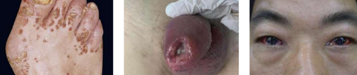
}|

## Collagen and Elastic Tissue

|名稱|| 成因 |GLA|特徵 ||||
|-|-|-|-|-|-|-|-|
|Ehlers-Danlos Syndrome || 體顯性 (80%)   Type V collagen   `GENE`: COL5A1, COL5A2 |-| \oneline{
#### Classical type
- 表皮彈性過高(Hyperelasticity of the skin)
- papyraceous scarring(薄如紙的瘢痕組織) 
- 牙齒: 畸形、大Pulp stone, 牙根牙釉質發育不全
}|
|^|^|^|^|\oneline{
#### Hypermobility type 
- 關節度變大
- Scar 不明顯 
}|
|^|^|^|^|\oneline{
#### Vascular/ ecchymotic type
- Collagen III 異常 
- 瘀血, 動脈瘤 
}|
|^|^|^|^|\oneline{
#### type VIII^罕^

- 較早的牙周病,基因為 C1R and C1S
}|
 Marfan’s syndrome || `GENE`: FBN1 (fibrillin-1，肌原纖維，影響 Collagen) | - |\oneline{
- 長四肢、大手掌、長手指
- Gorlin sign: 舌頭碰鼻尖
- 鷄胸症(pectus carinatum): 胸骨突出
- 漏斗胸(pectus excavatum): 胸骨後突
- 背部綫條筆直
- 二尖瓣脫垂(mitral valve prolapse)
- 動脈瘤(aneurysm)
- 必須給予術前抗生素
  
 }|
|  Tuberous Sclerosis   (結節型硬化症， Epilolianuria) || 體顯性，   `GENE`: TSC1, TSC2 | -| \oneline{
- 緻密的纖維結締組織增生
  - 下顎 radiolucent lesion 
  - 血管纖維瘤(angiofibroma): 鼻翼, 指甲旁 

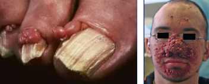

- 結締組織錯構瘤
  - Shagreen patches
  - Ash-leaf spots: Ash-leaf spots
  - CNS: radiopaque lesion, potato like 增生
\picBox{

}
- 血管平滑肌脂肪瘤^良^ (angiomyolipoma): 腎臟，雙側
- CNS: 癲癇(70%), 智能障礙(30%)
- 心臟橫紋肌瘤^良^ (cardiac rhabdomyoma)
}
|^|^|^|^|\oneline{
- enamel pitting: 恆齒前牙
- 多發性的纖維丘疹(Multiple fibrous papules)

\picBox{
  
  
}
}
|Proteus syndrome || `GENE`:  AKT1 (PKB related) | - |\oneline{
- sporadic(散發性,非遺傳性)
- 骨骼異常增大
  - 巨頭、巨指、長骨過度生長
  - 脊柱側彎(scoliosis)
  - 顱外骨疣(cranial exostoses): 外耳、鼻樑、alveolar ridge
- moccasin foot: 足部軟組織過度生長
- 龐狀表皮痣(verrucous epidermal nevi)
- 皮下病變
  - 脂肪瘤, 血管瘤, 淋巴管瘤
  - 皮下和深部軟組織錯搆瘤
- 血管異常
  - 多發性鮮紅斑痣(multiple port wine stains)
  - 靜脈曲張(varicose veins)

}

## 特發性結締組織疾病
Idiopathic Connective Tissue Disorders

|名稱|| 成因 |GLA|特徵 ||||
|-|-|-|-|-|-|-|-|
| \style[color: red;]{ Systemic Sclerosis    全身性硬化 } || M2 macrophage 相關 | 成年 | \oneline{
- Raynaud phenomenon(雷諾現象): 情緒困擾、寒冷暴露 &rarr; 血管收縮
- Claw-like finger(爪狀指): 末端指骨吸收、屈曲攣縮 &rarr; 手指變短
- 指尖潰瘍
- 皮膚: 瀰漫堅硬、光滑
- 鼻翼萎縮，老鼠臉

\picBox{

}
}
|^|^|^|^|\oneline{
- 小口症 (Microstomia)
- 口乾症 (xerostomia), Sjogren syndrome 可能伴隨
- 所有 PDL 增寬
- 骨吸收
  

}
|^|^|^|^| \oneline{
- 檢測 anti-Scl 70 (topoisomerase I)
- vessel 阻塞，Dense collagen 堆積 

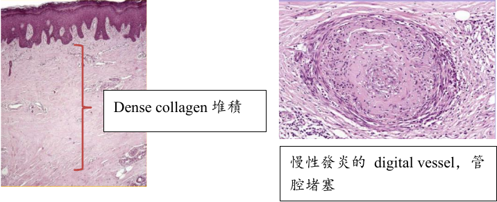
}
| \style[color: red;]{localized scleroderma} || 類似 Systemic Sclerosis， 但指影響一塊局部皮膚，無後遺症 |
| \style[color: red;]{ CREST Syndrome }|| 一種 Scleroderma 變形 | 50-60y |\oneline{
- Calcinosis cutis (皮膚鈣質沉著症)
  - 多發，可移動，不軟 
- Raynaud phenomenon(雷諾現象)
- Esophageal dysfunction(食道功能異常)
- Sclerodactyly (皮硬化)
- Telangiectasias (毛細血管擴張)
  - 臉部皮膚、朱紅區
  - 可能大量出血
}

## 退化性、代謝性疾病
Degenerative and Metabolic Diseases

|名稱|| 成因 |GLA|特徵 ||||
|-|-|-|-|-|-|-|-|
| Acanthosis Nigricans    黑色棘皮層增厚病 | 良性| \oneline{
- 胰島素阻抗有關
  - 可能遺傳性、內分泌、藥物相關 

} |
|^| 惡性 | \oneline{
- 差異: ==皮膚彎曲區域出現細小乳頭==
- 口內特徵 (主要在惡性)
  - 瀰漫性的黏膜改變，呈現細乳頭狀
- 內臟惡性腫瘤

\picBox{

}
}
|^| \oneline{
- Oral: Acanthosis 多 ， Melanin 少
- Dermin: Acanthosis 少， Melanin 多 
} |
| Xanthelasma   黃斑瘤 | 血脂升高 | 中老年，眼周圍|\oneline{
- 軟，黃
- 動脈粥樣硬化(atherosclerosis) risk &uarr;
- 最常見的皮膚黃瘤
- superficial 至 mid-dermal 存在 xanthoma cell

\picBox{

}
}

## 血管疾病 
Vascular Diseases

|名稱|| 成因 |GLA|特徵 ||||
|-|-|-|-|-|-|-|-|
| \style[color: Deepskyblue;]{ Behçet Syndrome }|| \oneline{
- neutrophilic hyperactivity &rarr; 系統性血管炎
- ==HLA-B51==

}| 30-40y，眼部、口腔、生殖器和皮膚 | \oneline{
- 口腔: 口瘡性潰瘍(aphthous ulcerations)， 周圍有較大的瀰漫性紅斑區
- 皮膚: 
  - pathergy test + (皮下生理食鹽水注射試)
  - 結核菌素樣皮膚反應
- 眼部: 
  - 男性更常見
  - 發炎 &rarr; 白內障(cataracts)、青光眼(glaucoma)、視網膜的新生血管
  - 即使治療，25%仍會失明
- 關節炎，但不變形
- 生殖器
  - 男性: 90%涉及陰囊
  - 女性: 於外陰、陰道或子宮頸
  - 流疤，復發低

\picBox{

}

}|
|^|^|^|^|\oneline{
- 白細胞破碎性血管炎(leukocytoclastic vasculitis)，非獨有
- 嗜中性球的壁內浸潤(intramural invasion)、嗜中性球核破裂(karyorrhexis)、紅血球外滲和血管壁纖維蛋白樣壞死(fibrinoid necrosis)

\picBox{
  
  
}
}|
| MAGIC syndrome || Behçet syndrome 變形。多發性的口腔與生殖器潰瘍，間質性的軟骨炎  (Mouth and Genital Ulcers with Inflamed Cartilage Syndrome )
| Aphthous Ulcer    口瘡性潰瘍 || CD8+ T cell 破壞上皮 | 30y&darr;， 非角化上皮 | \oneline{
- 40% 患者有家族史 
- 中間黃，外紅暈
- Minor type
  - 最常見，80%
  - buccal and labial mucosae
  - &phi;: 3-10mm
  - 7-14d 癒合

  - 熱癢痛， 7-14 天消失
- Major type
  - 較深
  - &phi;: 1-3 cm
  - 2-6w 癒合
- Herpetiform
  - 多發，且頻繁復發的 Minor

\picBox{

}
}|
| \style[color: Deepskyblue;]{ Kawasaki Disease    川崎氏病 }||-|10y&darr;亞裔 |\oneline{
- 雙側眼球結膜炎
- 頸部淋巴結腫大
- 皮膚:
  - 手掌和腳底紅斑、水腫、指甲周圍脫屑
  - 多形性瀰漫性斑丘疹
- 口腔:
  - 草莓舌
  - 嘴唇乾裂
  - 咽部紅斑
- 有冠狀動脈擴張或動脈瘤 (15-25%，致命)
}

## 其他

- X隱性 
  - 外胚層發育不良
  - Dyskeratosis Congenita
- X顯性
  - Incontinentia Pigmenti (色素失調病，Bloch-Sulzberger syndrome )
    - NEMO
- 舌背白斑 
  - Lichen planus 
  - Pachyonychia Congenita
  - Dyskeratosis congenita 
- 脫屑性牙齦炎 
  - MMP, LP, PV
- 易有惡性變化
  - Dyskeratosis Congenita (OPMD)
  - Xeroderma Pigmentosum (SCC, BCC)
  - GVHD (SCC)
  - Generalized Recessive Dystrophic EB (SCC)
  - Plummer-Vinson syndrom (SCC)
  - Peutz-Jeghers syndrome (胃腸道腺癌, 乳癌)
  - Cowden Syndrome ( 乳腺癌risk)
  - **DNA repair 異常**
    - Muir-Torre Syndrome
    - Keratoacanthoma
    - Xeroderma Pigmentosum

### 指甲 

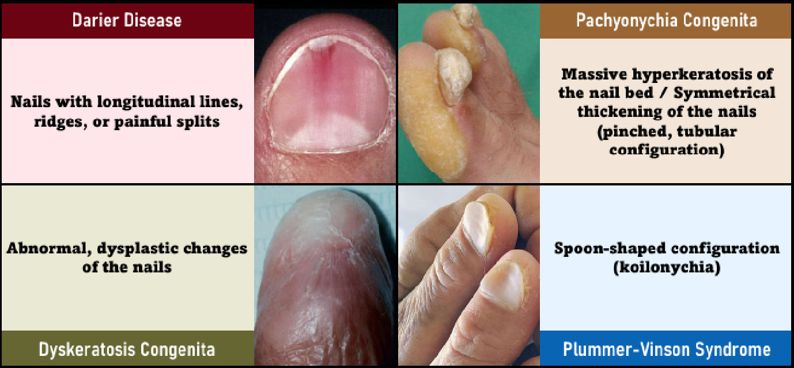

### 舌頭 

- Hairy Tongue 是絲狀乳頭過度角化，與抽菸相關。
- Fissure Tongue 是絲狀乳頭角化消失。
- Hairy Leukoplakia 較常在舌側，與其他三者不同。[EBV 感染]

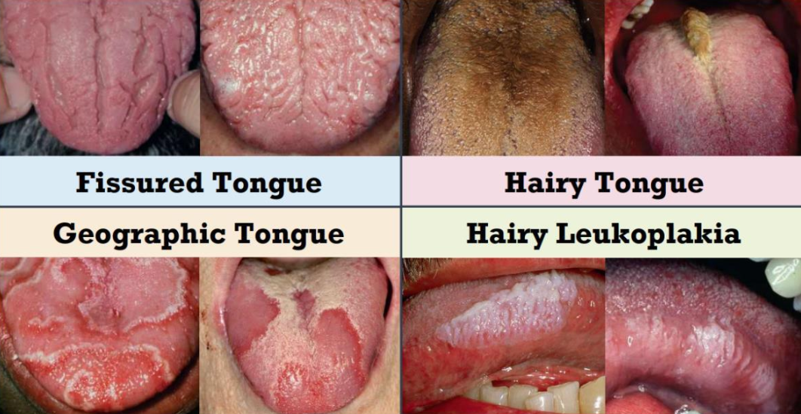

### 天疱瘡們 

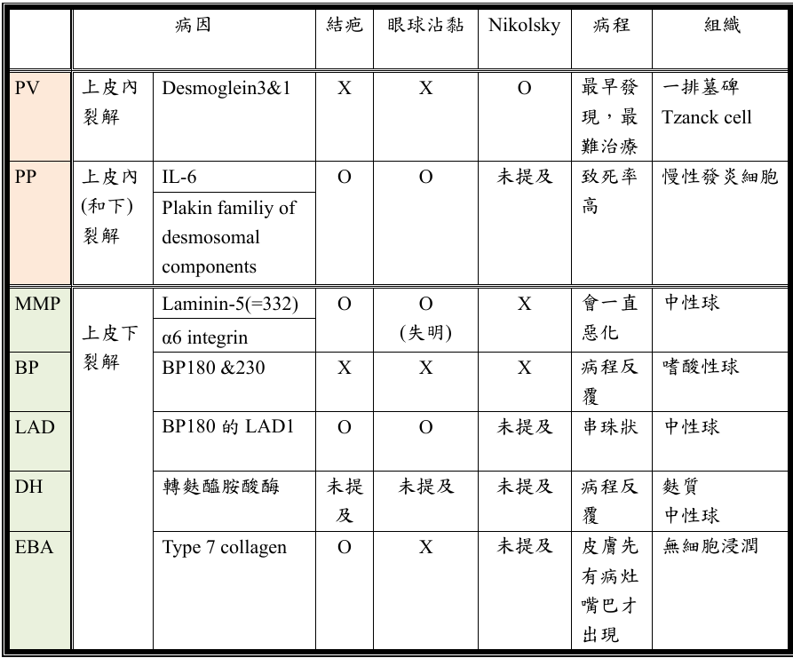

### 裂開　

- Acantholytic 
  - PV 
  - Darier Disease 

> 牙齒 Hemidesmosomes 無 17 &rarr; MMP 口內病灶常見 

|目標 | EB | Pemphigus
|-|-|-|
|***Hemidesmosomes***|
| Keratin 5,14| Simplex  |-|
|BP230|-| BP
||
|\style[color: gray;]{ Collagen 17 (BP180) }|Junctional| BP, LAD
|Laminin-332|^| MMP |
|&alpha;6&beta;5 integrin | ^ | MMP (&alpha;6)
||
|\style[color: gray;]{Collagen 7 (BP290)} | Dystrophic, EBA | -|
|***Desmosomes***|
| Desmoglein 1,3 | - | PV, PP
| Plakin family | - | PP |

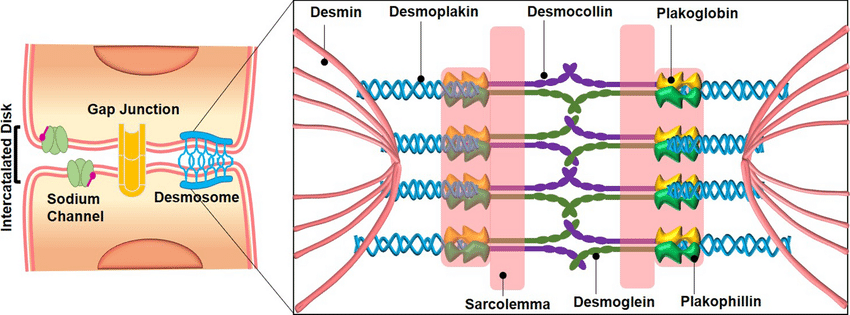

### 復發性口瘡 

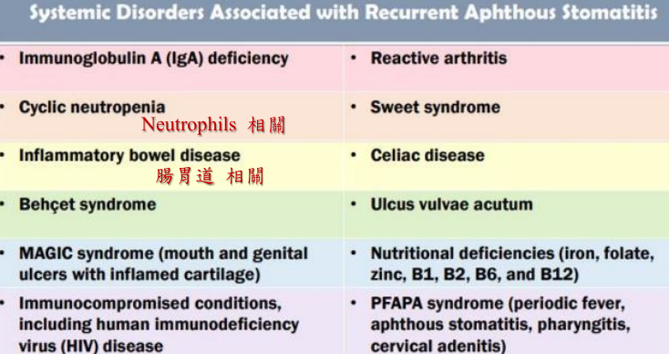
