---
toc:
    depth_from: 1
    depth_to: 3
html:
    offline: false
    embed_local_images: false #嵌入base64圖片
print_background: true
export_on_save:
    html: true
---
>f 

@import "口病_cyst.md"
@import "口病_odontogenicTumor.md"
@import "口病_唾液腺.md"
@import "口病_epithelialTumor.md"

# Anomalies 

- 症候群相關
  - PITX-2 
  - SHH 
  - PAX-9

Neonatal ring
: 胎兒期與出生後期牙齒發育中的交界

## 發育型

|變異名稱| 好發位置|| 好發族群| 成因 | 症狀 |其他
|-|-|-|-|-|-|-|-|
|Turner hypoplasia|Crown & Root|<ul><li>**Trauma** : 上顎正中門牙, Facial (Avulsion, intrusive luxation)</li><li> **Caries**: 小臼齒</li></ul>| <ul> <li>**Crown**: 1.5-3y</li><li>**Root**: 4-5y</li></ul>|發炎 (乳牙 Caries, trauma) 影響恆牙發育 |局部或整個牙冠白、黃或棕色發育不全 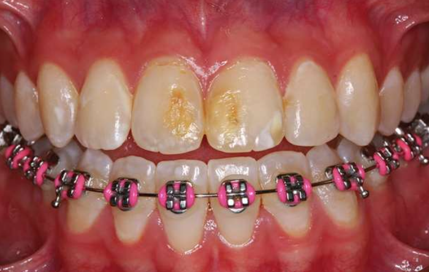|	
|^|^|^|^|^| 無明顯邊界|
|Molar-Incisor Hypomineralization (MIH)|Crown|單或多個恆牙下顎 1^st^Molar (可能影響 Incisor) |-| **乳牙**: 產前母體疾病、藥物、早產   **恆牙**: 幼兒期疾病(fever, asthma, pneumonia)| 局部白、黃或棕色發育不全，可能多孔凹陷 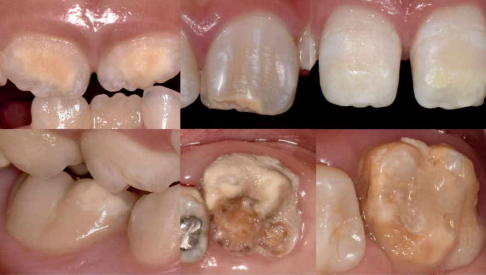 | CPPACP: 重新鈣化，降敏
|^|^|^|^|^| 有明顯邊界|^|
|^|^|^|^|^| 痛 (27.4%)|^|
| Molar Root-Incisor Malformation (MRIM, MIM) |Crown & Root|單個恆牙下顎 1^st^Molar (可能影響 Incisor) |3y (1^st^ Molar root)|非遺傳，可能和神經疾病( seizures, meningitis)相關|短窄尖牙根，牙冠相對正常|
|^|^|^|^|^| Chamber 變矮，異位礦化(ectopic mineralized ) 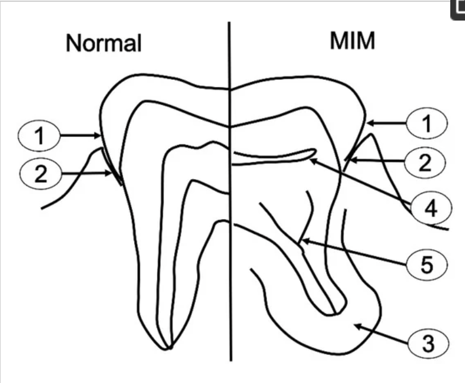
|^|^|^|^|^| 常見疼痛|
|^|^|^|^|^| 1^st^ Molar 拔除|
|Hypoplasia Caused by Antineoplastic Therapy| Root & Crown | -| 12y&darr; (Common)   5y&darr; (Extensive)| 放射線(4gy: 畸形，30gy: 發育停止)、化療 | 小牙症 (microdontia, 3y&darr; 暴露)
|^|^|^|^|^|發育不全 (hypodontia)
|^|^|^|^|^|V-shaped hypoplastic roots
|^|^|^|^|^|enamel hypoplasia
|^|^|^|^|^|下顎垂直發育減少
|Dental Fluorosis |Crown |兩側同時，對稱性|上顎 Incisor 在 3y 發育完成，需重點監測|氟結合 Amelogenin |琺瑯質白色區域(white, chalky areas)，無光澤，不透明
|^|^|^|^|^| 可能有黃色至深棕色區域(mottled enamel)
|Syphilitic Hypoplasia (Congenital syphilis)|Crown| ALL | - | 先天梅毒 | **Screwdriver-shaped incisors**: Incisor 切端收縮，中間 1/3 最寬 (必要)
|^|^|^|^|^| Incisor 切端中間發育不全切跡 (central hypoplastic notch)
|^|^|^|^|^| 桑椹臼齒(mulberry molars)

## 發育後

|變異名稱| 好發位置|| 好發族群| 成因 | 症狀 |其他
|-|-|-|-|-|-|-|-|
|Attrition| Crown| Occlusal, incisor edge|-|磨牙, Deep bite, Cross bite | 敏感。雖然會 Pulp exposure 但 reparative secondary dentin 填充 pulp chamber，較少疼痛| 
|Abrasion|^|非慣用手頰側齒頸 | - | 刷牙| 齒頸水平 notch
|^|^| 鄰接面 |^| 牙籤、牙線| 鄰接面半月形
|^|^| 犬齒、小臼齒 |^| 咬螺絲、菸斗| O, V 型缺口|
|Erosion| ^ | **唾液較少處:** 上顎前牙, 下顎後牙 Occlusal& Facial| **唾液腺功能衰退**: salivary gland aplasia, 脫水(dehydration) , 放射治療, Sjögren syndrome, DM, 神經性貪食症(bulimia nervosa) | 酸性侵蝕 | Dentin exposure，周圍 Enamel 白圈高起 (侵蝕抗性差異)
|^|^|^|^|^|上顎門牙齒頸湯齒狀凹陷|
|^|^|^|^|^|金屬補綴物邊緣暴露|
|^|^|^| **胃酸**: perimolysis|^|^|
|Abfraction |^| 後牙Facial, 單顆齒頸1/3 | - | 咬合力| V 形尖銳缺口，可能延伸到牙齦下。 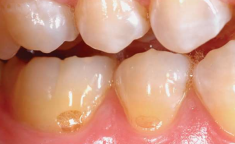
|^|^|^|^|^| Tertiary dentin 修復，較少疼痛
|Internal Resorption |Root|少見||**發炎吸收:** 肉芽組織取代 Dentin|無症狀，發炎則疼痛。   Pulp 紅色透出。   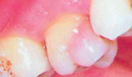  X-ray 下 balloon-like dilation of the canal。 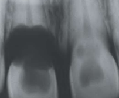|
|^ |^|^|^|**替代或化生吸收 (replacement or metaplastic resorption )**: Bone, cementum 取代 Dentin|^|
|External Resorption|^|常見|| 發炎| Root 變短，根尖不規則。妥善治療則一年內痊癒。 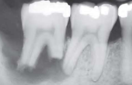
|^|^|^|| ^| PDL, 根尖周圍 lamina dura 消失或模糊
|^|^|^|| ^| 妥善治療則一年內痊癒
|^|^| 上顎門牙 (移動距離長)| 矯正| | 根尖圓形。 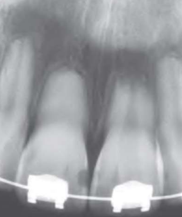
|^|^| -|| **其他外部壓力:** 阻生齒、腫瘤、Cysts | 根據受力位置、形狀
|^|^| -||嚴重 luxation, avulsion 導致 PDL 死亡| 牙齒視為異物，外吸收並骨取代|
|^|^|齒頸 cementum|Invasive cervical resorption (三顆牙以上 &rarr; multiple idiopathic cervical root resorption )|-| 沿著齒頸一圈吸收，不太影響 pulp|
|^| 遺傳 (如 IL-1B allele) 可能導致外吸收。未萌發牙冠可能發生外吸收|

# 整理 

## 整理 

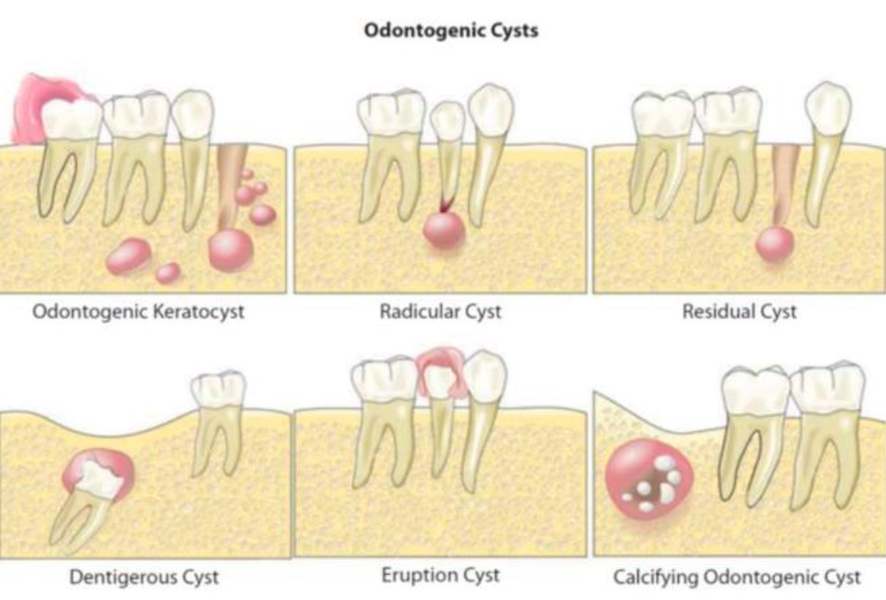

> - COC 在前區

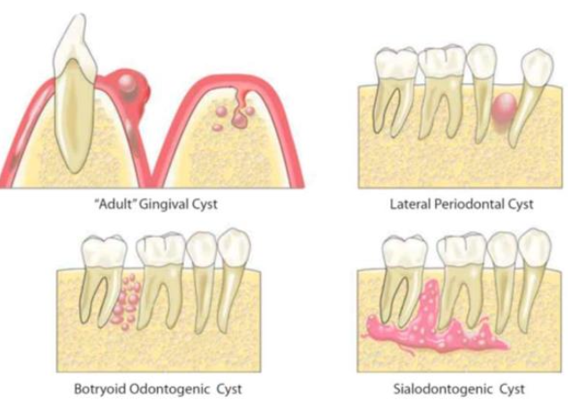

> - BOC = 多囊 LPC &rarr; 在 premolar
> - Slaodontogenic Cyst (GOC) 在前牙跨中線

| 男性較多                                                                                                                                                                                                                                  | 女性較多                                                                       |
|---------------------------------------------------------------------------------------------------------------------------------------------------------------------------------------------------------------------------------------|----------------------------------------------------------------------------|
| OOC  odontogenic carcinoma NDC   EC Stafne Defect   Simple Bone Cyst 長骨型 | Nasolabial Cyst   Gardner syndrome  Pilar cysts |

| 必定伴隨阻生牙           | 可能伴隨阻生牙                                                                                                                                                                      | 一定不伴隨阻生牙                 |
|-------------------|------------------------------------------------------------------------------------------------------------------------------------------------------------------------------|--------------------------|
| DC  | OKC(40%)   OOC (66%)   COC(33%機率)   Unicystic Ameloblastoma  Adenomatoid odontogenic tumor (66%)   Ameloblastic fibroma (75%)| LPC |

| 牙根吸收| 牙根不太吸收|
|-|-|
| DC    RC    Ameloblastoma 多房型   Ameloblastic Carcinoma    Squamous odontogenic tumor   Odontogenic fibroma     Odontogenic myxoma| OKC   LPC  |

| 正角化上皮                                                                               | 不完全角化上皮                                                | 非角化上皮                                                                                                 |
|-------------------------------------------------------------------------------------|--------------------------------------------------------|-------------------------------------------------------------------------------------------------------|
| OOC   EC    Dermoid cyst | OKC   Oral Lymphoepithelial Cyst  | DC    LPC    GOC |

| 單房 Unilocular                                                                                                            | 多房 Multilocular                                                    |
|--------------------------------------------------------------------------------------------------------------------------|--------------------------------------------------------------------|
| OOC   COC   Simple Bone Cyst | GOC   Ameloblastoma |

## 基因 

### BRAF mutation
- [Intraoral melanocytic Nevus](#p-stylecolorred-intraoral-melanocytic-nevusp)
- Skin Melanoma  

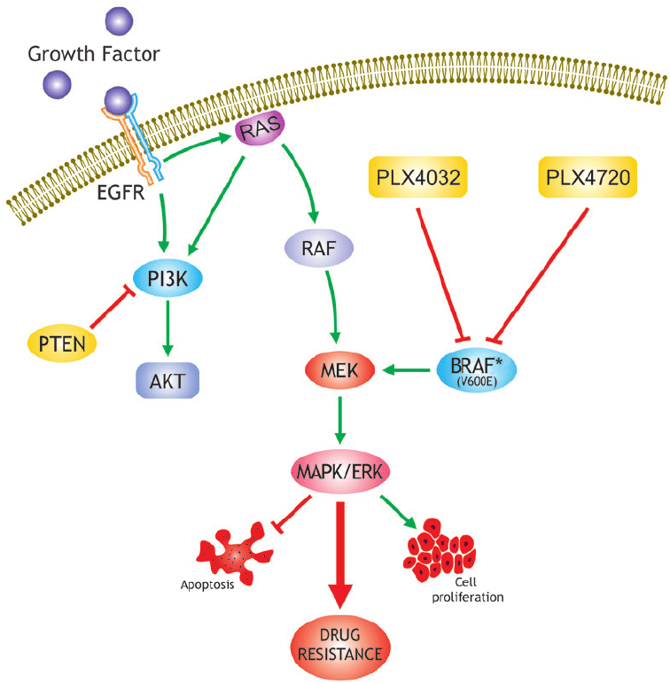

### CTNNB1 mutation
- β-catenin 由 CTNNB1基因編碼，Mutation &rarr; β-catenin 無法降解
- Calcifying Odontogenic Cyst
