---
toc:
    depth_from: 1
    depth_to: 3
html:
    offline: false
    embed_local_images: false #嵌入base64圖片
print_background: true
export_on_save:
    html: true
---
>f 
# cyst

## 分類

## 玻片特徵

- Developmental cyst
  - epithelial lining 與結締組織交界處平整
- 非發炎型(noninflamed)
  - 結締組織鬆散
  - 糖胺聚醣基質(glycosaminoglycan ground substance)。  
- 發炎型(inflamed)
  - 網嵴(rete ridges)
  - cholesterol clefts

  - 齒源 &rarr; Rushton bodies
:::left

:::right

:::

- true cyst
  - 兩到四層的扁平非角化上皮

## Odontogenic

### 癌化

- 良性不痛
- Risk 
  - RC > DC > OKC

### 發育型

| |原因|好發| 年齡 |特徵
|-|-|-|-|-|
|Dentigerous cyst (DC)|follicle 分離|38,48| 10 - 30y| 阻生齒,牙根吸收  &phi; = 3-4mm
|Eruption cyst (EC)| Dentigerous 萌發 |12a, 12b, 34a, ?6|10y &darr;|藍色或紫棕色 
| Odontogenic Keratocyst cyst (OKC)| dental lamina rest| 下顎骨後端，下齒槽管上方|10-40y |組生齒(40%) 
|^|^|^|^|PCNA (proliferating cell nuclear antigen),  Ki-67,   Gorlin Syndrome 
|^|^|^|^| Radiolucent、  MD方向下顎骨吸收，但牙根完整。 
|^|^|^|^|4-8 層、副角化(有核)、Basal cell 為 palisaded(柵狀)
|^|^|^|^|高復發 (30%)
| 
Orthokeratinized Odontogenic cyst (OOC)
|-|下顎後牙|年輕人| 阻生齒 (66%)、   granule layer 明顯 、  生長慢
| Gingival Cyst of the newborn | dental lamina rest | 新生兒上顎牙齦   |-| 管腔內含有角質碎屑(keratinaceous debris) 
| Gingival Cyst of the adult (LPC 長出來)| ^| 下顎premolar、canine facial 牙齦| 40-60y| 藍色(bluish)、藍灰色(DeepSkyBlue-gray) 
|^|^|^|^| focal plaques|
|^|^|^|^| focal plaques|
|Lateral Periodontal (LPC) | ^|  下顎 premolar、canine、lateral incisor lateral root 表面| 40-70y | ^|
|^|^|^|^|類似 OKC，但推開牙齒 |
| Botryoid Odontogenic Cyst (BOC)| 多囊 LPC
|Calcifying Odontogenic Cyst   ( Gorlin Cyst, COC)|- |前牙(65%) | 20-40y  若有 odontoma，17y 發病| 未萌發的牙齒(33%)、 阻生齒(66%)
|^|^|^|^| basal cell reverse polarity 
|^|^|^|^| ghost cells (嗜酸無核) 
|^|^|^|^| &beta; catenine + |
| Peripheral Calcifying Odontogenic Cyst|COC 長出來 |-|60-80y |.|
|Glandular Odontogenic Cyst (GOC)|-|下顎前牙|46-51y| 跨中線、無 MAML2|
|^|^|^|^| 復發、侵犯性，吃 cortical bone 
|^|^|^|^| 杯狀細胞, cilia, focal plaques

:::note {Gorlin syndrome}
- SUFU 也可能造成

:::

==MAL2 讓 MEC 預後好==

### 發炎型

| |原因|好發| 年齡 |特徵
|-|-|-|-|-|
|Periapical(radicular) cysts| Rest of  Malassez 被刺激|-|-|true/ periapical cyst   圓形的光通性==包圍根尖==|
|^|^|^|^| 牙根吸收, 2cm &uarr; 根管治療無效  |
| Buccal Bifurcation Cyst| 36, 46 Buccal (兩側 1/3)| 5-13y | -|腫脹，推牙根  |

Rest of Malassez
: Hertwig's epithelial 殘留

Rushton bodies
: 齒源系上皮

## Non- Odontogenic
| |原因|好發| 年齡 |特徵|
|-|-|-|-|-|
| Palatal Cysts of the Newborn | Epstin’s pearl &rarr; 融合線的上皮 | 中腭裂(前)、多發性| -| \collapse[白色或黃白色, 角化, 不需治療]{ }
|^| Bohn nodules &rarr; 小唾液腺 | 散佈在硬腭軟顎的交界(後)、多發性|^|^
| 
Nasolabial Cyst 
| \collapse[融合線]{} | 上唇中線旁(外側)，軟組織內 | 40-50y| 不痛 |
|^|^|^|^|   \collapse[纖毛上皮, goblet cells, 附近有肌肉]{}|
|^|^|^|^| \collapse[facial depression]{ } 
|
Nasopalatine duct cyst 
| Nasopalatine duct 上皮的殘留 | 顎部前 |==40-60y== | \collapse[藍]{}|
|^|^|^|^|  \collapse[牙根吸收]{}|
|^|^|^|^| 多種上皮, cilia, goblet cell, 神經和血管可見|
|
Incisive canal cyst 
| NDC 特例| \collapse[Incisive papilla 內]{} |^ | &phi; < 6mm |
| Median palatal cyst | lateral palatal shelves 融合時將上皮困住 | palatine papilla 後硬顎中線 | 年輕 | 表面是多層鱗狀上皮 |
|^|^|^|^| \collapse[無神經、血管、cilia、goblet cell]{ }|
| 
Epidermoid Cyst (Infundibular cyst)  
| trauma|-| 青春期後|  \collapse[凹陷]{ }
|^|^|^|^| ==正角化上皮==，爆開會被當異物 &rarr; granuloma
|^| Gorlin syndrome| 多發性 | ^| ^|
|^|Gardner syndrome| ^ | 青春期前| ^|
|Milia |-|類似 Epidermoid Cyst |-| 小、黃或白、充滿keratin  |
|^|^|^|^| 位於 Superficial dermis|
|\style[color:red]{Pilar (Trichilemmal) cysts  毛髮囊腫}| -|頭皮 (90%)、多發性(70%)|-|無凹陷開口|
|^|^|^|^|  \collapse[cholesterol clefts(90%), 淡染,  無 granular layer]{}|
|^|^|^|^| 破裂 &rarr; 發炎細胞湧入 cyst &rarr; secondary inflammation
| Dermoid Cyst | Teratoma| 口底中線|兒童、年輕| 多個 germ layer| 
|^|^|^|^|  \collapse[正角化上皮, Cyst Wall 有皮膚附屬物(皮脂腺細胞核居中)]{}|
| Thyroglossal Duct Cyst   甲狀舌管囊腫 | 甲狀腺殘留 | 脖子中線上、舌骨下(75%) |20y &darr; (40%) | \collapse[Cyst wall 上有 Thyroid follicle ]{} |
| Branchial Cleft Cyst   (cervical lymphoepithelial cyst，鰓裂囊) | branchial arches 殘留 (2^nd^，95%)| \collapse[SCM 前/下]{}| 10 - 40y| 複層鱗狀、淋巴、發中心(germinal center)。
| Oral Lymphoepithelial Cyst | 上皮內陷(invagination)淋巴 &rarr; keratin debris | Waldeyer ring, 口底, 舌腹, 軟顎| 年輕人 |  \collapse[&phi;<1cm 的黏膜下黃白色腫塊]{}
|^|^| 單發&rarr;發育   多發&rarr;HIV |^|\collapse[不含rete ridges, 角化不全並脫落填滿空腔, 淋巴組織包圍 ]{}|

Gardner syndrome 
: APC基因突變，β catenin 分解不掉 &rarr; 上皮增生 [Wnt 相關](/notes/國考/口胚整理.html#wnt)

:::info {魏氏環(Waldeyer ring)}
- 顎扁桃(palatine tonsils)
- 舌扁桃(lingual tonsils)
- 咽部腺樣體(pharyngeal adenoids)

:::

## Pseudocyst

| |原因|好發| 年齡 |特徵|
|-|-|-|-|-|
| Mucocele| 唾腺導管破裂，黏液灑入周遭的軟組織間隙 | 下唇中線旁(易咬到)| 常見 | 透明藍色, 波動感(fluctuant), 高復發  |
|^|^|^|^|發炎，granulation tissue 包圍黏液 |
| Ranula 蛤蟆腫 | 口底、和舌下腺有關的 Mucocele|-|
|\style[color: DeepSkyBlue;]{ Stafne Defect (Stafne Bone Cyst ，骨內囊腫)} | 唾液腺擠壓 cortical bone &rarr; x-ray 透光 |後側 mandibular canal | 中年 | 大小固定，邊界明顯 |
| Simple Bone Cyst  單純性骨囊腫 | 空($\frac{1}{3}$)或液體骨腔 | 肱骨、 股骨近端、 下顎後牙、 下顎聯合區| 年輕人 | 少疼痛、皮膚感覺異常|
|^|^|^|^| 不須積極治療，復發率低   (例外: cementoosseous dysplasia)|
|^|^|^|^| 侵犯牙根之間區域，不影響鄰牙，近遠心擴張 |
| Aneurysmal Bone Cyst   動脈瘤性骨囊腫|==大小不等==骨內堆積被纖維結締組織和活性骨包圍，並充滿血液| 長骨或脊椎骨、 下顎(2%)後牙  | 30y &darr; | 骨頭腫得快，可能多房，邊界不一定完整 
|^|^|^|^| Granulation tissue: 巨噬細胞蝕骨  |

# 唾液腺疾病 
|||原因|好發| 年齡 |特徵|||
|-|-|-|-|-|-|-|-|
| Mucocele/Ranula (口底)| mucous extravasation |Duct 破 | 下唇 | Youth| \oneline{
- 發炎 &rarr; Foamy cell
- 藍色腫 
 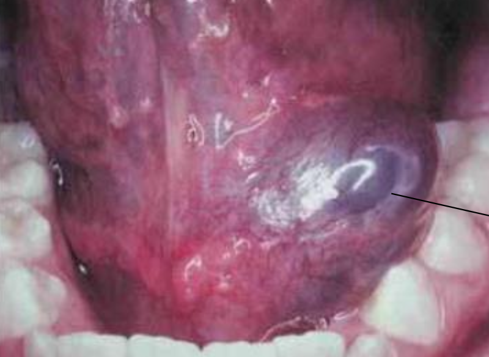
}|
|^| mucus retention cyst | Duct 阻塞 |-| 較老 | \oneline{
- true cyst 
- 少發炎 (close)
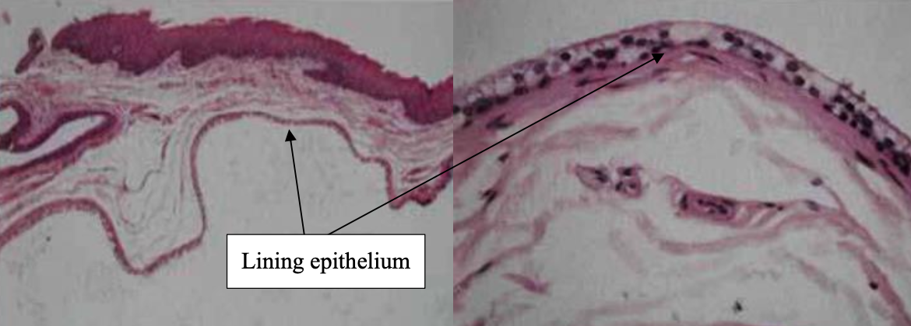
}|
| Maxillary sinus lesion | pseudocyst | 創傷、發炎導致膿液堆積在 CT |-|-| \oneline{
- 單側，界線清楚，均值半球
- 自行破裂，不用治療。
  
}
|^|retention cyst| 黏液腺分泌受阻 | -|-| cystic lesion 充滿黏液、少發炎 |
|^|\style[color: DeepSkyBlue;]{Post Operative Maxillary Cyst }|  相關手術後併發症，granulation tissue 陷入粘膜|-|\style[color: DeepSkyBlue;]{術後長時間 & 30-50y}| \oneline{
- ==腫痛==
}
|\style[color: DeepSkyBlue;]{ Necrotizing sialometaplasia (壞死性涎腺變生)} || 缺血 &rarr; 局部破壞性發炎: 局部麻醉劑(Dental injection) 、不合的假牙 | 軟硬顎連接處、小唾液腺 |-| \oneline{
- 火山口狀潰瘍，不太痛 (與潰瘍大小不成比例) 
- 5-6 週自己會好，持續 2 週懷疑惡性

}｜
|^|^|^|^|^| \oneline{
- Duct 鱗狀化生 (Squamous metaplasia, ~SCC)
- 腺泡壞死(acinar necrosis)
- 小葉結構完整
- 無細胞異生 (no cytologic atypia) 

}|
|Adenomatoid hyperplasia^罕^|| 不明 | -|40-60y|\oneline{
- 局部腫脹
- 腺泡(acini)、小葉(lobule)變多變大，但型態正常
- 無發炎浸潤 
} | 
|Sialadenitis| Mumps |-|-|Youth|\oneline{
- 雙側，初期不對稱
}
|^| Acute Bacterial ~ |S.aureus,  S.viridans,  S. pneumoniae||-|\oneline{
- 表淺，疼痛，紅斑
- 低燒，有 Pus  
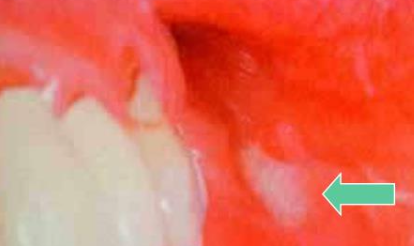
}
|^|Chronic| Duct 阻塞 | -|
|^|^|  Küttner tumor | IgG4-related disease|Submandibular g.|-| \oneline{
- 纖維化，Acini 破壞 
- 淋巴球浸潤
}|
|^| Subacute Necrotizing ~ (亞急性壞死性)|-|Palate|Youth|\oneline{
- 多種發炎 
- Acinar cell 消失 
- Duct squamous metaplasia 
- 兩週自愈 
}
|^|\style[color: DeepSkyBlue;]{Cheilitis Glandularis} | 太陽? | 下唇 |老男 |\oneline{
- Dysplasia: 彈性纖維 (solar elastosis)
- ==&rarr; SCC== (18%-35% )

}
| Sialolithiasis (唾液腺結石症)||和鈣、磷的代謝無關 | Submandibular gland |-|\oneline{
- 單發 
- 用餐 30mins 痛
- 硬、不移動
- 檢測需要 occlusal film 

}| 
|Sialadenosis (Sialosis，唾液腺腫大)||治療效果不好，除非控制住潛在的系統性疾病|
|Sialorrhea (excessive salivation，流涎症)||^|
|Xerostomia (dry mouth，口乾症)||-|||鵝口瘡(oral candidiasis), 蛀牙 |

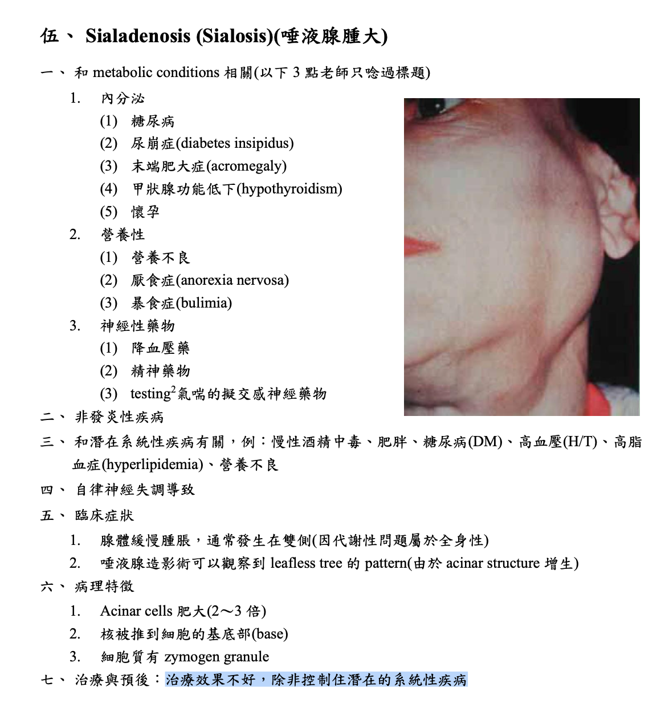

# Epithelial tumors 

## HPV 

|lesion |type|
|-|-|
focal epithelial hyperplasia|13、32

| Low-risk | High-risk |
|-|-|
|良 |惡|
| episomal form | integrated form |

- E6 &rarr; p53, E7 &rarr; RB

:::info {episomal v.s. integrated form}

:::

|變異名稱 |風險/ 原因|位置|症狀、特徵||||
|-|-|-|-|-|-|-|-|
|papilloma  (6, 11)| 30~50y |軟顎、口腔常見 |單發、低傳染|
|^|^| ^|pedunculated, sessile(少)  |
|^|^|^| stratified squamous epi. 包結締組織   hyperparakeratosis (有核、顆粒層缺失) 
| Verruca vulgaris  尋常疣  (2, 4) | -|皮膚、口腔(少見、接觸、自傳染) |大多是sessile(無梗)| 
|^|^|^| \oneline{
- hyperparakeratosis 但 granular layer 明顯 &rarr; coarse keratohyalin granules
- "cupping" effect: rete ridges 往 lesion 中心 

}
|^|^|^| 小孩身上有機會自行痊癒，治療需要 basal layer 清乾淨
| Condyloma acuminatum   尖銳濕疣 |-|\oneline{ 
- 口內: 6, 11
- 肛門: 16, 18
}| 多顆、界線清楚、無痛、兒童有機會自愈
|^|^|^| 廣底、papillary 突起不明顯、Koilocytes (空亮、葡萄乾核)  |
|\style[color: red;]{ Multifocal epithelial hyperplasia (Heck's disease，  13, 32)}|低社經、HIV| 唇、頰、舌 | 小、軟、多、無痛|
|^|^|^| \oneline{ 
**Papillomatous variant**
  - 舌、attached gingiva

} || \oneline{
**Papulonodular** 
- 常見 
- 扁平

} |
|^|^|^| \oneline{
- acanthosis: spinous layer (棘狀層) 增生
- rete ridge 寬扁，深度差不多
- Connective tissue 發炎細胞浸潤
- Koliofcyte
- mitosoid cells (spinous cell 之間，彷彿在分裂)

} |
Verruciform xanthoma (非 HPV)|Leasion 旁，異常免疫反應 |口腔 > 皮膚 > 性器 | 油脂撐起 epi. 形成 Verruciform。非 Metabolic  |
|^|^|^|\oneline{
- parakeratin plugging: parakeratin layer 增厚 &rarr; 細菌發炎
- 結締組織空亮 (foamy histocytes)

}

xanthoma
: 吃了油脂的 Macrophage 細胞，CD63+, CD68+, CD163+ IHC8+，diastase-PAS染色+

:::info {diastase-PAS}
- diastase: 澱粉酶
- PAS: Periodic Acid-Schiff stain
- 過碘酸氧化 OH 成 =O，Schiff 染
:::

## Melanotic lesions  

### 色素增加
|名稱| 單發? |風險/位置 || 特徵 ||
|-|-|-|-|-|-|-|-|
|\style[color: red;]{Oral melanotic Macules}|  單 | 下唇朱紅區(vermilion zone, 33%), Buccal mucosa, gingiva, palate||表面平坦、棕黑色、邊界清楚、&phi;<5mm |
|^|^|^|^| 不須治療，但不易和 Oral melanoma 分辨 &rarr; 燒毀! |
|^|^|^|^| **黑色素失禁(melanin incontinence):**   basal cell 可能破損 &rarr; macrophage 於 CT 吞噬 &rarr; ==melanophage== 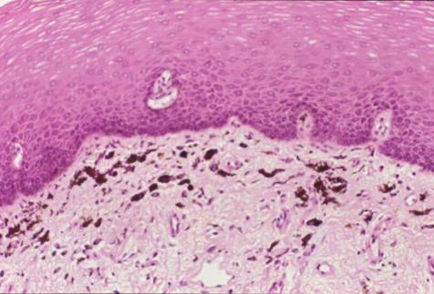|||
| Physiologic Pigmentation (生理性)  | 多 | 黑人|| - |
| Chronic irritation (慢性刺激) |^|\oneline{
- 常咬到的頰側
- 類天皰瘡(pemphigoid)
- Smoker’s melanosis
- 多氯聯苯(PCB)汙染
}|| |
|Syndromes or Diseases Associated |^|\oneline{
1. Peutz-Jeghers syndrome
2. Addison’s disease
3. Neurofibromatosis
4. McCune-Albright syndrome
}|
| Drug-induced |^|==奎寧(chloroquine)==, palate|| 左右沒有完全對稱  |
|^|^|^|^| melanin堆積，確診直接 Bleaching |

:::info { 一些名詞}
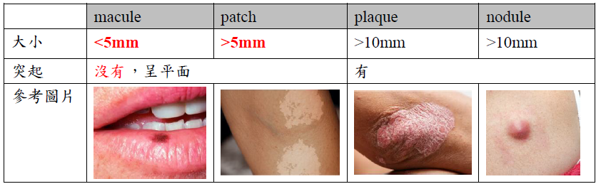
:::

#### Peutz-Jeghers syndrome 
- 體染色體顯性
- STK11/LKB1 
- peri-oral跟oral cavity會出現很多pigment
- 惡化腸道癌症intestinal cancer 15被 &rarr; 預防性切腸子

:::left

:::right

:::

#### Addison’s disease 

- 腎上腺 &darr; &rarr; cortisol &darr; &rarr; ACTH&uarr; &rarr; &alpha;-MSH &rarr; malannin
- 面色黯淡 
- 到處都黑色素沉澱

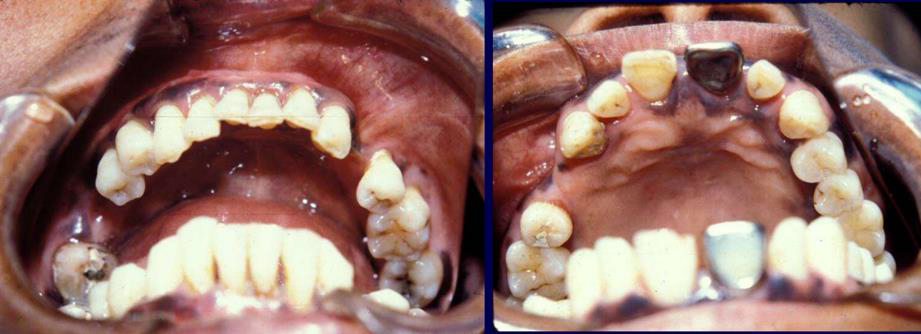

#### Neurofibromatosis

- cafe-au-lait spots disease (咖啡牛奶斑)
- neurofibroma (神經纖維瘤)

#### McCune-Albright syndrome (Albright’s syndrome)

- 咖啡牛奶斑
- 遺傳性疾病
- 多骨性纖維發育不良(Polyostotic Fibrous Dysplasia)

:::info {咖啡牛奶斑}

:::

### Naevus 

- Naevus cell 無 Dendrites
- 位置: 
  - 先天: 四肢，口內少見

  - 後天: ==NRAS(大 lesion，6%)==, BRAF(小 lesion，80%) mutation (3.~5.是一個漸進的過程)

#### \style[color:red ;]{Intraoral melanocytic Nevus}

- 後天，口內，最常見
- 位置: Palate,mucobuccal fold, orgingiva
- BRAF 
- 35y

#### \style[color:red ;]{Blue nevus} 
- 後天，口內，次常見
- 位置: Palate
- GNAQ mutation

#### 組織
- Cell 分三類： 
  - A: Epithelioid (在 epi)
  - B: Lymphocyte-like 
  - Spindle-shaped

- Compound (在 epi., dermis 之間) 或 Intradermal
  - 只有 Junctional 會呈現 Tear-like Nest
- Indian-file pattern: 鑽進 Dermis 排成一排

- 深層可能圍皮膚附屬物、神經

### Melanoma (惡)
>可以從 Melano cell, Naevus 轉過來，多變，甚至可以沒有 Pigmentation
>染色: S100, HBM-45   

- ABCDE
  - Asymmetry
  - Border irregularity
  - Colot veruegation
  - Diameter >6mm
  - Evolving
- Horizontal phase(Radial) &rarr; Vertical phase (Invasive)
- 基因 
  - Mucosa: Kit (CD117) \style[color: red;]{壞透了，直接 T3}
  - Skin: BRAF, NRAs

| 類型 ||特徵|||
|-|-|-|-|-|
|Superficial Spreading (Pagetoid) - || 連續 ridge 都有 nest |
| Nodular - | | 無 Radial phase，直接往下侵犯|
| Lentigo maligna|| 中臉，只有 Radial 陽光曝曬 (Lamina propia 沒啥細胞，嗜鹼) |
| Lentigo maligna - || Lentigo malign 侵犯 |
| Acral Lentiginous - || 在指甲下面 (無毛)
|^||\oneline{
- 上皮增生，rete ridge 變長
- Junctional nest
}

Acral
: 肢端

## Oral potentially malignant disorders (OPMD)

>煙、酒、檳榔

| 名稱 |  原因 ||特徵||
|-|-|-|-|-|-|-|
|Oral submucous fiberosis | Arecoline (檳榔鹼)|| \oneline{ 
- &rarr; SCC 
- hyperkeratosis 或 parakeratosis，上皮變薄。
- Collagen fiber 最深侵犯肌肉層
- 無法復原
} |
Leukoplakia, Erythroplakia |紅斑較嚴重，不產生角質 ||\oneline{
- 白色的多為 hyperkeratosis &rarr; 用排除法診斷
- verrucous 高風險
- 女性 maligant transformation rate 高
} |
|^|^|^| .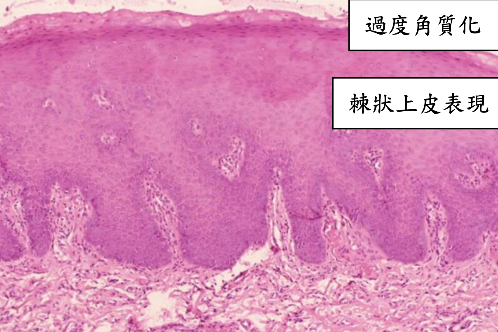
| \style[color: red;]{ Poliferative verrucous leukoplakia (pbl) }|  ？ || \oneline{
- 女，gingiva/alveolar gingiva，66.8y
- 菸酒檳榔無關
- 不切掉高機率癌化
- 多發性

}|
|^|^|^| \oneline{
- Sharp 分化改變
- bulbous rete ridge &rarr; 延長
- exophytic, endophytic growth, cyst 充滿 keratin

}

### Oral epithelial dysplasia 

- 硬顎較少發生。
- 分為三個程度

#### Mild
- 影響到下三分之一
- Basal cell 增生
- Rete ridge 變寬
- 底層 keratin (紅染)
- 可能發炎

#### Moderate
- 到中三分之一

#### Sever 

## 整理 

### Verruciform xanthoma 相關疾病

> 與皮膚、黏膜破壞相關的Immune disease、precancerous disease

- 扁平苔癬(lichen planus)
- 疱瘡(pemphigus vulgaris)
- 紅斑性狼瘡(lupus erythematosus)
- 移植相關疾病(graft-versus-host disease(gvhd))
- 大皰性表皮鬆懈(epidermolysis bullosa俗稱泡泡龍症)
- 上皮病變(epithelial dysplasia)
- 鱗狀細胞癌(squamous cell carcinoma)
- 疣狀角化不良瘤(warty dyskeratoma)。

# 齒源性腫瘤 Odontogenic Tumor 
> - 上皮組織惡性病變: carcinoma
> - 間葉組織惡性病變: sarcoma

1. 上皮性來源(tumors of odontogenic epithelium)
   1. Ameloblastoma (2^nd^)
   2. Clear cell odontogenic carcinoma
   3. Adenomatoid odontogenic tumor (4^th^)
   4. Calcifying odontogenic tumor
   5. Squamous odontogenic tumor
2. 混和性來源(mixed odontogenic tumors)來自上皮+外胚層間葉
   1. Ameloblastic fibroma
   2. Ameloblastic fibro-odontoma
   3. Ameloblastic fibrosarcoma
   4. Odontoma (1^st^)
   5. Primordial odontogenic tumor
3. 外胚層間葉來源(tumors of odontogenic ectomesenchyme)
   1. Odontogenic fibroma
   2. Granular cell odontogenic tumor
   3. Odontogenic myxoma (3^rd)
   4. Cementoblastoma

## 上皮性來源
| ||原因|位置| 年齡 |特徵||
|-|-|-|-|-|-|-|-|
Ameloblastoma | 多囊腫型 (coventional solid or multicystic intraosseous) | \oneline{
- 牙齒發育過程上皮(典型良性)在錯的位置
- BRAF mutation 
- DC 變過來 (unicystic)
} |下顎 (80-85%)|-| \oneline{
- 最常見(80%)，長得慢，通常會到了腫瘤很大時才來就診。
- 頰舌擴張
- 牙根吸收
- 局部侵犯，少轉移，預後好
}|
|^|^|^|^|^|\oneline{
\collapse[follicular pattern]{}
\collapse[plexiform pattern]{ stellate reticulum 擠扁  }
\collapse[basal cell pattern (少)]{stellate reticulum 不明顯 }
\collapse[acanthomatous pattern]{}
\collapse[granular cell pattern]{}
}|
|^|^|^|  前牙 | ^ | \collapse[desmoplastic pattern]{fibrous stroma &rarr; TGF-β &rarr; collagen fiber &rarr; 大量膠原蛋白基質(dense collagenized stroma)堆積 &rarr; radiopaque, odontogenic epithelium 呈現小島狀(small islands)或是索狀(cord) } |
|^| 單一囊腫型(unicystic) |^|下顎後 | ~23y | \oneline{
- 預後較多囊好
- 常圍繞未萌發的牙齒，特別是第三大臼齒

 } |
|^|^|^|^|^| **luminal ameloblastoma** |
|^|^|^|^|^| **intraluminal ameloblastoma**   多為 plexiform type   |
|^|^|^|^|^| **mural ameloblastoma** |
|^|骨外囊腫型(peripheral/ extraosseous)|^|下顎後、軟組織^限^| 52y | plexiform 或是 follicular pattern |
|^|^|^|^|^|局部切除， 15-20% 復發 |
| Ameloblastic Carcinoma ||- |下顎後側 |50-60y| **放射線**   不規則，邊界不清楚。|
| Calcifying epithelial odontogenic tumor (CEOT) ||-|下顎 | 30-50y|\oneline{
- 類似 Ameloblastoma，可能單多囊
- 鈣化，長得慢，低侵略，邊界清楚
- 阻生齒 
- 復發率約 15%

}|
|^|^|^|^|^| \oneline{
- intercellular bridge 
- 嗜酸 amyloid-like substance (ODAM) &rarr; ==Congo red==
- 多核細胞(→)
 
}|
| \style[color: red;]{Adenomatoid odontogenic tumor (AOT)} ||-|上顎、前牙、犬齒、頰側|-| \oneline{
**Tumor of two-third**
1. 10~19y
2. Female
3. 上顎、前牙、犬齒
4. 未萌發牙冠
}
|^|^|^|^|^| 無痛小病灶(&phi;<3cm)，變大時==骨膨脹==
|^|^|^|^|^| radiolucency 跨過 CEJ，可能有鈣化  |
|^|^|^|^|^| \oneline{
- fibrous capsule 厚 &rarr; 切得乾淨
- 上皮螺旋(whorled mass)、玫瑰(rosettelike)團塊
- Ductlike 
- 2/3 鈣化， 內部 fiber 少

}| 
| Squamous odontogenic tumor ||-|上顎前，下顎後|-| \oneline{
- 可能造成牙根鬆動，一般無症狀
- "正常"鱗狀上皮小島被Fiber包圍
- 上皮小島內可能會出現一些 microcyst

}| 
| Clear cell odontogenic carcinoma |biphasic |一堆 Clear cell, 一堆 Glycogen|-|-|\oneline{
- Clear cell
- 嗜酸多邊形上皮 (eosinophilic polygonal epithelial cells)

}
|^|monophasic| -|-|-| \oneline{
- 只有 Clear cell 
- 均質 hyalinized CT 

}
|^| ameloblastoma-like |-|-|-|\oneline{
- 最外圈 Clear cell 反極 

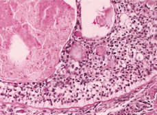
}

## 混和性來源

| ||原因|位置| 年齡 |特徵||
|-|-|-|-|-|-|-|-|
| Ameloblastic fibroma ||-| 下顎臼齒區| 20y &darr; | \oneline{
- 通常無症狀
- 阻生齒(75%)
- fiber &rarr; 邊界清楚
- odontogenic epithelium 排列成兩層細胞 long, narrow cords
- Ameloblast 包未成熟 fibroblast，小顆無 cyst
- CT 充滿 fibroblast

}|
| \style[color: DeepSkyBlue;]{ Ameloblastic fibrosarcoma} ||Ameloblastic fibroma 惡化 | 下顎(80%) | 27.5y (1.5:1)| \oneline{
- 侵犯快，==會痛==
- 骨頭破壞 &rarr; 牙齒鬆動
- 向外侵犯 &rarr; 粘膜潰養
}
|^|^|^|^|^|\oneline{
- 只有 CT 惡性 
- 
}
| Odontoma |compound  | 最常見|上顎前牙| ^|\oneline{
- 構造順序排列

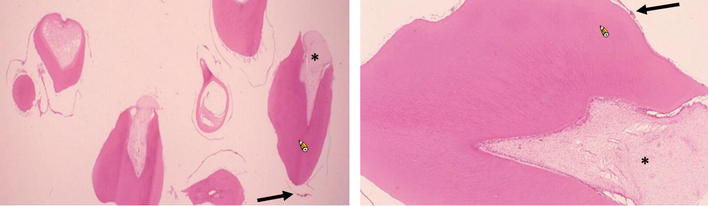
}
|^| complex | ^| 後牙|^|\oneline{
- dentin 和 enamel matrix 混在一起
- 有時可見嗜酸 Ghost cell

}| 
| Ameloblastic fibro-odontoma || Ameloblastic fibroma + Odontoma | 下顎後 | 10y | \oneline{
- 多為單房，分界明顯

}|
|Primordial Odontogenic Tumor ^新^||-| 下顎後牙(3^rd 大臼齒, 乳臼齒) | 10y-20y| \oneline{
- 良性，分界好，堅硬，無痛 
- 包住牙冠
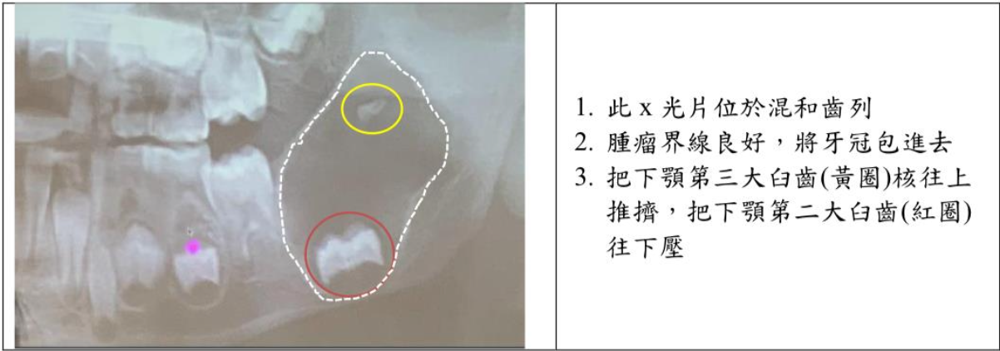
}
|^|^|^|^|^| --|

## 外胚層間葉來源

| ||原因|位置| 年齡 |特徵||
|-|-|-|-|-|-|-|-|
| Odontogenic fibroma | central type^罕^ (骨內)|-| 上顎為第一大臼齒以前、下顎為第一大臼齒以後 | 未萌發的牙齒(5%) | \oneline{
- 多房: 大，骨頭膨大
- 單房: 小
- 擠牙根，齒動搖

}|
|^|^|^|^|^| Simple, WHO 
|^| peripheral type (軟組織) |-|下顎牙齦 facial | 10-40y| 又稱 Odontogenic epithelial harmatoma, Peripheral fibroameloblastic dentinoma |
|^|^|^|^|^| \oneline{
- 無痛
- 緻密的 collagen
- 厚的 epithelium
- WHO type 類似
- 某些區域類似 giant cell granuloma
  
}|
| Granular Cell Odontogenic tumor ||-|-|-| \oneline{
- 富含 Lysosome &rarr; 嗜酸
- Narror cords, island Odontogenic 上皮

}
| Odontogenic myxoma   齒源性黏液瘤|| - | 顎骨^限^(下顎稍高) | 25-30y |\oneline{
- 無痛腫脹，生長慢
- 難切乾淨，復發率高(25%)
  - 推開牙根，牙根吸收
- 單或多房，多房分成 soap bubble, ==stepladder==
- IHC: Actin 不太表現

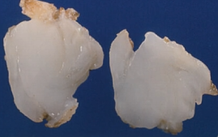}
|^|^|^|^|^| 間質淡粉紅色，看不太到 collagen fiber
|Cementoblastoma || cementoblast 狂做 | 下顎(75%)，後牙(90%)，下顎第一大臼齒(50%)| <20y (50%)|\oneline{
- ==不受控生長==，但不能不同牙齒黏一起
- 阻生齒、未萌發
- ==2/3 腫痛==
- Pulp 存活 
- 高復發

}
|^|^|^|^|^| \oneline{
- 有 Capsule，cementum 高柱狀
- 多核巨細胞
  - cementoclast, ==odontoclast==
- 小空腔: cementocyte 
- reversal line
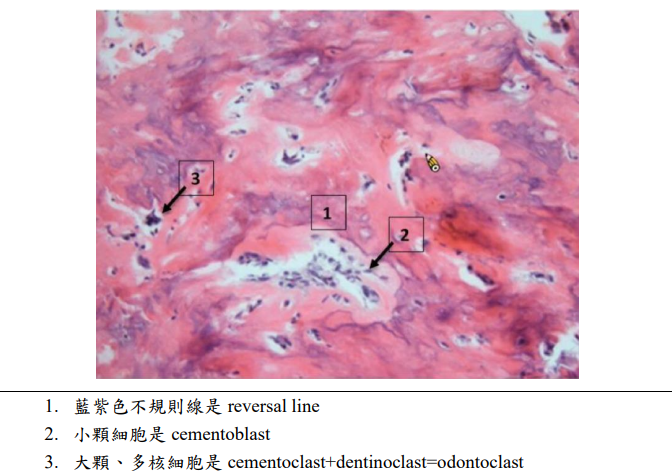
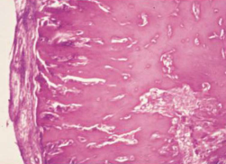
}|

# Anomalies 

- 症候群相關
  - PITX-2 
  - SHH 
  - PAX-9

Neonatal ring
: 胎兒期與出生後期牙齒發育中的交界

## 發育型

|變異名稱| 好發位置|| 好發族群| 成因 | 症狀 |其他
|-|-|-|-|-|-|-|-|
|Turner hypoplasia|Crown & Root|<ul><li>**Trauma** : 上顎正中門牙, Facial (Avulsion, intrusive luxation)</li><li> **Caries**: 小臼齒</li></ul>| <ul> <li>**Crown**: 1.5-3y</li><li>**Root**: 4-5y</li></ul>|發炎 (乳牙 Caries, trauma) 影響恆牙發育 |局部或整個牙冠白、黃或棕色發育不全 |	
|^|^|^|^|^| 無明顯邊界|
|Molar-Incisor Hypomineralization (MIH)|Crown|單或多個恆牙下顎 1^st^Molar (可能影響 Incisor) |-| **乳牙**: 產前母體疾病、藥物、早產   **恆牙**: 幼兒期疾病(fever, asthma, pneumonia)| 局部白、黃或棕色發育不全，可能多孔凹陷  | CPPACP: 重新鈣化，降敏
|^|^|^|^|^| 有明顯邊界|^|
|^|^|^|^|^| 痛 (27.4%)|^|
| Molar Root-Incisor Malformation (MRIM, MIM) |Crown & Root|單個恆牙下顎 1^st^Molar (可能影響 Incisor) |3y (1^st^ Molar root)|非遺傳，可能和神經疾病( seizures, meningitis)相關|短窄尖牙根，牙冠相對正常|
|^|^|^|^|^| Chamber 變矮，異位礦化(ectopic mineralized ) 
|^|^|^|^|^| 常見疼痛|
|^|^|^|^|^| 1^st^ Molar 拔除|
|Hypoplasia Caused by Antineoplastic Therapy| Root & Crown | -| 12y&darr; (Common)   5y&darr; (Extensive)| 放射線(4gy: 畸形，30gy: 發育停止)、化療 | 小牙症 (microdontia, 3y&darr; 暴露)
|^|^|^|^|^|發育不全 (hypodontia)
|^|^|^|^|^|V-shaped hypoplastic roots
|^|^|^|^|^|enamel hypoplasia
|^|^|^|^|^|下顎垂直發育減少
|Dental Fluorosis |Crown |兩側同時，對稱性|上顎 Incisor 在 3y 發育完成，需重點監測|氟結合 Amelogenin |琺瑯質白色區域(white, chalky areas)，無光澤，不透明
|^|^|^|^|^| 可能有黃色至深棕色區域(mottled enamel)
|Syphilitic Hypoplasia (Congenital syphilis)|Crown| ALL | - | 先天梅毒 | **Screwdriver-shaped incisors**: Incisor 切端收縮，中間 1/3 最寬 (必要)
|^|^|^|^|^| Incisor 切端中間發育不全切跡 (central hypoplastic notch)
|^|^|^|^|^| 桑椹臼齒(mulberry molars)

## 發育後

|變異名稱| 好發位置|| 好發族群| 成因 | 症狀 |其他
|-|-|-|-|-|-|-|-|
|Attrition| Crown| Occlusal, incisor edge|-|磨牙, Deep bite, Cross bite | 敏感。雖然會 Pulp exposure 但 reparative secondary dentin 填充 pulp chamber，較少疼痛| 
|Abrasion|^|非慣用手頰側齒頸 | - | 刷牙| 齒頸水平 notch
|^|^| 鄰接面 |^| 牙籤、牙線| 鄰接面半月形
|^|^| 犬齒、小臼齒 |^| 咬螺絲、菸斗| O, V 型缺口|
|Erosion| ^ | **唾液較少處:** 上顎前牙, 下顎後牙 Occlusal& Facial| **唾液腺功能衰退**: salivary gland aplasia, 脫水(dehydration) , 放射治療, Sjögren syndrome, DM, 神經性貪食症(bulimia nervosa) | 酸性侵蝕 | Dentin exposure，周圍 Enamel 白圈高起 (侵蝕抗性差異)
|^|^|^|^|^|上顎門牙齒頸湯齒狀凹陷|
|^|^|^|^|^|金屬補綴物邊緣暴露|
|^|^|^| **胃酸**: perimolysis|^|^|
|Abfraction |^| 後牙Facial, 單顆齒頸1/3 | - | 咬合力| V 形尖銳缺口，可能延伸到牙齦下。 
|^|^|^|^|^| Tertiary dentin 修復，較少疼痛
|Internal Resorption |Root|少見||**發炎吸收:** 肉芽組織取代 Dentin|無症狀，發炎則疼痛。   Pulp 紅色透出。     X-ray 下 balloon-like dilation of the canal。 |
|^ |^|^|^|**替代或化生吸收 (replacement or metaplastic resorption )**: Bone, cementum 取代 Dentin|^|
|External Resorption|^|常見|| 發炎| Root 變短，根尖不規則。妥善治療則一年內痊癒。 
|^|^|^|| ^| PDL, 根尖周圍 lamina dura 消失或模糊
|^|^|^|| ^| 妥善治療則一年內痊癒
|^|^| 上顎門牙 (移動距離長)| 矯正| | 根尖圓形。 
|^|^| -|| **其他外部壓力:** 阻生齒、腫瘤、Cysts | 根據受力位置、形狀
|^|^| -||嚴重 luxation, avulsion 導致 PDL 死亡| 牙齒視為異物，外吸收並骨取代|
|^|^|齒頸 cementum|Invasive cervical resorption (三顆牙以上 &rarr; multiple idiopathic cervical root resorption )|-| 沿著齒頸一圈吸收，不太影響 pulp|
|^| 遺傳 (如 IL-1B allele) 可能導致外吸收。未萌發牙冠可能發生外吸收|

# 整理 

## 整理 

> - COC 在前區

> - BOC = 多囊 LPC &rarr; 在 premolar
> - Slaodontogenic Cyst (GOC) 在前牙跨中線

| 男性較多                                                                                                                                                                                                                                  | 女性較多                                                                       |
|---------------------------------------------------------------------------------------------------------------------------------------------------------------------------------------------------------------------------------------|----------------------------------------------------------------------------|
| OOC  odontogenic carcinoma NDC   EC Stafne Defect   Simple Bone Cyst 長骨型 | Nasolabial Cyst   Gardner syndrome  Pilar cysts |

| 必定伴隨阻生牙           | 可能伴隨阻生牙                                                                                                                                                                      | 一定不伴隨阻生牙                 |
|-------------------|------------------------------------------------------------------------------------------------------------------------------------------------------------------------------|--------------------------|
| DC  | OKC(40%)   OOC (66%)   COC(33%機率)   Unicystic Ameloblastoma  Adenomatoid odontogenic tumor (66%)   Ameloblastic fibroma (75%)| LPC |

| 牙根吸收| 牙根不太吸收|
|-|-|
| DC    RC    Ameloblastoma 多房型   Ameloblastic Carcinoma    Squamous odontogenic tumor   Odontogenic fibroma     Odontogenic myxoma| OKC   LPC  |

| 正角化上皮                                                                               | 不完全角化上皮                                                | 非角化上皮                                                                                                 |
|-------------------------------------------------------------------------------------|--------------------------------------------------------|-------------------------------------------------------------------------------------------------------|
| OOC   EC    Dermoid cyst | OKC   Oral Lymphoepithelial Cyst  | DC    LPC    GOC |

| 單房 Unilocular                                                                                                            | 多房 Multilocular                                                    |
|--------------------------------------------------------------------------------------------------------------------------|--------------------------------------------------------------------|
| OOC   COC   Simple Bone Cyst | GOC   Ameloblastoma |

## 基因 

### BRAF mutation
- [Intraoral melanocytic Nevus](#p-stylecolorred-intraoral-melanocytic-nevusp)
- Skin Melanoma  

### CTNNB1 mutation
- β-catenin 由 CTNNB1基因編碼，Mutation &rarr; β-catenin 無法降解
- Calcifying Odontogenic Cyst
