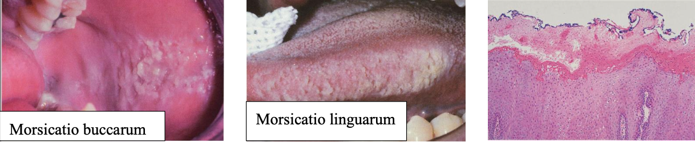
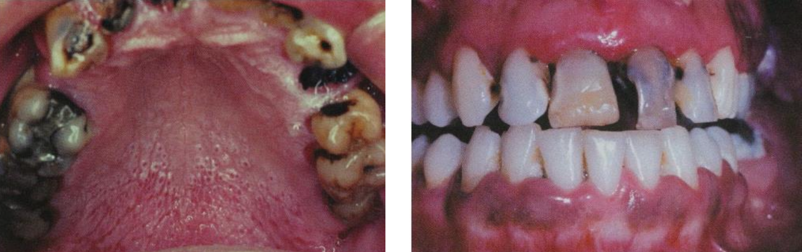
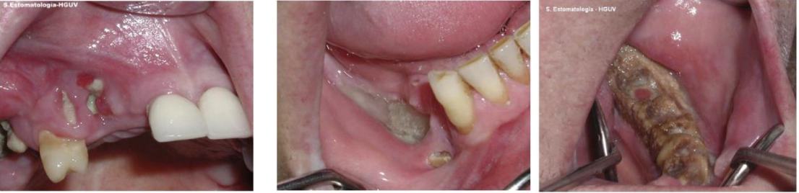
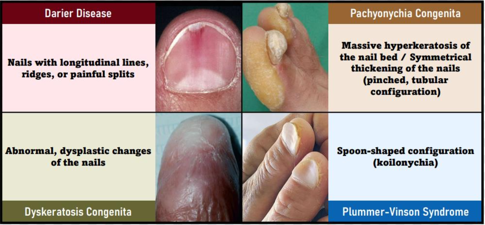

---
toc:
    depth_from: 1
    depth_to: 3
html:
    offline: false
    embed_local_images: false #嵌入base64圖片
print_background: true
export_on_save:
    html: true
---

@import "口病_cyst.md"
@import "口病_odontogenicTumor.md"
@import "口病_epithelialTumor.md"
@import "口病_唾液腺.md"
@import "口病_皮膚.md"
@import "口病_感染.md"
@import "口病_Hema.md"

# Anomalies 

- 症候群相關
  - PITX-2 
  - SHH 
  - PAX-9

Neonatal ring
: 胎兒期與出生後期牙齒發育中的交界

## 發育型

|變異名稱| 好發位置|| 好發族群| 成因 | 症狀 |其他
|-|-|-|-|-|-|-|-|
|Turner hypoplasia|Crown & Root|<ul><li>**Trauma** : 上顎正中門牙, Facial (Avulsion, intrusive luxation)</li><li> **Caries**: 小臼齒</li></ul>| <ul> <li>**Crown**: 1.5-3y</li><li>**Root**: 4-5y</li></ul>|發炎 (乳牙 Caries, trauma) 影響恆牙發育 |局部或整個牙冠白、黃或棕色發育不全 |	
|^|^|^|^|^| 無明顯邊界|
|Molar-Incisor Hypomineralization (MIH)|Crown|單或多個恆牙下顎 1^st^Molar (可能影響 Incisor) |-| **乳牙**: 產前母體疾病、藥物、早產   **恆牙**: 幼兒期疾病(fever, asthma, pneumonia)| 局部白、黃或棕色發育不全，可能多孔凹陷  | CPPACP: 重新鈣化，降敏
|^|^|^|^|^| 有明顯邊界|^|
|^|^|^|^|^| 痛 (27.4%)|^|
| Molar Root-Incisor Malformation (MRIM, MIM) |Crown & Root|單個恆牙下顎 1^st^Molar (可能影響 Incisor) |3y (1^st^ Molar root)|非遺傳，可能和神經疾病( seizures, meningitis)相關|短窄尖牙根，牙冠相對正常|
|^|^|^|^|^| Chamber 變矮，異位礦化(ectopic mineralized ) 
|^|^|^|^|^| 常見疼痛|
|^|^|^|^|^| 1^st^ Molar 拔除|
|Hypoplasia Caused by Antineoplastic Therapy| Root & Crown | -| 12y&darr; (Common)   5y&darr; (Extensive)| 放射線(4gy: 畸形，30gy: 發育停止)、化療 | 小牙症 (microdontia, 3y&darr; 暴露)
|^|^|^|^|^|發育不全 (hypodontia)
|^|^|^|^|^|V-shaped hypoplastic roots
|^|^|^|^|^|enamel hypoplasia
|^|^|^|^|^|下顎垂直發育減少
|Dental Fluorosis |Crown |兩側同時，對稱性|上顎 Incisor 在 3y 發育完成，需重點監測|氟結合 Amelogenin |琺瑯質白色區域(white, chalky areas)，無光澤，不透明
|^|^|^|^|^| 可能有黃色至深棕色區域(mottled enamel)
|Syphilitic Hypoplasia (Congenital syphilis)|Crown| ALL | - | 先天梅毒 | **Screwdriver-shaped incisors**: Incisor 切端收縮，中間 1/3 最寬 (必要)
|^|^|^|^|^| Incisor 切端中間發育不全切跡 (central hypoplastic notch)
|^|^|^|^|^| 桑椹臼齒(mulberry molars)

## 發育後

|變異名稱| 好發位置|| 好發族群| 成因 | 症狀 |其他
|-|-|-|-|-|-|-|-|
|Attrition| Crown| Occlusal, incisor edge|-|磨牙, Deep bite, Cross bite | 敏感。雖然會 Pulp exposure 但 reparative secondary dentin 填充 pulp chamber，較少疼痛| 
|Abrasion|^|非慣用手頰側齒頸 | - | 刷牙| 齒頸水平 notch
|^|^| 鄰接面 |^| 牙籤、牙線| 鄰接面半月形
|^|^| 犬齒、小臼齒 |^| 咬螺絲、菸斗| O, V 型缺口|
|Erosion| ^ | **唾液較少處:** 上顎前牙, 下顎後牙 Occlusal& Facial| **唾液腺功能衰退**: salivary gland aplasia, 脫水(dehydration) , 放射治療, Sjögren syndrome, DM, 神經性貪食症(bulimia nervosa) | 酸性侵蝕 | Dentin exposure，周圍 Enamel 白圈高起 (侵蝕抗性差異)
|^|^|^|^|^|上顎門牙齒頸湯齒狀凹陷|
|^|^|^|^|^|金屬補綴物邊緣暴露|
|^|^|^| **胃酸**: perimolysis|^|^|
|Abfraction |^| 後牙Facial, 單顆齒頸1/3 | - | 咬合力| V 形尖銳缺口，可能延伸到牙齦下。 
|^|^|^|^|^| Tertiary dentin 修復，較少疼痛
|Internal Resorption |Root|少見||**發炎吸收:** 肉芽組織取代 Dentin|無症狀，發炎則疼痛。   Pulp 紅色透出。     X-ray 下 balloon-like dilation of the canal。 |
|^ |^|^|^|**替代或化生吸收 (replacement or metaplastic resorption )**: Bone, cementum 取代 Dentin|^|
|External Resorption|^|常見|| 發炎| Root 變短，根尖不規則。妥善治療則一年內痊癒。 
|^|^|^|| ^| PDL, 根尖周圍 lamina dura 消失或模糊
|^|^|^|| ^| 妥善治療則一年內痊癒
|^|^| 上顎門牙 (移動距離長)| 矯正| | 根尖圓形。 
|^|^| -|| **其他外部壓力:** 阻生齒、腫瘤、Cysts | 根據受力位置、形狀
|^|^| -||嚴重 luxation, avulsion 導致 PDL 死亡| 牙齒視為異物，外吸收並骨取代|
|^|^|齒頸 cementum|Invasive cervical resorption (三顆牙以上 &rarr; multiple idiopathic cervical root resorption )|-| 沿著齒頸一圈吸收，不太影響 pulp|
|^| 遺傳 (如 IL-1B allele) 可能導致外吸收。未萌發牙冠可能發生外吸收|

# 物裡傷害 

Emphysema
: 氣腫

Dysguesia
: 味覺障礙

Contusion
: 挫傷/鈍器傷

Riga-Fede Disease
: 一歲內，neonatal/natal tooth 萌出後磨到舌尖或口底

Bednar’s ulcer
: 新生兒吸吮負壓造成， palate 壓迫 hamulus 形成 ulcer

epulis fissuratum
: 假牙側翼太長，長期摩擦上顎前庭

Inflammatory papillary hyperplasia
: palate 假牙不合創傷 + candida albicans，漱口水 (Nystatin)

Morsicatio buccarum, linguarum
: 片狀，長期咬

Exfoliative cheilitis 
: 剝落性唇炎

Stomatitis nicotina
: 尼古丁性口炎，palate 反向草莓 (紅色為小唾液腺開口)

Radiation Caries
:Dentin 壞死 ，齒頸一圈，可能一刮就掉。

osteoradionecrosis(ORN)
: 無局部腫瘤疾病，骨頭表面暴露，長達 3~6 個月無法癒合。Fibrosis 導致缺血造成骨壞死 &rarr; 下顎 risk

# Chemical injuries

- 上皮凝固性壞死(Coagulation necrosis): 外型尚存中央壞死

- 傳統化療導致 DNA 裂解，ROS 導致發炎壞死，不宜 steroids 治療 (無法防止 DNA damage 又抑制免疫 )。
- mTOR inhibitor-associated stomatitis (-limus ) 
  - 類似 RU 潰瘍 + 周圍紅斑 
  - 用 steroids

## Osteonecrosis of the Jaw (ONJ)

Medication-Related Osteonecrosis of the Jaw (MRONJ)

- 名稱流變 BRONJ→MRONJ→ONJ
- 雙磷酸鹽 (曾用於抑制骨吸收) 相關
- 植牙一直失敗
- Osteoblast 把藥存進骨頭裡 
- Fosamx, Zometa
- mandible 多

# 整理 

- 上唇疾病
  - Canalicular Adenoma
  - Nasolabial Cyst
  - Fordyce Granules

## 基因 

### BRAF mutation
- [Intraoral melanocytic Nevus](#p-stylecolorred-intraoral-melanocytic-nevusp)
- Skin Melanoma  

### CTNNB1 mutation
- β-catenin 由 CTNNB1基因編碼，Mutation &rarr; β-catenin 無法降解
- Calcifying Odontogenic Cyst
- Fibromatosis
- Gardner syndrome risk
- Basal cell adenoma
- Sinonasal-type hemangiopericytoma

### KRAS

- 原癌基因
  - 生長因子信號細胞膜  &rarr; 細胞核
- March 在搞 ， 就他一個人說 KRAS 和 Giant cell 有關，明明機制超不清楚，2018 才被提出來 KRAS 和 Central giant cell carcinoma 有關
- 反正總而言之，大概和==顎骨腫瘤裡面的發炎反應有關==

### HLA-傻B 

| |HLA|
|-|-|
|Sjogren syndrome | B8, DR3 &rarr; DRw52 |
| Dermatitis Herpetiformis (DH) | DQ2(90%), DQ8 |
| Stevens-Johnson Syndrome |  B1502 (carbamazepine), B5801(allopurinol)
| Psorsis | Cw6 |
| Reactive Arthritis (RA) | B27|

## 指甲 

## IHC 

- 神經 
  - S100 
  - Sox 10
  - GFAP (髓鞘 )
- 肌肉 
  - SAM 
  - Actin
  - Calponin
  - Desmin (分化好)
  - Myogeni, MyoD1 (橫紋)
- 間質 
  - Vimentin
- 間質腫瘤
  - CD 117 (c-kit)
- adipocyte
  - S100

---
- 淋巴球 
  - CD43 
- 血管內皮 
  - CD31, CD34
- 淋巴內皮 
  - D2-40 

---
- 上皮腫瘤
  - CK
  - p63 
  - p40 (鱗狀上皮)

- Skin
  - BRAF

- melanoma 
  - HMB45
  - MART-1 (Melan-A)

---
- Cell cycle
  - MDM2
  - CDK4
- Mitosis
  - Ki67
- 抗凋亡
  - bcl-2
---
- 玻尿酸
  - Alcian blue
- 粒線體
  - PTAH

## 誰有病 
Gorlin Syndrome
: 頭大, 眼寬, OKC, Basal cell carcinoma, 分岔肋

Gorlin Cyst
: Calcifying Odontogenic Cyst

Gardner syndrome 
: APC基因突變，β catenin 分解不掉 &rarr; 上皮增生 [Wnt 相關](/notes/國考/口胚整理.html#wnt)

Sjogren syndrome
: 自體免疫疾病，腮腺淚腺

Heck’s disease
: Multifocal epithelial hyperplasia

Mikulicz Disease
: IgG4-related disease， Sialadenitis

Cannon disease
: White Sponge Nevus，Disorder of Keratinization

Witkop’s disease
: Hereditary Benign Intraepithelial Dyskeratosis (HBID)

Papillon-Lefèvre Syndrome 
: Cathepsin C gene mutation

Bloch-Sulzberger syndrome
: Incontinentia Pigmenti 色素失調病

Klinefelter syndrome
: 次雄症，XXY

Darier Disease 
: 毛囊角化病

Osler-Weber-Rendu syndrome 
: Hereditary Hemorrhagic Telangiectasia 遺傳性出血性微血管擴張症

Bourneville-Pringle disease
: Tuberous Sclerosis 結節型硬化症

Proteus syndrome
: 變形!四肢不一樣長

Stevens-Johnson Syndrome
: Toxic Epidermal Necrolysis 

Cowden Syndrome
: 多發性缺陷瘤症候群，PTEN，錯構瘤

Muir-Torre Syndrome
: 皮脂腺瘤+胃腸道惡性腫瘤

Warthin tumor
: From striated duct，良性
