---
toc:
    depth_from: 1
    depth_to: 3
html:
    offline: false
    embed_local_images: false
print_background: true
---  
  
  
#  cyst
  
  
##  分類
  
  

```
Error: mermaid CLI is required to be installed.
Check https://github.com/mermaid-js/mermaid-cli for more information.

npm WARN exec The following package was not found and will be installed: @mermaid-js/mermaid-cli@11.2.0
npm WARN EBADENGINE Unsupported engine {
npm WARN EBADENGINE   package: '@mermaid-js/mermaid-cli@11.2.0',
npm WARN EBADENGINE   required: { node: '^18.19 || >=20.0' },
npm WARN EBADENGINE   current: { node: 'v18.17.0', npm: '9.6.7' }
npm WARN EBADENGINE }
npm notice 
npm notice New major version of npm available! 9.6.7 -> 10.8.3
npm notice Changelog: <https://github.com/npm/cli/releases/tag/v10.8.3>
npm notice Run `npm install -g npm@10.8.3` to update!
npm notice 

```  

  
  
##  玻片特徵
  
  
  
  
- Developmental cyst
  - epithelial lining 與結締組織交界處平整
- 非發炎型(noninflamed)
  - 結締組織鬆散
  - 糖胺聚醣基質(glycosaminoglycan ground substance)。  
- 發炎型(inflamed)
  - 網嵴(rete ridges)
  - cholesterol clefts

  - 齒源 &rarr; Rushton bodies
<div class="dcl">
<section>
  

  
  
</section>
  
<section>
  

  
  
</section></div>
  
  
  
- true cyst
  - 兩到四層的扁平非角化上皮
  
  
  
  
  
##  Odontogenic
  
  
  
  
  
  
###  癌化
  
  
- 良性不痛
- Risk 
  - RC > DC > OKC
  
  
  
###  發育型
  
  
| |原因|好發| 年齡 |特徵
|-|-|-|-|-|
|Dentigerous cyst (DC)|follicle 分離|38,48| 10 - 30y| 阻生齒,牙根吸收 <br>&phi; = 3-4mm
|Eruption cyst (EC)| Dentigerous 萌發 |12a, 12b, 34a, ?6|10y &darr;|藍色或紫棕色 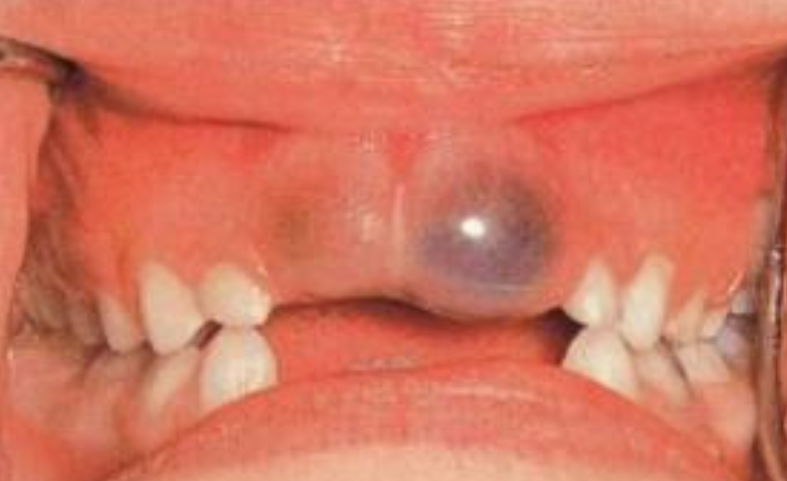
| Odontogenic Keratocyst cyst (OKC)| dental lamina rest| 下顎骨後端，下齒槽管上方|10-40y |組生齒(40%) 
|^|^|^|^|PCNA (proliferating cell nuclear antigen),<br> Ki-67, <br> Gorlin Syndrome 
|^|^|^|^| Radiolucent、<br> MD方向下顎骨吸收，但牙根完整。 
|^|^|^|^|4-8 層、副角化(有核)、Basal cell 為 palisaded(柵狀)
|^|^|^|^|高復發 (30%)
| <p style="color:DeepSkyBlue">Orthokeratinized Odontogenic cyst (OOC)</p>|-|下顎後牙|年輕人| 阻生齒 (66%)、 <br> granule layer 明顯 、<br> 生長慢
| Gingival Cyst of the newborn | dental lamina rest | 新生兒上顎牙齦   |-| 管腔內含有角質碎屑(keratinaceous debris) 
| Gingival Cyst of the adult (LPC 長出來)| ^| 下顎premolar、canine facial 牙齦| 40-60y| 藍色(bluish)、藍灰色(DeepSkyBlue-gray) 
|^|^|^|^| focal plaques|
|^|^|^|^| focal plaques|
|Lateral Periodontal (LPC) | ^|  下顎 premolar、canine、lateral incisor lateral root 表面| 40-70y | ^|
|^|^|^|^|類似 OKC，但推開牙齒 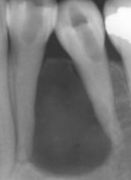|
| Botryoid Odontogenic Cyst (BOC)| 多囊 LPC
|Calcifying Odontogenic Cyst <br> ( Gorlin Cyst, COC)|- |前牙(65%) | 20-40y<br> 若有 odontoma，17y 發病| 未萌發的牙齒(33%)、 阻生齒(66%)
|^|^|^|^| basal cell reverse polarity 
|^|^|^|^| ghost cells (嗜酸無核) 
|^|^|^|^| &beta; catenine + |
| Peripheral Calcifying Odontogenic Cyst|COC 長出來 |-|60-80y |.|
|Glandular Odontogenic Cyst (GOC)|-|下顎前牙|46-51y| 跨中線、無 MAML2|
|^|^|^|^| 復發、侵犯性，吃 cortical bone 
|^|^|^|^| 杯狀細胞, cilia, focal plaques
  
  
  
  
  
  
!!! note Gorlin syndrome
    - SUFU 也可能造成
    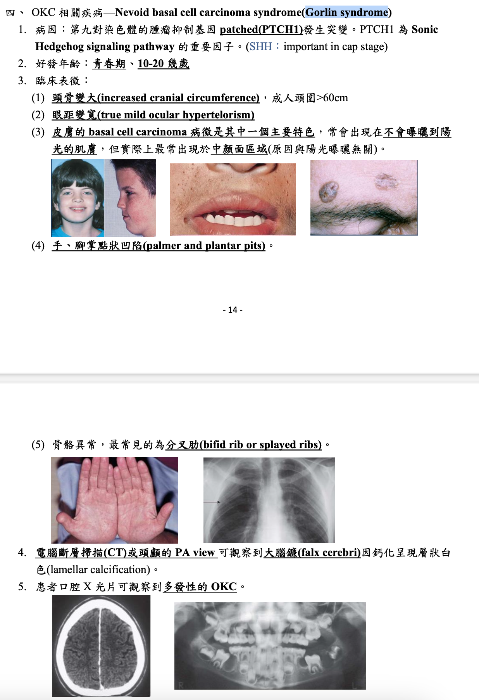
  
  
  
  
  
  

  
  
  
==MAL2 讓 MEC 預後好==
  
  
###  發炎型
  
  
| |原因|好發| 年齡 |特徵
|-|-|-|-|-|
|Periapical(radicular) cysts| Rest of  Malassez 被刺激|-|-|true/ periapical cyst <br> 圓形的光通性==包圍根尖==|
|^|^|^|^| 牙根吸收, 2cm &uarr; 根管治療無效  |
| Buccal Bifurcation Cyst| 36, 46 Buccal (兩側 1/3)| 5-13y | -|腫脹，推牙根 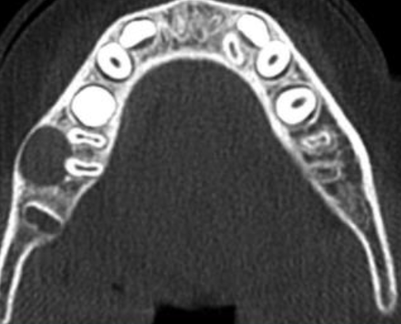 |
  
  
  
  
  
Rest of Malassez
: Hertwig's epithelial 殘留
  
Rushton bodies
: 齒源系上皮
  
  
  
  
  
##  Non- Odontogenic
  
| |原因|好發| 年齡 |特徵|
|-|-|-|-|-|
| Palatal Cysts of the Newborn | Epstin’s pearl &rarr; 融合線的上皮 | 中腭裂(前)、多發性| -| <details><summary>白色或黃白色, 角化, 不需治療</summary> 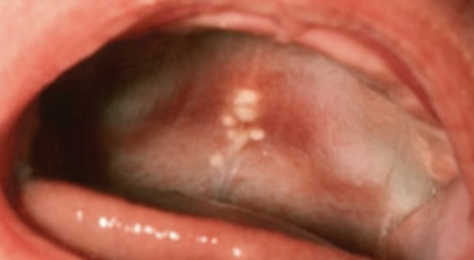</details>
|^| Bohn nodules &rarr; 小唾液腺 | 散佈在硬腭軟顎的交界(後)、多發性|^|^
| <p style="color:red">Nasolabial Cyst </p>| <details><summary>融合線</summary></details> | 上唇中線旁(外側)，軟組織內 | 40-50y| 不痛 |
|^|^|^|^|   <details><summary>纖毛上皮, goblet cells, 附近有肌肉</summary></details>|
|^|^|^|^| <details><summary>facial depression</summary> </details> 
|<p style="color:DeepSkyBlue">Nasopalatine duct cyst </p>| Nasopalatine duct 上皮的殘留 | 顎部前 |==40-60y== | <details><summary>藍</summary></details>|
|^|^|^|^|  <details><summary>牙根吸收</summary>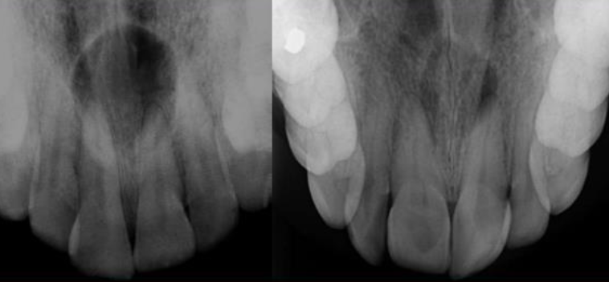</details>|
|^|^|^|^| 多種上皮, cilia, goblet cell, 神經和血管可見|
|<p style="color:DeepSkyBlue">Incisive canal cyst </p>| NDC 特例| <details><summary>Incisive papilla 內</summary></details> |^ | &phi; < 6mm |
| Median palatal cyst | lateral palatal shelves 融合時將上皮困住 | palatine papilla 後硬顎中線 | 年輕 | 表面是多層鱗狀上皮 |
|^|^|^|^| <details><summary>無神經、血管、cilia、goblet cell</summary> </details>|
| <p style="color:DeepSkyBlue">Epidermoid Cyst (Infundibular cyst)  </p>| trauma|-| 青春期後|  <details><summary>凹陷</summary> </details>
|^|^|^|^| ==正角化上皮==，爆開會被當異物 &rarr; granuloma
|^| Gorlin syndrome| 多發性 | ^| ^|
|^|Gardner syndrome| ^ | 青春期前| ^|
|Milia |-|類似 Epidermoid Cyst |-| 小、黃或白、充滿keratin  |
|^|^|^|^| 位於 Superficial dermis|
|<p style="color:red">Pilar (Trichilemmal) cysts <br>毛髮囊腫</p>| -|頭皮 (90%)、多發性(70%)|-|無凹陷開口|
|^|^|^|^|  <details><summary>cholesterol clefts(90%), 淡染,  無 granular layer</summary>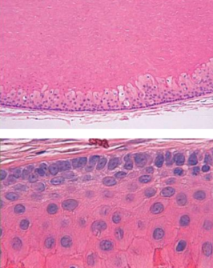</details>|
|^|^|^|^| 破裂 &rarr; 發炎細胞湧入 cyst &rarr; secondary inflammation
| Dermoid Cyst | Teratoma| 口底中線|兒童、年輕| 多個 germ layer| 
|^|^|^|^|  <details><summary>正角化上皮, Cyst Wall 有皮膚附屬物(皮脂腺細胞核居中)</summary>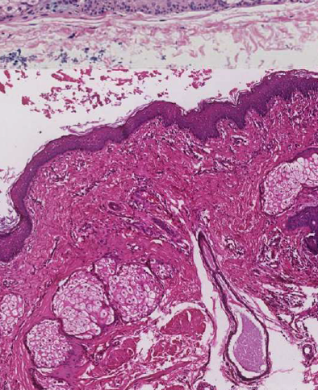</details>|
| Thyroglossal Duct Cyst <br> 甲狀舌管囊腫 | 甲狀腺殘留 | 脖子中線上、舌骨下(75%) |20y &darr; (40%) | <details><summary>Cyst wall 上有 Thyroid follicle </summary></details> |
| Branchial Cleft Cyst <br> (cervical lymphoepithelial cyst，鰓裂囊) | branchial arches 殘留 (2^nd^，95%)| <details><summary>SCM 前/下</summary></details>| 10 - 40y| 複層鱗狀、淋巴、發中心(germinal center)。
| Oral Lymphoepithelial Cyst | 上皮內陷(invagination)淋巴 &rarr; keratin debris | Waldeyer ring, 口底, 舌腹, 軟顎| 年輕人 |  <details><summary>&phi;<1cm 的黏膜下黃白色腫塊</summary></details>
|^|^| 單發&rarr;發育 <br> 多發&rarr;HIV |^|<details><summary>不含rete ridges, 角化不全並脫落填滿空腔, 淋巴組織包圍 </summary></details>|
  
  
  
Gardner syndrome 
: APC基因突變，β catenin 分解不掉 &rarr; 上皮增生 [Wnt 相關](../國考/口胚整理.html#wnt )
  
  
  
!!! info 魏氏環(Waldeyer ring)
    - 顎扁桃(palatine tonsils)
    - 舌扁桃(lingual tonsils)
    - 咽部腺樣體(pharyngeal adenoids)
  
  
  
  
  
  
##  Pseudocyst
  
  
| |原因|好發| 年齡 |特徵|
|-|-|-|-|-|
| Mucocele| 唾腺導管破裂，黏液灑入周遭的軟組織間隙 | 下唇中線旁(易咬到)| 常見 | 透明藍色, 波動感(fluctuant), 高復發  |
|^|^|^|^|發炎，granulation tissue 包圍黏液 |
| Ranula 蛤蟆腫 | 口底、和舌下腺有關的 Mucocele|-|
|<p style="color: DeepSkyBlue;"> Stafne Defect (Stafne Bone Cyst ，骨內囊腫)</p> | 唾液腺擠壓 cortical bone &rarr; x-ray 透光 |後側 mandibular canal | 中年 | 大小固定，邊界明顯 |
| Simple Bone Cyst<br> 單純性骨囊腫 | 空()或液體骨腔 | 肱骨、 股骨近端、 下顎後牙、 下顎聯合區| 年輕人 | 少疼痛、皮膚感覺異常|
|^|^|^|^| 不須積極治療，復發率低 <br> (例外: cementoosseous dysplasia)|
|^|^|^|^| 侵犯牙根之間區域，不影響鄰牙，近遠心擴張 |
| Aneurysmal Bone Cyst <br> 動脈瘤性骨囊腫|==大小不等==骨內堆積被纖維結締組織和活性骨包圍，並充滿血液| 長骨或脊椎骨、 下顎(2%)後牙  | 30y &darr; | 骨頭腫得快，可能多房，邊界不一定完整 
|^|^|^|^| Granulation tissue: 巨噬細胞蝕骨  |
  
  
  
##  整理 
  
  

  
> - COC 在前區
  

> - BOC = 多囊 LPC &rarr; 在 premolar
> - Slaodontogenic Cyst (GOC) 在前牙跨中線
  
  
  
  
  
  
| 男性較多                                                                                                                                                                                                                                  | 女性較多                                                                       |
|---------------------------------------------------------------------------------------------------------------------------------------------------------------------------------------------------------------------------------------|----------------------------------------------------------------------------|
| OOC <br>odontogenic carcinoma<br>NDC <br> EC<br>Stafne Defect <br> Simple Bone Cyst 長骨型 | Nasolabial Cyst <br> Gardner syndrome <br>Pilar cysts |
  
  
  
| 必定伴隨阻生牙           | 可能伴隨阻生牙                                                                                                                                                                      | 一定不伴隨阻生牙                 |
|-------------------|------------------------------------------------------------------------------------------------------------------------------------------------------------------------------|--------------------------|
| DC  | OKC(40%) <br> OOC (66%) <br> COC(33%機率) <br> Adenomatoid odontogenic tumor (66%機率) | LPC |
  
  
| 牙根吸收                                                  | 牙根不太吸收                                               |
|-------------------------------------------------------|------------------------------------------------------|
| DC  <br> RC | OKC <br> LPC  |
  
  
| 正角化上皮                                                                               | 不完全角化上皮                                                | 非角化上皮                                                                                                 |
|-------------------------------------------------------------------------------------|--------------------------------------------------------|-------------------------------------------------------------------------------------------------------|
| OOC <br> EC  <br> Dermoid cyst | OKC <br> Oral Lymphoepithelial Cyst  | DC  <br> LPC  <br> GOC |
  
| 單房 Unilocular                                                                                                            | 多房 Multilocular                                                    |
|--------------------------------------------------------------------------------------------------------------------------|--------------------------------------------------------------------|
| OOC <br> COC <br> Simple Bone Cyst | GOC <br> Ameloblastoma |
  
  
  
  
#  Epithelial tumors of oral aspect I 
  
  
  
##  HPV 
  
  
  
|lesion |type|
|-|-|
focal epithelial hyperplasia|13、32
  
  
| Low-risk | High-risk |
|-|-|
|良 |惡|
| episomal form | integrated form |
  
- E6 &rarr; p53, E7 &rarr; RB
  
  
  
  
!!! info episomal v.s. integrated form
    
  
  
  
  
  
|變異名稱 |風險|位置|症狀、特徵||||
|-|-|-|-|-|-|-|-|
|papilloma <br>(6, 11)| 30~50y |軟顎、口腔常見 |單發、低傳染|
|^|^| ^|pedunculated, sessile(少)  |
|^|^|^| stratified squamous epi. 包結締組織 <br> hyperparakeratosis (有核、顆粒層缺失) 
| Verruca vulgaris <br>尋常疣 <br>(2, 4) | -|皮膚、口腔(少見、自傳染) |大多是sessile(無梗)| 
|^|^|^| <ul> <li>hyperparakeratosis 但 granular layer 明顯 &rarr; coarse keratohyalin granules</li> <li>"cupping" effect: rete ridges 往 lesion 中心 </li> </ul> 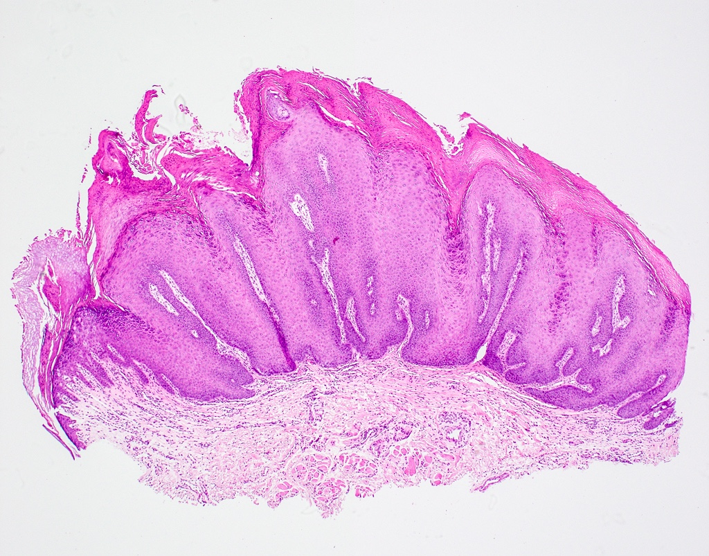
|^|^|^| 小孩身上有機會自行痊癒，治療需要 basal layer 清乾淨
| Condyloma acuminatum <br> 尖銳濕疣 |-|<ul> <li>口內: 6, 11</li> <li>肛門: 16, 18</li> </ul>| 多顆、界線清楚、無痛  
|^|^|^| papillary 突起不明顯、Koilocytes (空亮、葡萄乾核)  |
|<p style="color: red;"> Multifocal epithelial hyperplasia (Heck's disease，<br> 13, 32)</p>|低社經、HIV| 唇、頰、舌 | 小、軟、多、無痛|
|^|^|^| **Papillomatous variant** <ul> <li>舌、attached gingiva</li> </ul>  || **Papulonodular** <ul> <li>常見 </li> <li>扁平</li> </ul>  |
|^|^|^| <ul> <li>acanthosis: spinous layer (棘狀層) 增生</li> <li>rete ridge 寬扁</li> <li>Koliofcyte</li> </ul> 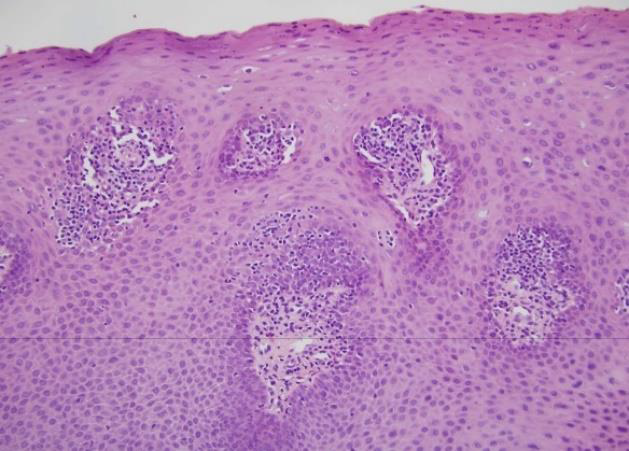 |


# Salivary Disease 

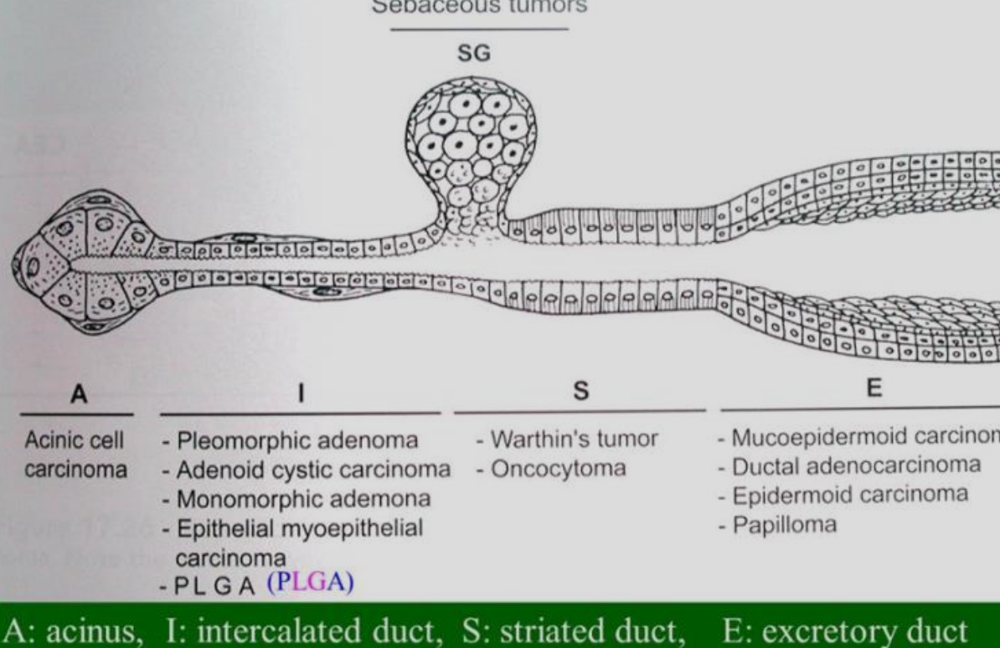


|名稱 ||原因|位置|年齡|症狀、特徵||||
|-|-|-|-|-|-|-|-|-|
|Ranula (口底 Mucocele) | mucous extravasation | Duct 破| 下唇小唾液腺|-| \oneline{
- 發炎 &rarr; Foamy cell 
}


#  Odontogenic Tumor 
  
  
##  Ameloblastoma
  
  
- 有著 reverse polarity 現象
- 分成
  - 多囊腫型(conventional solid or multicystic intraosseous) 
  - 單一囊腫型(unicystic ameloblastoma)
  - 骨外囊腫型(peripheral/extraosseous)


#  Anomalies 
  
  
  
- 症候群相關
  - PITX-2 
  - SHH 
  - PAX-9
  
Neonatal ring
: 胎兒期與出生後期牙齒發育中的交界
  
##  發育型
  
  
|變異名稱| 好發位置|| 好發族群| 成因 | 症狀 |其他
|-|-|-|-|-|-|-|-|
|Turner hypoplasia|Crown & Root|<ul><li>**Trauma** : 上顎正中門牙, Facial (Avulsion, intrusive luxation)</li><li> **Caries**: 小臼齒</li></ul>| <ul> <li>**Crown**: 1.5-3y</li><li>**Root**: 4-5y</li></ul>|發炎 (乳牙 Caries, trauma) 影響恆牙發育 |局部或整個牙冠白、黃或棕色發育不全 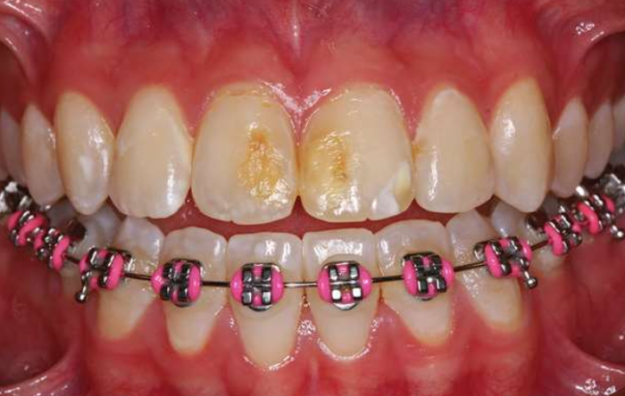|	
|^|^|^|^|^| 無明顯邊界|
|Molar-Incisor Hypomineralization (MIH)|Crown|單或多個恆牙下顎 1^st^Molar (可能影響 Incisor) |-| **乳牙**: 產前母體疾病、藥物、早產 <br> **恆牙**: 幼兒期疾病(fever, asthma, pneumonia)| 局部白、黃或棕色發育不全，可能多孔凹陷<br> | CPPACP: 重新鈣化，降敏
|^|^|^|^|^| 有明顯邊界|^|
|^|^|^|^|^| 痛 (27.4%)|^|
| Molar Root-Incisor Malformation (MRIM, MIM) |Crown & Root|單個恆牙下顎 1^st^Molar (可能影響 Incisor) |3y (1^st^ Molar root)|非遺傳，可能和神經疾病( seizures, meningitis)相關|短窄尖牙根，牙冠相對正常|
|^|^|^|^|^| Chamber 變矮，異位礦化(ectopic mineralized ) 
|^|^|^|^|^| 常見疼痛|
|^|^|^|^|^| 1^st^ Molar 拔除|
|Hypoplasia Caused by Antineoplastic Therapy| Root & Crown | -| 12y&darr; (Common) <br> 5y&darr; (Extensive)| 放射線(4gy: 畸形，30gy: 發育停止)、化療 | 小牙症 (microdontia, 3y&darr; 暴露)
|^|^|^|^|^|發育不全 (hypodontia)
|^|^|^|^|^|V-shaped hypoplastic roots
|^|^|^|^|^|enamel hypoplasia
|^|^|^|^|^|下顎垂直發育減少
|Dental Fluorosis |Crown |兩側同時，對稱性|上顎 Incisor 在 3y 發育完成，需重點監測|氟結合 Amelogenin |琺瑯質白色區域(white, chalky areas)，無光澤，不透明
|^|^|^|^|^| 可能有黃色至深棕色區域(mottled enamel)
|Syphilitic Hypoplasia (Congenital syphilis)|Crown| ALL | - | 先天梅毒 | **Screwdriver-shaped incisors**: Incisor 切端收縮，中間 1/3 最寬 (必要)
|^|^|^|^|^| Incisor 切端中間發育不全切跡 (central hypoplastic notch)
|^|^|^|^|^| 桑椹臼齒(mulberry molars)
  
##  發育後
  
  
  
  
|變異名稱| 好發位置|| 好發族群| 成因 | 症狀 |其他
|-|-|-|-|-|-|-|-|
|Attrition| Crown| Occlusal, incisor edge|-|磨牙, Deep bite, Cross bite | 敏感。雖然會 Pulp exposure 但 reparative secondary dentin 填充 pulp chamber，較少疼痛| 
|Abrasion|^|非慣用手頰側齒頸 | - | 刷牙| 齒頸水平 notch
|^|^| 鄰接面 |^| 牙籤、牙線| 鄰接面半月形
|^|^| 犬齒、小臼齒 |^| 咬螺絲、菸斗| O, V 型缺口|
|Erosion| ^ | **唾液較少處:** 上顎前牙, 下顎後牙 Occlusal& Facial| **唾液腺功能衰退**: salivary gland aplasia, 脫水(dehydration) , 放射治療, Sjögren syndrome, DM, 神經性貪食症(bulimia nervosa) | 酸性侵蝕 | Dentin exposure，周圍 Enamel 白圈高起 (侵蝕抗性差異)
|^|^|^|^|^|上顎門牙齒頸湯齒狀凹陷|
|^|^|^|^|^|金屬補綴物邊緣暴露|
|^|^|^| **胃酸**: perimolysis|^|^|
|Abfraction |^| 後牙Facial, 單顆齒頸1/3 | - | 咬合力| V 形尖銳缺口，可能延伸到牙齦下。 
|^|^|^|^|^| Tertiary dentin 修復，較少疼痛
|Internal Resorption |Root|少見||**發炎吸收:** 肉芽組織取代 Dentin|無症狀，發炎則疼痛。 <br> Pulp 紅色透出。 <br>   X-ray 下 balloon-like dilation of the canal。 |
|^ |^|^|^|**替代或化生吸收 (replacement or metaplastic resorption )**: Bone, cementum 取代 Dentin|^|
|External Resorption|^|常見|| 發炎| Root 變短，根尖不規則。妥善治療則一年內痊癒。 
|^|^|^|| ^| PDL, 根尖周圍 lamina dura 消失或模糊
|^|^|^|| ^| 妥善治療則一年內痊癒
|^|^| 上顎門牙 (移動距離長)| 矯正| | 根尖圓形。 
|^|^| -|| **其他外部壓力:** 阻生齒、腫瘤、Cysts | 根據受力位置、形狀
|^|^| -||嚴重 luxation, avulsion 導致 PDL 死亡| 牙齒視為異物，外吸收並骨取代|
|^|^|齒頸 cementum|Invasive cervical resorption (三顆牙以上 &rarr; multiple idiopathic cervical root resorption )|-| 沿著齒頸一圈吸收，不太影響 pulp|
|^| 遺傳 (如 IL-1B allele) 可能導致外吸收。未萌發牙冠可能發生外吸收|
  
  
