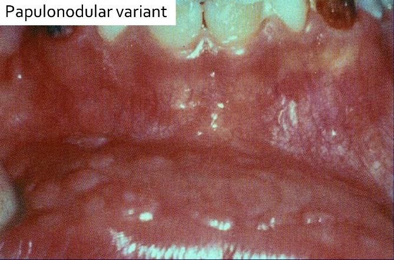

---
toc:
    depth_from: 1
    depth_to: 3
html:
    offline: false
    embed_local_images: false #嵌入base64圖片
print_background: true
export_on_save:
    html: true
---
# Epithelial tumors 

## HPV 

|lesion |type|
|-|-|
focal epithelial hyperplasia|13、32

| Low-risk | High-risk |
|-|-|
|良 |惡|
| episomal form | integrated form |

- E6 &rarr; p53, E7 &rarr; RB

:::info {episomal v.s. integrated form}

:::

|變異名稱 |風險/ 原因|位置|症狀、特徵||||
|-|-|-|-|-|-|-|-|
|papilloma  (6, 11)| 30~50y |軟顎、口腔常見 |單發、低傳染|
|^|^| ^|pedunculated, sessile(少)  |
|^|^|^| stratified squamous epi. 包結締組織   hyperparakeratosis (有核、顆粒層缺失) 
| Verruca vulgaris  尋常疣  (2, 4) | -|皮膚、口腔(少見、接觸、自傳染) |大多是sessile(無梗)| 
|^|^|^| \oneline{
- hyperparakeratosis 但 granular layer 明顯 &rarr; coarse keratohyalin granules
- "cupping" effect: rete ridges 往 lesion 中心 

}
|^|^|^| 小孩身上有機會自行痊癒，治療需要 basal layer 清乾淨
| Condyloma acuminatum   尖銳濕疣 |-|\oneline{ 
- 口內: 6, 11
- 肛門: 16, 18
}| 多顆、界線清楚、無痛、兒童有機會自愈
|^|^|^| 廣底、papillary 突起不明顯、Koilocytes (空亮、葡萄乾核)  |
|\style[color: red;]{ Multifocal epithelial hyperplasia (Heck's disease，  13, 32)}|低社經、HIV| 唇、頰、舌 | 小、軟、多、無痛|
|^|^|^| \oneline{ 
**Papillomatous variant**
  - 舌、attached gingiva

} || \oneline{
**Papulonodular** 
- 常見 
- 扁平

} |
|^|^|^| \oneline{
- acanthosis: spinous layer (棘狀層) 增生
- rete ridge 寬扁，深度差不多
- Connective tissue 發炎細胞浸潤
- Koliofcyte
- mitosoid cells (spinous cell 之間，彷彿在分裂)

} |
Verruciform xanthoma (非 HPV)|Leasion 旁，異常免疫反應 |口腔 > 皮膚 > 性器 | 油脂撐起 epi. 形成 Verruciform。非 Metabolic  |
|^|^|^|\oneline{
- parakeratin plugging: parakeratin layer 增厚 &rarr; 細菌發炎
- 結締組織空亮 (foamy histocytes)

}

xanthoma
: 吃了油脂的 Macrophage 細胞，CD63+, CD68+, CD163+ IHC8+，diastase-PAS染色+

:::info {diastase-PAS}
- diastase: 澱粉酶
- PAS: Periodic Acid-Schiff stain
- 過碘酸氧化 OH 成 =O，Schiff 染
:::

## Melanotic lesions  

### 色素增加
|名稱| 單發? |風險/位置 || 特徵 ||
|-|-|-|-|-|-|-|-|
|\style[color: red;]{Oral melanotic Macules}|  單 | 下唇朱紅區(vermilion zone, 33%), Buccal mucosa, gingiva, palate||表面平坦、棕黑色、邊界清楚、&phi;<5mm |
|^|^|^|^| 不須治療，但不易和 Oral melanoma 分辨 &rarr; 燒毀! |
|^|^|^|^| **黑色素失禁(melanin incontinence):**   basal cell 可能破損 &rarr; macrophage 於 CT 吞噬 &rarr; ==melanophage== |||
| Physiologic Pigmentation (生理性)  | 多 | 黑人|| - |
| Chronic irritation (慢性刺激) |^|\oneline{
- 常咬到的頰側
- 類天皰瘡(pemphigoid)
- Smoker’s melanosis
- 多氯聯苯(PCB)汙染
}|| |
|Syndromes or Diseases Associated |^|\oneline{
1. Peutz-Jeghers syndrome
2. Addison’s disease
3. Neurofibromatosis
4. McCune-Albright syndrome
}|
| Drug-induced |^|==奎寧(chloroquine)==, palate|| 左右沒有完全對稱  |
|^|^|^|^| melanin堆積，確診直接 Bleaching |

:::info { 一些名詞}

:::

#### Peutz-Jeghers syndrome 
- 體染色體顯性
- STK11/LKB1 
- peri-oral跟oral cavity會出現很多pigment
- 惡化腸道癌症intestinal cancer 15被 &rarr; 預防性切腸子

:::left

:::right

:::

#### Addison’s disease 

- 腎上腺 &darr; &rarr; cortisol &darr; &rarr; ACTH&uarr; &rarr; &alpha;-MSH &rarr; malannin
- 面色黯淡 
- 到處都黑色素沉澱

#### Neurofibromatosis

- cafe-au-lait spots disease (咖啡牛奶斑)
- neurofibroma (神經纖維瘤)

#### McCune-Albright syndrome (Albright’s syndrome)

- 咖啡牛奶斑
- 遺傳性疾病
- 多骨性纖維發育不良(Polyostotic Fibrous Dysplasia)

:::info {咖啡牛奶斑}

:::

### Naevus 

- Naevus cell 無 Dendrites
- 位置: 
  - 先天: 四肢，口內少見

  - 後天: ==NRAS(大 lesion，6%)==, BRAF(小 lesion，80%) mutation (3.~5.是一個漸進的過程)

#### \style[color:red ;]{Intraoral melanocytic Nevus}

- 後天，口內，最常見
- 位置: Palate,mucobuccal fold, orgingiva
- BRAF 
- 35y

#### \style[color:red ;]{Blue nevus} 
- 後天，口內，次常見
- 位置: Palate
- GNAQ mutation

#### 組織
- Cell 分三類： 
  - A: Epithelioid (在 epi)
  - B: Lymphocyte-like 
  - Spindle-shaped

- Compound (在 epi., dermis 之間) 或 Intradermal
  - 只有 Junctional 會呈現 Tear-like Nest
- Indian-file pattern: 鑽進 Dermis 排成一排

- 深層可能圍皮膚附屬物、神經

### Melanoma (惡)
>可以從 Melano cell, Naevus 轉過來，多變，甚至可以沒有 Pigmentation

- ABCDE
  - Asymmetry
  - Border irregularity
  - Colot veruegation
  - Diameter >6mm
  - Evolving
- Horizontal phase(Radial) &rarr; Vertical phase (Invasive)
- 染色: 
  - S100
  - HBM-45, Mitf: Spindle-shaped cells
  - MART-1 (Melan-A): Epithelioid
   
- **Cutaneous melanoma**
  - 第三常見(<5%)的皮膚癌，但卻是皮膚癌中致死率最高的(75%)(第一常見為basal cell carcinoma，第二為SCC)
  - 主因為 UV
  - `GLA:` 白人成人，中年(45-84歲，平均61歲)
  - `GENE:`
    - CDKN2A, CDK4 mutation
    - BRAF, NRAs
- **\style[color: Deepskyblue;]{Oral mucosal melanoma}**
  - 原因不明
  - ==壞透了，直接 T3==
  - 佔 melanoma <1%
  - `GLA:` 男性，hard palate or maxillary alveolus，50-70y
  - `GENE:` Kit (CD117) 

| 類型 |好發|特徵|||
|-|-|-|-|-|
|Superficial Spreading (Pagetoid) - |\oneline{
- 男性: 兩肩胛骨間
- 女性: 小腿後方
}| \oneline{
- 連續 ridge 都有 nest 
- ==Pagetoid spread, Paget’s disease==: single tumor cell浸潤於表面上皮的上層

:::fbox 

:::

}|
| Nodular - | | 無 Radial phase，直接往下侵犯|
| Lentigo maligna|中臉(陽光曝曬)|\oneline{
- 生長慢，Radial growth平均15年
- Lamina propia 沒啥細胞，嗜鹼

}|
| Lentigo maligna - || Lentigo malign 侵犯 |
| Acral Lentiginous - |oral melanoma中最常見的類型 | \oneline{
- 黑人最常見的melanoma
- oral melanoma中最常見的類型
}
|^|^|\oneline{
- 在指甲下面 (無毛)
- 上皮增生，rete ridge 變長
- Junctional nest
}

Acral
: 肢端

## Oral potentially malignant disorders (OPMD)

>煙、酒、檳榔

- 好發: lateral/ventral tongue、floor of mouth

| 名稱 |  原因 ||特徵||
|-|-|-|-|-|-|-|
|Oral submucous fiberosis | Arecoline (檳榔鹼)|| \oneline{ 
- &rarr; SCC 
- hyperkeratosis 或 parakeratosis，上皮變薄。
- Collagen fiber 最深侵犯肌肉層
- 無法復原
} |
Leukoplakia, Erythroplakia |紅斑較嚴重，不產生角質 ||\oneline{
- 白色的多為 hyperkeratosis &rarr; 用排除法診斷
- verrucous 高風險
- 女性 maligant transformation rate 高
} |
|^|^|^| .
| \style[color: red;]{ Poliferative verrucous leukoplakia (pbl) }|  ？ || \oneline{
- 女，gingiva/alveolar gingiva，66.8y
- 菸酒檳榔無關
- 不切掉高機率癌化
- 多發性

}|
|^|^|^| \oneline{
- Sharp 分化改變
- bulbous rete ridge &rarr; 延長
- exophytic, endophytic growth, cyst 充滿 keratin

}

### Oral epithelial dysplasia (OED)
> OED &in; OMPD 

- 硬顎較少發生。
- 分為三個程度

#### Mild
- 影響到下三分之一
- Basal cell 增生，變大
- Rete ridge 變寬
- 底層 keratin (紅染)
- 可能發炎

#### Moderate
- 到中三分之一

#### Sever 

## Oral Squamous Cell Carcunoma(OSCC)
- 徵兆: OMPD
- 好發: lateral/ventral tongue, floor of mouth 
  - 檳榔: Tongue
- `GENT:`
  - TP53: 抑癌基因，沒有藥物
  - PIK3CA: 致癌基因，有標靶藥物
- 紅白斑，凸起

### 分級 
> 根據和正常上皮的相似度及產生的 keratin 多寡來分級

1. Grade I, well-differentiated: 產生正常量的 keratin
2. Grade II, moderately-differentiated: 產生少量的 keratin
3. Grade III, poorly-differentiated: 幾乎不產生 keratin

Grading 的判斷較為主觀,[staging](#oscc-staging) 和預後(prognosis)的相關性比 grading 高很多。

## Verrucous Carcinoma(VC) 
- Ackerman’s tumor
- 分化良好，不會鑽，用推的(Pushing) &rarr; 侵犯稍差 
- HPV 低相關
- 四周可能有 SCC(20%)

## Oropharyngeal Cancer

==Staging > Grading==

|   特徵    | HPV(+) |                  HPV(-)                  |
|---------|--------|------------------------------------------|
|  發生率趨勢  |   增加   |                    減少                    |
|   年紀    |55-58y |                   + 3 ~ 4 y                    |
|  危險因子   |多重性伴侶、抽菸|                  抽菸、酒精                   |
|分期(stage)| \oneline{
- Small primary
- large nodal
- metastases } | Variable|
來源 | 顎和舌扁桃腺的隱窩上皮 (crypt epithelium) |表層上皮 (surface epithelium)|
|癌前病變 | 難偵測 | Squamous dysplasia |
| 主要型態 | nonkeratinizing SCC | keratinizing SCC|
|分級(grading) | &cross; |&check; |
| p16 IHC | +|-|
|存活率 |較好 |較差|

### \style[color: Deepskyblue;]{ HPV-associated oropharyngeal squamous cell CA (OPSCC)}

- 常常病人來的時候都已經轉移到頸部淋巴，頸部淋巴結通常不會痛
- HPV type 16 (90%)
  - p16 IHC (免疫螢光染色)，若 70%細胞核、值都呈現染色即確診 (==口咽 only==)

- Risk:  \style[color: Deepskyblue;]{性行為}
- GLA: 4:1, -, 55-58y
- 組織 
  - nonkeratinizing SCC

## 整理 

### Verruciform xanthoma 相關疾病

> 與皮膚、黏膜破壞相關的Immune disease、precancerous disease

- 扁平苔癬(lichen planus)
- 疱瘡(pemphigus vulgaris)
- 紅斑性狼瘡(lupus erythematosus)
- 移植相關疾病(graft-versus-host disease(gvhd))
- 大皰性表皮鬆懈(epidermolysis bullosa俗稱泡泡龍症)
- 上皮病變(epithelial dysplasia)
- 鱗狀細胞癌(squamous cell carcinoma)
- 疣狀角化不良瘤(warty dyskeratoma)。

### TNM staging 

- Tumor: 原發性腫瘤(primary tumor)的大小和侵犯範圍
  - 大小(cm)
  - 深度 (DOI，mm)
  - `TX`: 無法評估
  - `Tis`: carcinoma in situ
- Lymph Node: 擴散至區域淋巴結的程度
  - 轉移的淋巴結顆數、大小(cm)、同/對/雙側(ipsi-, contra-, bi-)
  - extranodal extension (ENE，淋巴結外擴散)
    - `Minor`: 擴散< 2 mm
    - `Major`: 擴散> 2 mm
    - `NX`: 淋巴結無法被評估
- distant Metastasis? `M1` : `M0`

:::note

:::

#### OSCC staging 

- T

DOI(mm) \ size(cm) | < 2 |2~4 | > 4|
|-|-|-|-|
< 5 | T1 |T2| T3
5~10 |T2 |T2| T3
>10 |? |T3| T3

- N

|N|淋巴結|| 大小 |ENE|
|-|-|-|-|-|
1| 單|同 | &leq; 3 cm |&cross;|
2a|^|^| 3-6 cm | ^|
2b|多|^| &leq; 6cm|^|
2c|-| 對/雙| ^| ^|
3a| - |-| > 6 cm |^|
3b| - |-| - | &check;|

- Staging 

