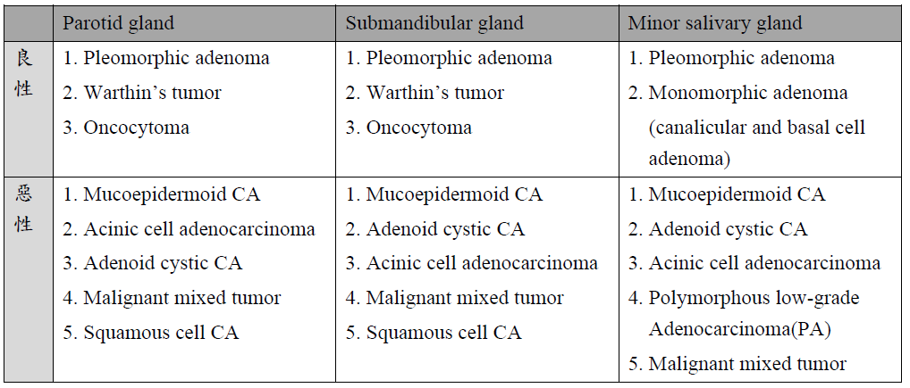

---
toc:
    depth_from: 1
    depth_to: 3
html:
    offline: false
    embed_local_images: false #嵌入base64圖片
print_background: true
export_on_save:
    html: true
---

# 唾液腺疾病 

## Cyst, 增生, 壞死 
|||原因|好發| 年齡 |特徵|||
|-|-|-|-|-|-|-|-|
| Mucocele/Ranula (口底)| mucous extravasation |Duct 破 | 下唇 | Youth| \oneline{
- 發炎 &rarr; Foamy cell
- 藍色腫 
 
}|
|^| mucus retention cyst | Duct 阻塞 |-| 較老 | \oneline{
- true cyst 
- 少發炎 (close)

}|
| Maxillary sinus lesion | pseudocyst | 創傷、發炎導致膿液堆積在 CT |-|-| \oneline{
- 單側，界線清楚，均值半球
- 自行破裂，不用治療。
  
}
|^|retention cyst| 黏液腺分泌受阻 | -|-| cystic lesion 充滿黏液、少發炎 |
|^|\style[color: DeepSkyBlue;]{Post Operative Maxillary Cyst }|  相關手術後併發症，granulation tissue 陷入粘膜|-|\style[color: DeepSkyBlue;]{術後長時間 & 30-50y}| \oneline{
- ==腫痛==
}
|\style[color: DeepSkyBlue;]{ Necrotizing sialometaplasia (壞死性涎腺變生)} || 缺血 &rarr; 局部破壞性發炎: 局部麻醉劑(Dental injection) 、不合的假牙 | 軟硬顎連接處、小唾液腺 |-| \oneline{
- 火山口狀潰瘍，不太痛 (與潰瘍大小不成比例) 
- 5-6 週自己會好，持續 2 週懷疑惡性

}｜
|^|^|^|^|^| \oneline{
- Duct 鱗狀化生 (Squamous metaplasia, ~SCC)
- 腺泡壞死(acinar necrosis)
- 小葉結構完整
- 無細胞異生 (no cytologic atypia) 

}|
|Adenomatoid hyperplasia^罕^|| 不明 | -|40-60y|\oneline{
- 局部腫脹
- 腺泡(acini)、小葉(lobule)變多變大，但型態正常
- 無發炎浸潤 
} | 
| Oncocytosis   瘤細胞增多症|| oncocyte 在唾液腺裡面一區一區的增生 | Parotid g. | 老人 |\oneline{
- 不會malignant change，預後良好

} 

## Sialadenitis

|||原因|好發| 年齡 |特徵|||
|-|-|-|-|-|-|-|-|
|Sialadenitis| Mumps |-|-|Youth|\oneline{
- 雙側，初期不對稱
}
|^| Acute Bacterial ~ |S.aureus,  S.viridans,  S. pneumoniae||-|\oneline{
- 表淺，疼痛，紅斑
- 低燒，有 Pus  

}
|^|Chronic| Duct 阻塞 | -|
|^| Subacute Necrotizing ~ (亞急性壞死性)|-|Palate|Youth|\oneline{
- 多種發炎 
- Acinar cell 消失 
- Duct squamous metaplasia 
- 兩週自愈 
}
|^|\style[color: DeepSkyBlue;]{Cheilitis Glandularis} | 太陽? | 下唇 |老男 |\oneline{
- Dysplasia: 彈性纖維 (solar elastosis)
- ==&rarr; SCC== (18%-35% )

}|
|^|  Küttner tumor | IgG4-related disease|Submandibular g.|-| \oneline{
- 纖維化，Acini 破壞 
- 淋巴球浸潤
}|
|^| Mikulicz Disease (米庫立茲氏病)| ^|Parotid g.| - |雙側腮腺、淚腺腫大、席紋樣纖維化(storiform-type fibrosis)、淋巴球浸潤 

## 其他 

|||原因|好發| 年齡 |特徵|||
|-|-|-|-|-|-|-|-|
| Sialolithiasis (唾液腺結石症)||和鈣、磷的代謝無關 | Submandibular gland |-|\oneline{
- 單發 
- 用餐 30mins 痛
- 硬、不移動
- 檢測需要 occlusal film 

}| 
|Sialadenosis (Sialosis，唾液腺腫大)||治療效果不好，除非控制住潛在的系統性疾病|
|Sialorrhea (excessive salivation，流涎症)||^|
|Xerostomia (dry mouth，口乾症)||-|||舌乳頭萎縮、鵝口瘡(oral candidiasis), 蛀牙 |
| \style[color: red;]{ Sjogren syndrome} || 慢性、系統性、自體免疫疾病 |腮腺 (85%)|\style[color: red;]{ 中年}|\oneline{
- 口乾症(xerostomia)、乾眼症(xerophthalmia)
- 4 mm的腺體有超過50個lymphocyte 
- HLA-B8(primary), HLA-DR3(primary), HLA-DRw52(secondary)
- 支持療法，40x Lymphoma 
}|

:::info {乾眼症檢測: Schimer test} 
把試紙放在病人眼下5分鐘，觀測溼透的程度是否低於8mm 

|Value(試紙沾濕長度)|Condition|
|-|-|
| >10mm/5min|Normal|
| <5mm/5min |Highly suggestive|
| 0-2mm/5min | Strongly confirm a dry-eye state|

:::

:::info {乾口的檢測}
- Lashley cups測量腮腺流量是否減少
- 下唇小唾液腺切片，觀測每四個小葉中，是否有兩個以上的小葉有不正常的Lymphocytes infiltrate(4mm2區域超過50個lymphocyte)
:::

## Tumor 
- Parotid glands: 發生高，體積大，良性多
- Sublingual glands: 一出現，高機率惡性
- 女性較常見，Warthin tumor 例外 
- 良性: 40-70y；惡性更年長
- 沒有可靠的標準可以在臨床區分出良性及惡性腫瘤

|好發位置| 種類|| age | 特徵|||
|-|-|-|-|-|-|-|-|
Acinus| \style[color:red]{Acinic cell CA } ||-|  \oneline{
- capsule 
- 淋巴結轉移: 8-11%
- 多變的結構及細胞型態: 

}
Intercalated duct| \style[color:red]{Pleomorphic adenoma  (PA, 多型性腺瘤)}\style[color:lightgreen]{^良,1st^} ||30-55y|\oneline{
- 主要來源: 上皮、myoepithelial cell
- 長越久，轉惡機率越大
- 如果幾乎 myoepithelial cell &rarr; myoepithelioma (良)
- 邊界明顯，capsule，但可能沒包好 &rarr; Daughter nodule &rarr; carcinoma ex pleomorphic adenoma

}|
^| \style[color:red]{Malignant mixed tumors} ||^| Carcinoma ex pleomorphic adenoma 
^|\style[color:red]{Adenoid cystic CA}||-|\oneline{
- 好發: minor salivary g.
- 邊緣不完整，易復發
- 大於50%轉移
- `GENE:` MYB-NFIB fusion
- 易有神經侵犯 &rarr; 痛
- CD43(+), CD117(+)
}
^|^||^| \oneline{
- hyalinized or myxoid 的 myoepithelial cell 組成篩狀結構
- Basement membrane 厚
- 可能存在導管(藍箭頭)

}
^|\style[color:red]{Epithelial myoepithelial CA}
^| \style[color:red]{Polymorphous adenocarcinoma} ||老人|\oneline{
- 好發: minor salivary g., Palate(65%)
- 多型態，邊界清楚
- 見神經侵犯
- CD43(+), CD117(+), GFAP(-)
- 預後好
- 微鼓起，中間有ulcer

}
^|\style[color:red]{Monomorphic adenoma\style[color:lightgreen]{^良^}}&darr;
^|\style[color:red]{Canalicular Adenoma}\style[color:lightgreen]{^良^}   小管腺瘤|| 上唇(75%)，70y &uarr; | \oneline{
- 兩條單層柱狀或立方平行排列
- 血管多易出血(high vascularity)
- Cyst  

}
|^|\style[color:red]{Basal cell Adenoma}\style[color:lightgreen]{^良^} 基底細胞腺瘤 ||中老年人| \oneline{
- parotid gland最多(75%)，小唾液腺次之
- 觸診時可以移動
- 具有capsule
- 分四型
}|
|^|^||^| \oneline{
**membranous type**  
- 底層深染
- 一圈厚 hyaline 堆積

}|
^| \style[color: DeepSkyBlue ;]{Salivary duct carcinoma^罕^  (唾液腺管癌)}|| 老人 | \oneline{
- 較惡性
- 通常是parotid gland(可能雙側)
- AR(androgen receptor)(+)
}
Striated duct| \style[color: DeepSkyBlue;]{Warthin’s tumor}\style[color:lightgreen]{^良,2nd^}|| 50-70y|\oneline{
- Papillary cystadenoma lymphomatosum
  - 顯微下可見到管腔(cyst)周圍呈現乳突狀(papillary)突起，背景可以看到很多lymphoid tissue

}
^| \style[color:red]{Oncocytoma }\style[color:lightgreen]{^良,3rd^}  嗜酸細胞瘤||80y| \oneline{
- major salivary g. (85-90%)，parotid gland
- 界線分明
- 嗜酸細胞質，大量mitochondria
- glycogen堆積 (PAS+,-)

}
Excretory duct| \style[color:red]{Mucoepidermoid carcinoma^1st^} || -| \oneline{
- Radio relation 
- parotid gland (60-70%) &rarr; Palate
- `GENE:`MECT1-MAML2 fusion 

}
^|^||^| \oneline{
- 缺乏capsule、infiltrating border
- 分成三種細胞: Squamous cell, Mucin-secreting cell, intermediate hybrids(前二之間，前驅)

} |
^|^||^| \oneline{
**Central type** 
- 最常見 intrabony salivary
- 來自齒源性上皮
- 大部分 low grade
- radiolucency

}
^| \style[color:red]{Ductal adenocarcinoma}
^|\style[color:red]{Epidermoid carcinoma}
^| \style[color:red]{Papilloma}

