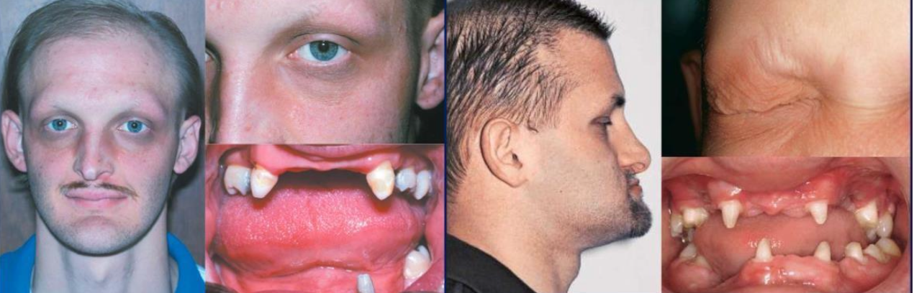
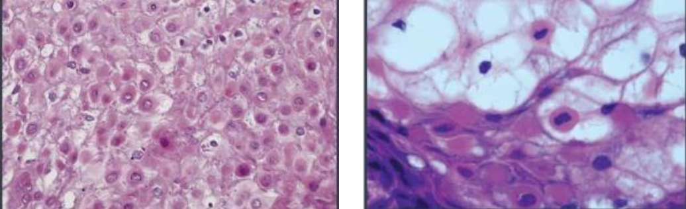
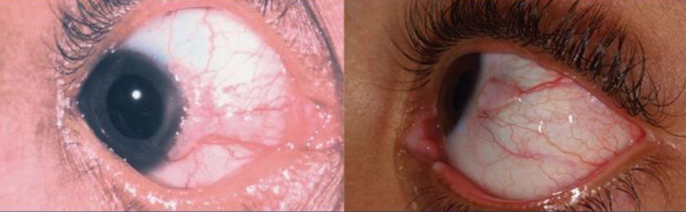
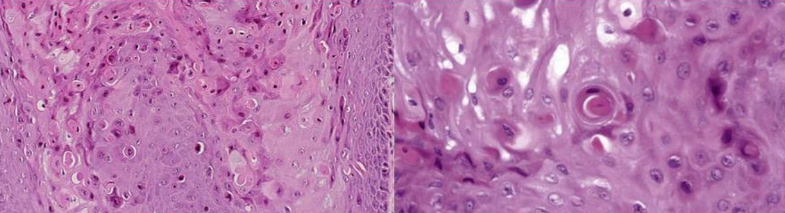
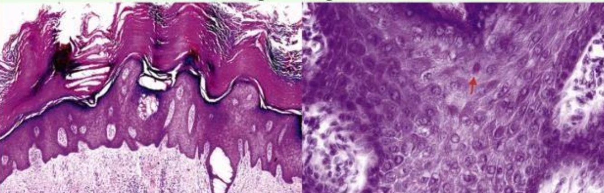
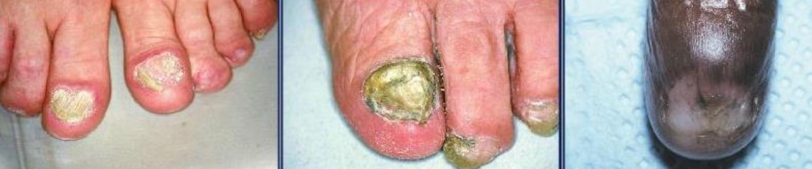
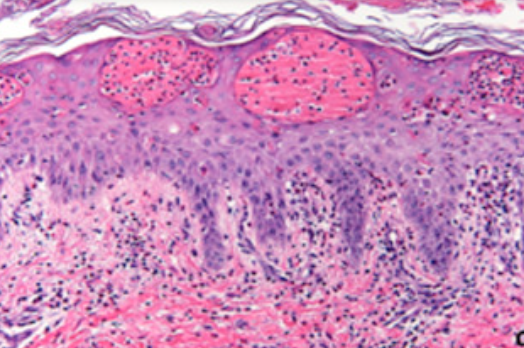
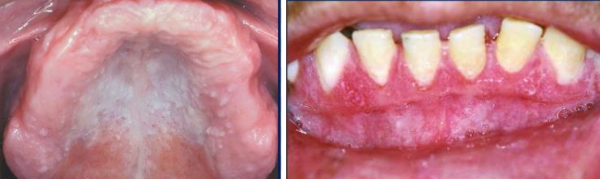

---
toc:
    depth_from: 1
    depth_to: 3
html:
    offline: false
    embed_local_images: false #嵌入base64圖片
print_background: true
export_on_save:
    html: true
---

# 皮膚疾病

## 外胚層發育不良
Ectodermal Dysplasia
: 兩個以上外胚層來源的構造無

- \style[color:Deepskyblue]{X隱性}
- EDA mutation 
  - NF&kappa;B family 
- 特徵
  - 缺牙、少髮、口乾、無汗
  - 完全缺牙 (anodontia) 少見
  - 眼睛周圍細小、有色素沉澱的皺紋
  - midface hypoplasia
  - 指甲可能出現營養不良和易碎

## 角化異常
Disorder of Keratinization

:::info {角質}
5、14: 複層口腔上皮都有

1、6、10、16: 角化

4、13、19: 非角化
:::

|名稱|| 成因 |GLA|特徵 |||
|-|-|-|-|-|-|-|-|
| White Sponge Nevus^良^   (Cannon disease)|| 體顯性 |兩側的頰黏膜，出生時、孩童早期 |\oneline{
- 口腔黏膜的正常角質化缺陷
- 對稱
- keratin 4 和 keratin 13 表現在上皮的棘狀上皮細胞層
}|
|^|^|^|^|\oneline{
- hyperparakeratosis, acanthosis
- spinous layer 清澈的細胞質
- 表層細胞核周圍嗜酸

}
| Hereditary Benign Intraepithelial Dyskeratosis^良^  (HBID, Witkop’s disease)||體顯性  `GENE`: 4q35端粒, \style[color: gray;]{NLRP1, M77T}|口腔與結膜黏膜，孩童|\oneline{
- 類似Cannon disease
- 眼睛: 不透明凝膠狀斑塊
- 舌背: 通常沒有影響
- 

}|
|^|^|^|^|\oneline{
- hyperparakeratosis, acanthosis
- upper spinous layer 局部角化 
- ell-within-a- cell

}|
|  Pachyonychia Congenita  先天性厚甲症|| 體顯性 | - |\oneline{
- keratin 6a, 6b, 16, 17
- 手掌跟腳掌厚繭、指甲底部累積角蛋白
- 多汗
- 走路會有明顯的疼痛

\picBox{
 
}
} |
|^|^|^|^|\oneline{
- 口內^良^ `GENE`: keratin 6a (KRT6a)
- 如果: Keratin 17 &rarr; neonatal teeth, oral white lesion(1/3)}
|^|^|^|^|\oneline{
- hyperkeratosis, acanthosis
- 斑狀顆粒增生(patchy hypergranulosis)
- 毛囊病變，堵塞
- white spongy nevus 比較: 表皮細胞核旁清澈的

}|
|Dyskeratosis Congenita   先天性角化不良|| \style[color:Deepskyblue]{X隱性}   `GENE`: DKC1 |10y &darr; | \oneline{
- 影響 telomerase
- 再生性貧血(aplastic anemia)
- 易有惡性變化
- 皮膚網狀的色素過度沉澱
- 指甲會有明顯的萎縮，甚至消失
- 沒得醫

}
|^|^|^|^|\oneline{
- 水泡(bullae) &rarr; 白斑 &rarr; OPMD
}| 
| Hereditary Mucoepithelial Dysplasia^良^  || 體顯性 | -| \oneline{
- 少毛脫髮、畏光、視力明顯受損
- 軟硬顎交界明顯火紅班
- 表徵明顯，但通常沒有症狀(asymptomatic)}|
|^|^|^|^|\oneline{
- minimal keratinization
- 雜亂無章的成熟
- 無明顯的核、細胞多形性

\picBox{ 
 

}

}
| Papillon-Lefèvre Syndrome || `GENE`: cathepsin C gene |手掌與腳底 | \oneline{
- Cathepsin C: 溶酶體內蛋白酶
- 皮膚病灶的治療:維 A 酸類(systemic retinoids)
}|
|^|^|^|^|\oneline{
- PMN 功能不足 &rarr; 嚴重牙周病
- 快速的骨流失 &rarr; floating in air 
- 瀰漫出血與增生性牙齦炎

}|

## 色素相關

|名稱|| 成因 |GLA|特徵 |||
|-|-|-|-|-|-|-|-|
|Peutz-Jeghers syndrome || 體顯性，  抑癌 `GENE`: STK11(LKB1) |兒童早期 | \oneline{
- 雀斑樣(freckle-like): 陽光無關，發生於手部、開口周圍
- 朱紅區、口腔黏膜、舌頭出現 &phi; 1~4mm 的棕色至藍灰色斑點
- 腸息肉(intestinal polyps，良) &rarr; 腸梗塞 &rarr; 大比例發展成胃腸道腺癌
- 黑色素細胞無明顯增加，但樹突延長
}|
| Incontinentia Pigmenti   (色素失調病，Bloch-Sulzberger syndrome )|| \style[color:red]{X顯性}   `GENE`: NEMO (NF&kappa;B Essential Modulator) | 剛出生| \oneline{
- 先天免疫 gg
- CNS (30%)
- 眼睛 (35%): 斜視(strabismus)、眼球震顫(nystagmus)、白內障(cataracts)、視網膜血管異常、視神經萎縮
- 皮膚: 水皰期 &rarr; 疣狀期 &rarr; 色素過度沉積階段 &rarr; 萎縮和脫色階段
- 口腔: 同 EDA mutation 
}|
|^|^|^|^|\oneline{
#### 水皰期
上皮內裂解，內部充滿嗜酸性球

#### 疣狀期
過度角化, acanthosis, papillomatosis

#### 色素過度沉積階段
皮下結締組織 melanin-containing macrophage，即黑色素失調(melanin incontinence)

}|

## 上皮裂解病

Acantholytic Disorder

|名稱|| 成因 |GLA|特徵 |||
|-|-|-|-|-|-|-|-|
| Keratosis follicularis (Darier Disease) || 體顯性， ATP2A2 mutation &rarr; 細胞內鈣離子幫浦(SERCA2) 異常 &rarr; desmosome 異常 | 10-20y | \oneline{
- 皮膚明顯症狀，口腔輕微
- 多發性紅斑
- keratin 堆積 &rarr; 惡臭
- 指甲出現縱向線條、隆起、疼痛的裂口。
- 口腔: 角化粘膜，平頂丘疹(flat topped papules)

\picBox{

}

}
|^|^|^|^|\oneline{
- 上皮內裂 (acantholysis)
- Rete ridges 窄長，且呈試管狀。
- 角化不良細胞: corps ronds & grains(類似於穀粒)
- central keratin plug :  keratin 堆積

\picBox{

}
}
| Warty Dyskeratoma   (疣狀角化不良，   Isolated Darier disease) || ^ | \oneline{
- 皮膚: 單發，老人
- 口腔: 角化粘膜，40y&uarr;
}|\oneline{
- 保守性切除，預後良好，沒有明顯的惡性潛能
- 類似 Darier disease，除了無 corps ronds, grains 型態
}

## Connective Tissue Tumors 

|名稱|| 成因 |GLA|特徵 |||
|-|-|-|-|-|-|-|-|
| Hereditary Hemorrhagic Telangiectasia (遺傳性出血性微血管擴張症，HHT，Weber syndrome)| 體顯性 |\oneline{
`GENE`
- HHT1: endoglin(ENG)
- HHT2: activin receptor-like kinase(ALK1;ACVRL1)
- HHT + juvenile polyposis: MADH4
}| \oneline{
- 流鼻血(epistaxis)而被診斷
- 口鼻粘膜紅色丘疹，壓迫變白
- 腸道易出血 &rarr; 慢性缺鐵性貧血
- 動靜脈廔(arteriovenous fistulas)
- 牙周血管畸形 &rarr; 菌血 &rarr; 化膿性肺栓塞
}

## 其他

|名稱|| 成因 |GLA|特徵 |||
|-|-|-|-|-|-|-|-|
| Xeroderma Pigmentosum^罕^   著色性乾皮病 || 體隱性，UV損傷修復不能 | 下唇和舌尖(SCC 多)，  很早   (口腔: 20y&darr; ; 非黑色素皮膚癌: 10y&darr;)  | \oneline{
- 容易轉成 SCC, BCC
- 沒得醫
}|
