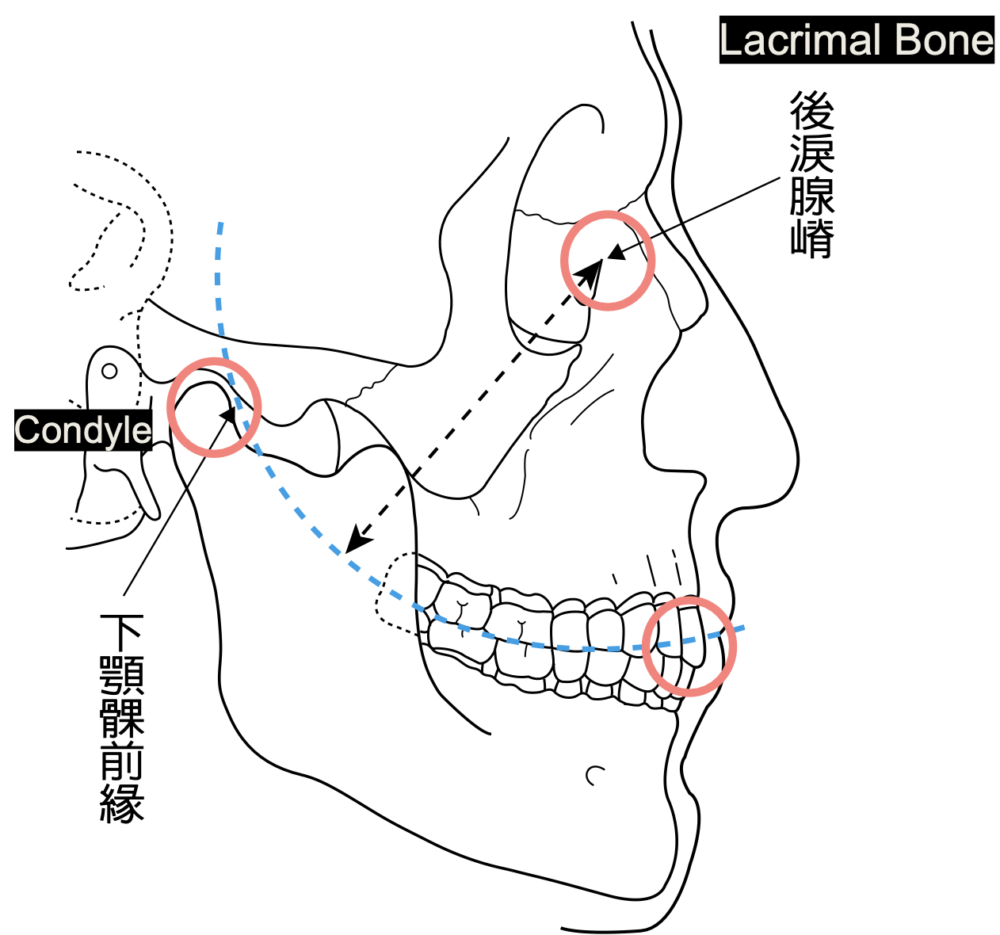
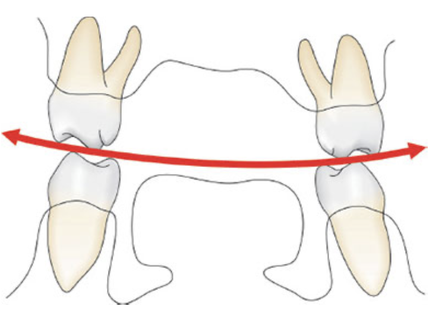
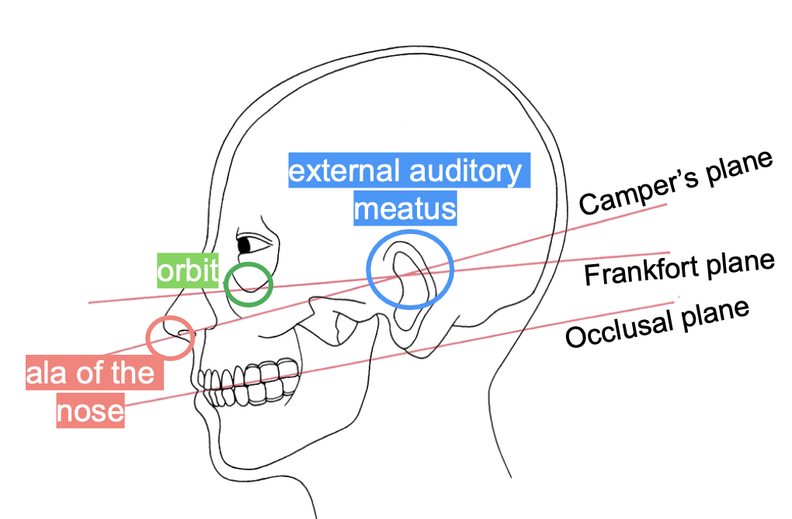
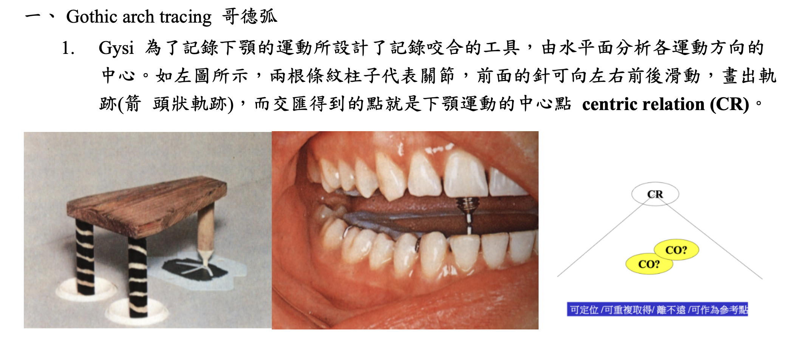
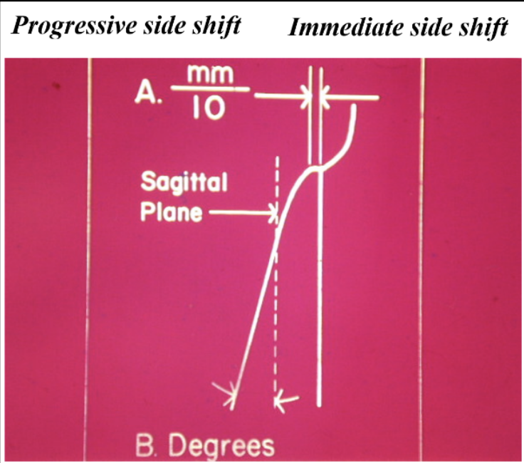

---
toc:
    depth_from: 1
    depth_to: 3
html:
    offline: false
    embed_local_images: false #嵌入base64圖片
print_background: true
export_on_save:
    html: true
---

# Intro 

- Curve of Spee

- Curve of Wilson

- 平面們，全口重建
  - 甘伯氏平面(Camper’s plane): 鼻翼往外耳道
  - 蘭克福平面(Frankfort plane): 眼窩下緣往外耳道

- 哥德弧 

- Bennett movement: 側方運動 Working side 原來的中心點會有點向外偏移，即 Bennett movement。
- Bennett angle : 側方運動 Balancing condyle 起點到終點連線和矢狀面夾角。

