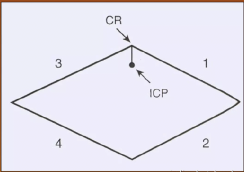
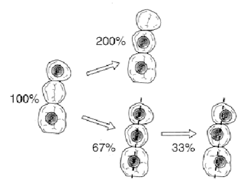

---
toc:
    depth_from: 1
    depth_to: 3
html:
    offline: false
    embed_local_images: false #嵌入base64圖片
print_background: true
export_on_save:
    html: true
---

# Intro 

- Curve of Spee

- Curve of Wilson

- 平面們，全口重建
  - 甘伯氏平面(Camper’s plane): 鼻翼往外耳道
  - 蘭克福平面(Frankfort plane): 眼窩下緣往外耳道

- 哥德弧 

- Bennett movement: 側方運動 Working side 原來的中心點會有點向外偏移，即 Bennett movement。
- Bennett angle : 側方運動 Balancing condyle 起點到終點連線和矢狀面夾角。

# 大亂鬥 

| |陳健誌|郭尚倫 |
|-|-|-|
|CO|MICP=CO(少用)|
CR|最後，但要求不能壓迫|
Terminal hinge axis| CR，condylar中心|不一定condylar中心

# 咬合學只有吵架和 Intro

Gothic arch tracing
: 其實1, 3 是兩個弧，可以用來找 CR

Relaxed resting position
: EMG 低點

HMBF
: Position of highest maximal biting force

Mutual Protection
: 側方運動由牙根長前牙支撐，垂直力量由短牙根後牙支撐

Cantilever 
: 基座避免後牙、犬齒

Ante’s Law
: 跨牙弓穩定、多基台支撐

Lucia Jig Technique
: 用 anterior guidance 取 CR 
