---
toc:
    depth_from: 1
    depth_to: 3
html:
    offline: false
    embed_local_images: false #嵌入base64圖片
print_background: true
export_on_save:
    html: true
---

# 免疫

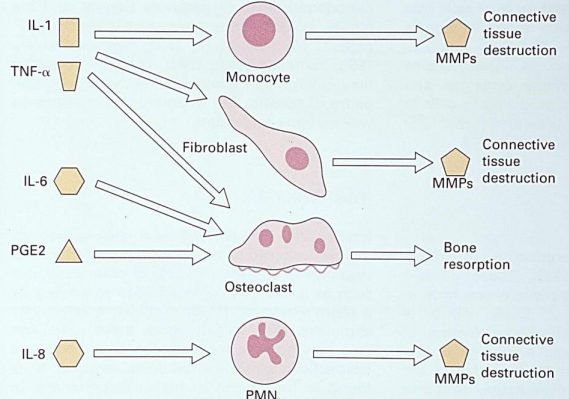

MMPs
: Matrix MetalloProteinases 造成結締組織的破壞

## 進展 

#### 時期 

| | Initial lesion| Early lesion | Established lesion |Advanced lesion |
|-|-|-|-|-|
day |2-4 | 4-7
菌種 | G(+)|| G(+), G(-)||
主導免疫球 | PNMs||PNMs  & plasma cell|plasma cell 
collagen 破壞| &cross;| &check;|||
rete pegs | &cross; || &check; ||
pocket epi | ^ || ^ ||
bone loss | &cross;|||&check;|
apical epithelial migration|^|||^|
其他|Normal healthy gingiva|Early gingivitis|Established gingivitis|初級牙周病
圖 | .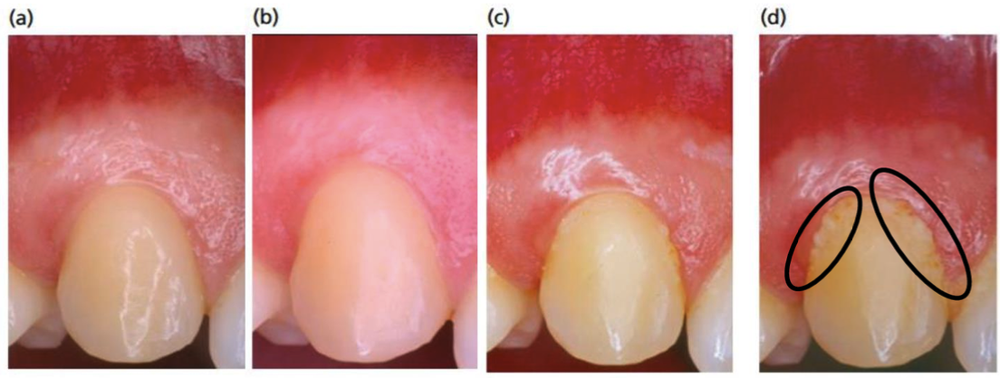 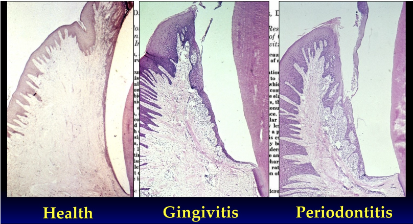|
#### Stages 
> 疾病嚴重程度與複雜性

分期 | CAL | Bone loss | Frucation | 牙齒喪失 |
|-|-|-|-|-|-|
Stage 1 | 1~2mm | Coronal third | -| 0|
Stage 2 |3~4mm | ^| ^| ^|
Stage 3  | ≥5mm | middle &geq; 3mm |II, III| &leq; 4
Stage 4 | ≥5mm | ^ |^| &geq; 5|

#### Grading 
> 進展速度和風險因素
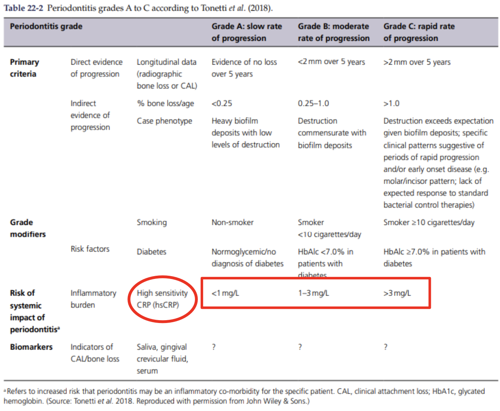

#### Frucation
> Hamp 分類法 (1975)

|Hamp 分級 | 戳入深度
|-|-|
| Degree I | < 3mm
|Degree II | >3mm ，不穿 |
| Degree III| 穿透 |

#### Mobility
> Miller index 

| Miller index | 定義 |
|-|-|-
Grade 1 | 存在異常移動 |
Grade 2 | 存在某方向移動等於 1mm
Grade 3 | 多個方向移動大於 1mm ， 包含旋轉、垂直 |

#### 預後 

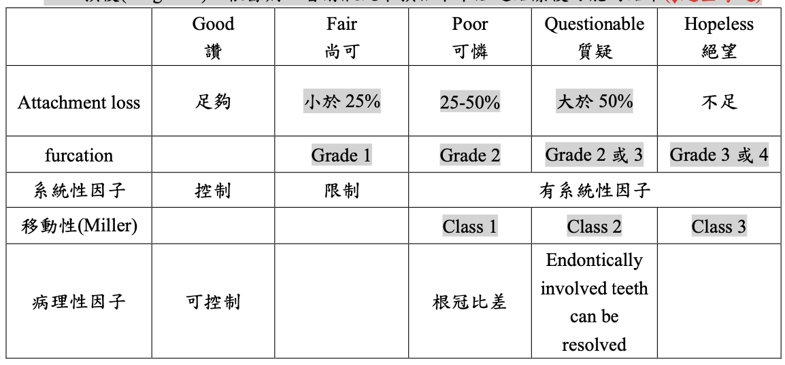

## 治療計畫 

- Phase 1: initial 
  - Oral hygiene instruction 口腔衛生教育(必要)
  - Scaling and root planning 牙結石清除及牙根整平(主要)
  - Extraction 拔牙
  - Occlusal adjustment 咬合調整
  - Remove ill-fitness restoration 去除不適用填補物
  - Endodontic treatment 根管治療
  - Fixation 牙齒加固
- Phase II: surgical
  - Periodontal Reconstruction Surgery 牙周重建手術
    - Osteoectomy 骨切除術
    - Osteoplasty 骨整形術
    - Soft tissue Graft 軟組織移植
  - Regeneration Therapy 牙周再生治療
    - Bone graft 骨頭移植
    - Guided tissue Regneration 引導組織再生
    - Dental implant 植牙
- Phase III(restorative phase)
- Phase IV(maintenance phase)

# 圖 

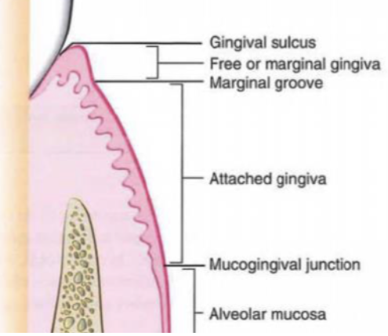
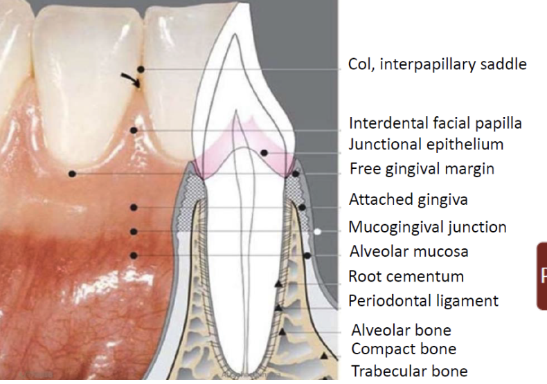

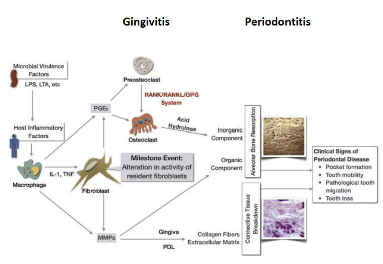

# 牙根覆蓋術式 

##  Langer & Langer technique 

- 切下來的組織有 epithelial band 

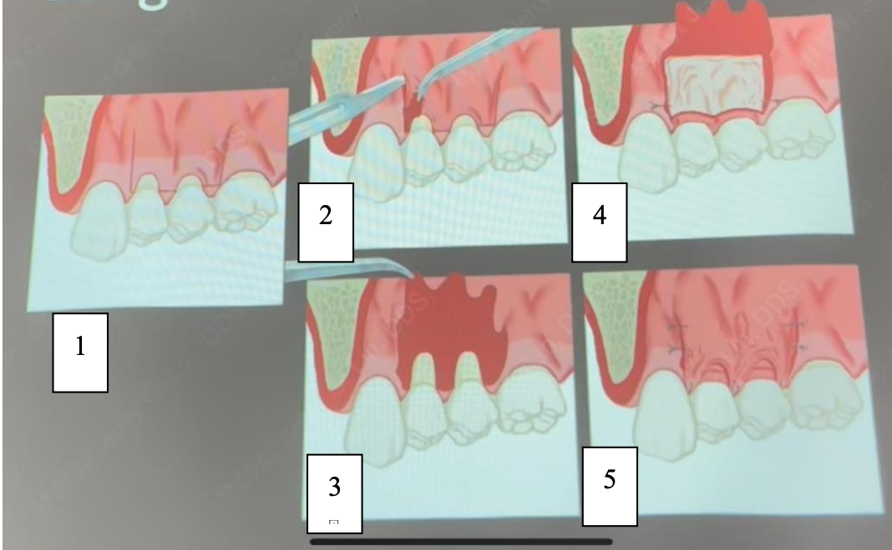

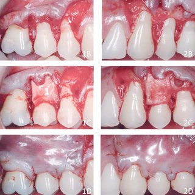

### Modified 

- Epithelium band 去掉 &rarr; CT Coronally advance

## Bruno technique

- 一格長方形切口
- partial, Full 不拘

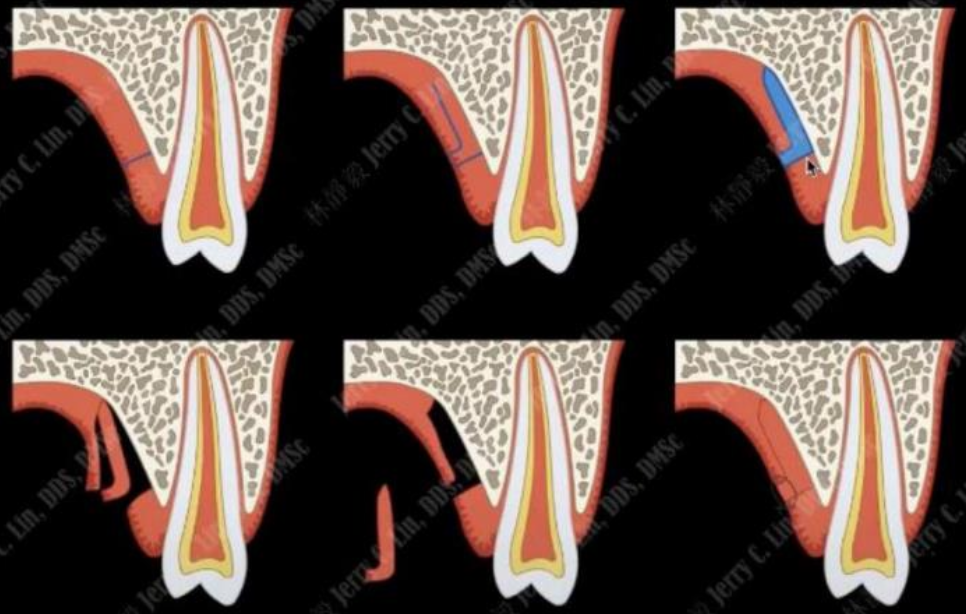

## Hurzeler technique/Lorenzana & Allen technique (one/single excision)

- 切口一條線
- 無 epithelial band 
- 最快，最難

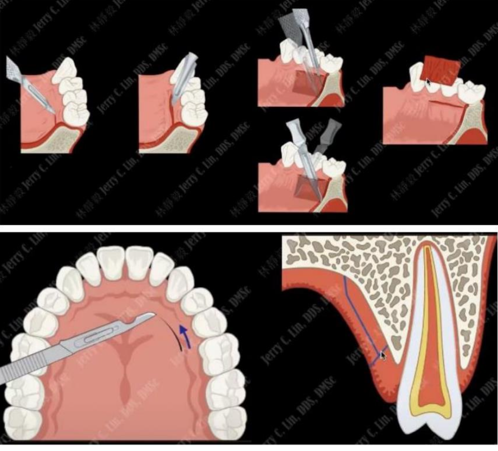

## Laser De-epithelialized technique 

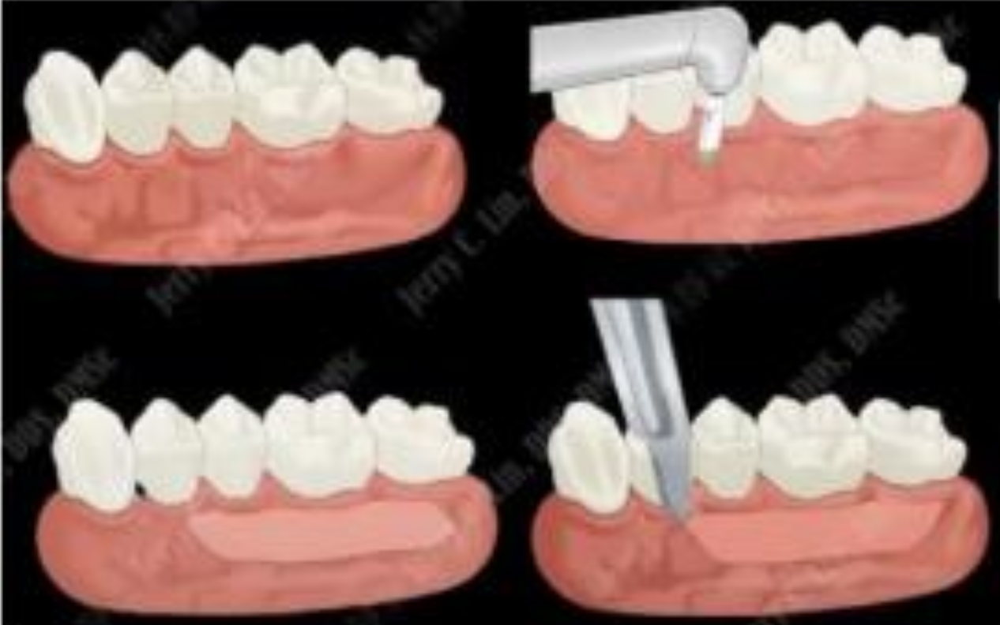

## Split double papilla flap + CT graft (Harris, 1992)

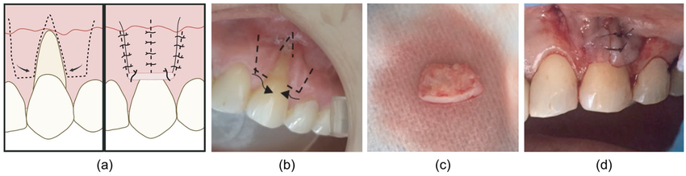

## Envelope flap ＋ CT graft (Raetzke, 1985)

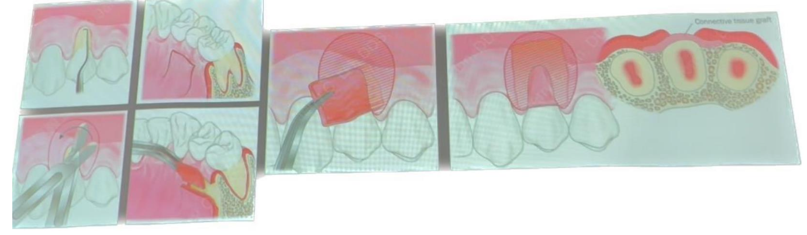

### Modified 

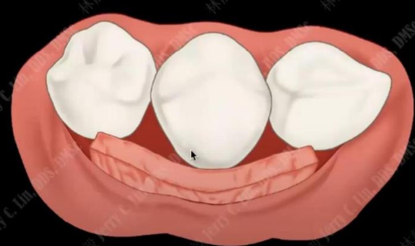

## Zuchelli & Sanctis (2000)

- 切完，往外拉平
- 補 CTG

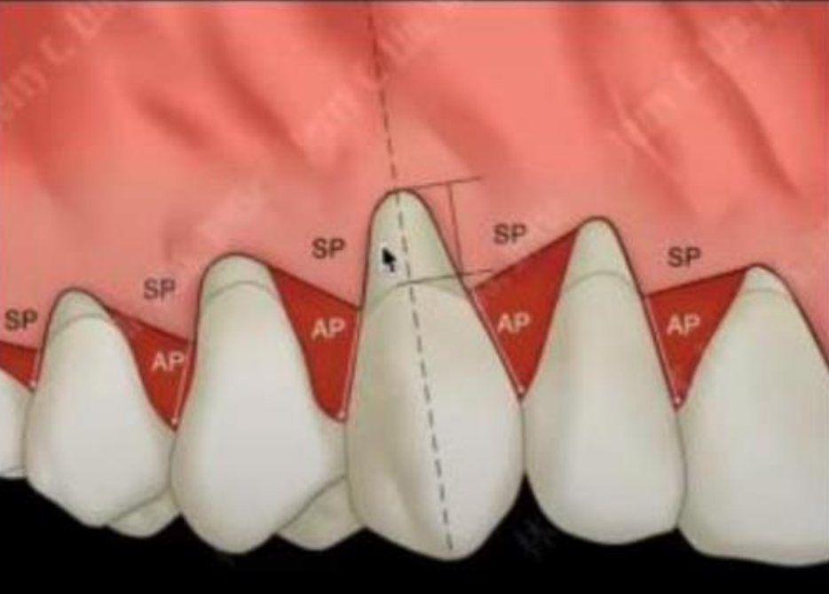

## Tunneling (Allen, 1994)

- 多顆牙齒牙齦萎縮
- 縫線把移植物往 envelope 裡面帶
- 前牙 (strung tissue pull)

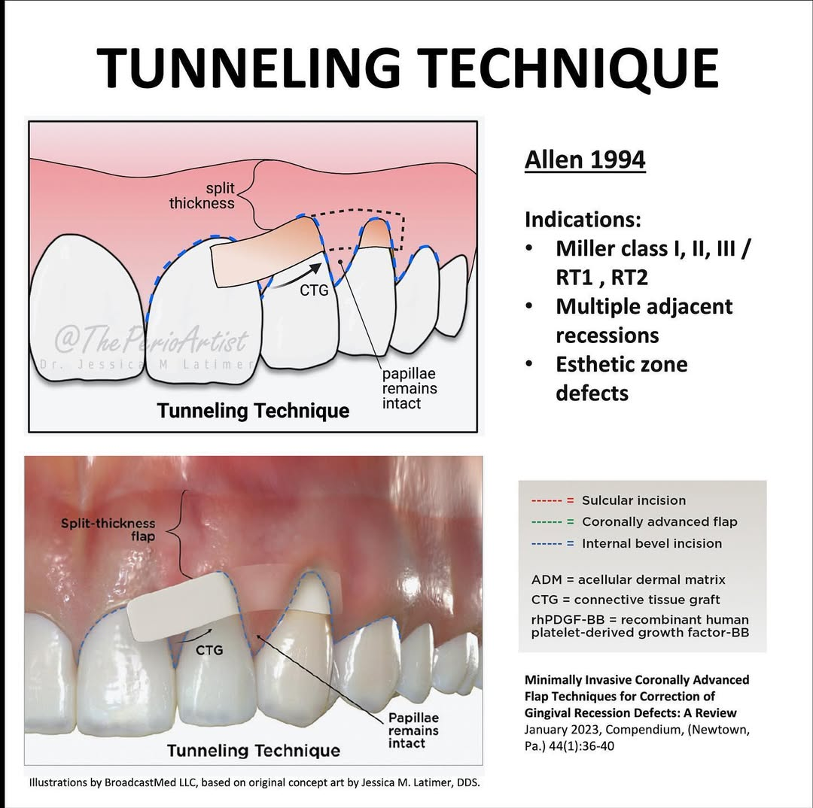

# 牙周再生手術

- Goldmen(1958)

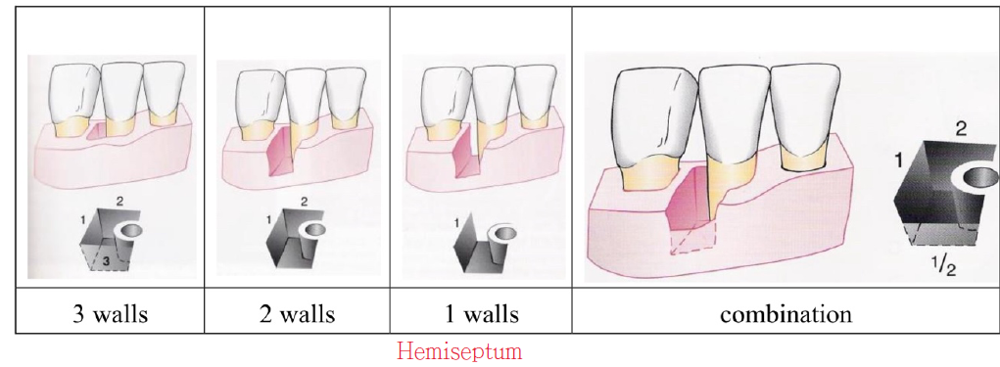

- 治療
  - 1 wall：Osseous surgery
  - 2 walls：Osseous/GTR(移除較淺較寬的骨缺損、引導殘留組織再生)
  - 3 walls：用囊袋深度決定治療方法
    - 牙周囊袋深度P.D.=0-3mm：非手術性治療、Osseous
    - 牙周囊袋深度P.D.=4-6mm：非手術性治療、Flap、GTR
    - 牙周囊袋深度P.D.>=7mm：GTR、Flap、拔牙

- 原則：PASS
  1. Primary closure：盡量用flap 把defect蓋住、使其不受外在影響
  2. Angiogenesis 血管新生：足夠的血流供應及growth factors、cytokines、
undifferetiated cells
  1. Space：預留組織再生的空間
  2. Stability：血塊(clot)要夠穩定骨頭才能生長
