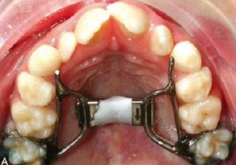

---
toc:
    depth_from: 1
    depth_to: 3
html:
    offline: false
    embed_local_images: false #嵌入base64圖片
print_background: true
export_on_save:
    html: true
---

# 生長 

:::left
**男性**
- 上顎成長高峰: 12-14
- 下顎成長高峰: 13-15
- 下顎成長完成: 18-20

:::right
**女性** 
- 上顎成長高峰: 10-12
- 下顎成長高峰: 11-13
- 下顎成長完成: 16-18

:::

RPE, SPE: 13y

functional appliance: 生長高峰期或之前1~3 年

# 力量

- 骨骼改變: 500g &uarr;
- intrusion: 10-20g
- tipping, rotation, extrusion: 35-60g
- root upright: 50-100
- body movement :70-120

# 活動矯正 

## palatal expansion: RPE, SPE
> 一轉 0.25mm a

- RPE:　一天兩轉

- SPE: 兩天一轉

## Headgear

- 治療 class II 
- upper 6 往後拉
- 往上減 VD，往下增加 VD

## Chin cap 

:::left
- 治療 class III
- 下臉部增長
:::right

:::

## Face mask

:::left
- 治療 class III
- 拉上顎出來
- 介入時機：上顎第一大臼齒萌發後
- 其餘同Chin cap 
- 兩類 
  - Delaire-type face mask(棒棒在兩側)
  - Rail-style face mask (棒棒在中間)
:::right

:::

## 口內功能性矯正裝置(Functional appliances)

- functional appliance 治療後咬合改變
  - II: 下顎順時針，前下
  - III: 上顎逆時針，前上
  - 代價: 臉變長，牙往外

--- 
> Passive 或  Active 用螺絲判斷
> Sunday bite : 歐美人星期天上教堂的時候，為了讓人覺得自己的咬合、外觀正常，就會刻意往前咬的習慣。

### Activator

- Andresen-Haupl activator (II d1)
  - Coffin spring: 上顎擴弓+舌頂
  - labial loop: 撐開 intercanine
  - Labial bow: 限制前牙不移動

- Modified activator (II d1)
  - lingual shields: 引導下顎、舌頭
  - Mandible ++
  - 下顎前旋，讓後牙長高，VD++

- FKO (reverse class III activator)
  - 上前牙樹脂 ++
  - 下顎鐵線 --

### Bionator 

- Open palate + Coffin spring 的逆襲
- condyle受力減少，mandible++
- labial bow 撐開 labial m. 
  - Intercanine expansion

### Twin block

- 上下分開，大牙引導
- screw

- reduce overbite

- reduce open bites

### Frankel appliance
> 唯一Tissue-borne appliance，作用力主要來自軟組織。

- **lip pads**：隔開 labial m. 讓顎向前，II, III 皆可
- **buccal shields**: 拉扯骨膜，促進顎骨basal bone 生長
- **labial bow & canine loop**

### Herbst appliance
- 唯一固定式functional appliance
- 推開上顎第一大臼齒、下顎第二乳臼齒，下顎往前

# 側顱分析

## Downs Analysis
- Frankfort Horizontal Plane ($Fh$ )
$$\overrightarrow{PoOr}$$
- Facial Plane ($F$ ): 
$$\overrightarrow{NPog}$$
- Mandibular Plane ($Ma$ )
  - 從Me點沿著Mandibular body 做切線
  - 定義成左上往右下
- Facial Plane Angle: (下顎前凸)
$$180\degree-\measuredangle (F, Fh)$$
- Mandibular Plane Angle: (下顎往下)
$$\measuredangle (Ma, Fh)$$
- Y axis angle (下顎骨的生長方向)
$$\measuredangle (SGn, Fh)$$
- Angle of Convexity: (上顎前凸)
$$\measuredangle PogAN$$
- A-B Plane Angle: (上顎骨相對前凸)
$$\measuredangle (\overrightarrow{AB}, F)$$

## Denture pattern

- Occlusal Plane (Oc) Angle
$$\measuredangle (Oc, Fh)$$
- Interincisal Angle:(上下門牙平直)
$$\measuredangle (\text{U1 ax, L1 ax})$$
- L1-Mandibular Plane Angle: (下門牙前翻凸)
$$\measuredangle (\text{L1 ax}, Ma)$$
- L1-Occlusal Plane Angle: (下門牙前翻)
$$\measuredangle (\text{L1 ax}, Oc)+90\degree$$
- U1-AP Plane Distance
$$d(\text{U1 切緣}, APog)$$

## Northwestern Analysis (Riedel’s Analysis)

認為S-N Plane比Fh準

- $\measuredangle SNA $: 上顎前凸
- $\measuredangle SNB $: 下顎前凸
- $\angle ANB = \measuredangle (NB, NA) $
  - <2&deg;: III 
  - 2&deg;: I 
  - \>2&deg;: II 
>Steiner’s認為2&deg;，日本人認為0~2 ˚都算 class I

- U1-SN Angle (上顎門牙前傾)
$$180\degree- \measuredangle (\text{U1 ax},SN)$$
- U1-NP Angle (Pog 前凸)
$$\measuredangle (\text{U1 ax}, F)$$

### Tweed Analysis (Tweed Triangle)

面貌姣好的女子

- FMA(25˚)
$$\measuredangle (Ma, F)$$
- FMIA(65˚)
$$\measuredangle (F, \text{L1 ax})$$
- IMPA(90˚)
$$\measuredangle (\text{L1 ax}, Ma)-180\degree$$

### Wits Analysis

ANB 沒意義: 受 N 點前後位置影響

$\Longrightarrow$ 看 A, B 到 Oc 垂足距離

- AO-BO 平均值男性為1 mm、女性為0 mm

# 評估 

## 混合齒列
- Tanaka-Johnston & Moyers Analysis
  - 下顎四恆門齒推測 上下顎 3-5 寬度
- 上前牙  Reverse Overjet 
  - 為了讓前牙對起來，無意識把下巴偏向某一側咬
  - 會讓下巴長歪
