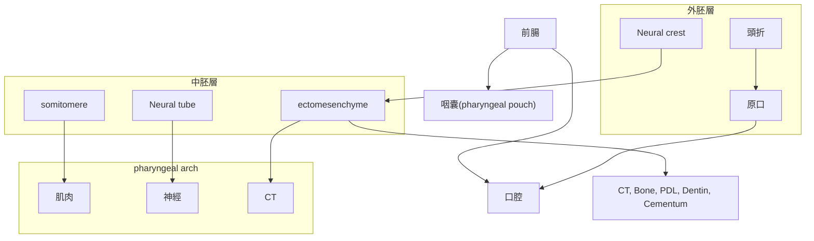

---
toc:
    depth_from: 1
    depth_to: 3
html:
    offline: false
    embed_local_images: false #嵌入base64圖片
print_background: true
export_on_save:
    html: true
---

# 頭怎麼長  

## 咽弓 

## 長臉了 

- 24d
  - 上下顎分開
- 24-28d 
  - Med. nasal process $\rightarrow$ 上顎門牙

- 26d
  - Frontal prominence

- 27d
  - Frontonasal process 
  - Odontogenic epi. 開始
- 27-29d 
  - 血管 

  
- 4w
  - 舌頭開始發育
- w5-w6
  - 初級上顎的形成
    - 內鼻突 &rarr; 上頷間結(intermaxillary segment)
    - 唇部(上唇人中)、上頷骨部(附 4 顆門齒)、顎部 (形成三角形原顎)
  - Odontogenic epi.連起來(37-38d)
- 7-9w
  - 舌頭下降
  - secondary palate 開始長，前往後聚合(-3m)
  - 長下顎
- 9w
  - 抬頭(upper facial complex has lifted away from the thorax)
- 8-12w 
  - condylar cartilage
- 16w 
  - Maxillary sinus 開始發育

# Pathway 

β-catenin 在背側聚集

## WNT
- &beta; catenin: 轉錄因子
- 抑制 pathway
  - sclerostin (SOST)
  - WISE
  - DKKs
- Inhibitor 
  - SFRP 
  - WIF1

---
- 頭尾分化，尾部濃度高，頭頸部發育最上游
- 促進鈣化
- 促進骨生成

- 促上皮生長、角化

## BMPs

- 腹背軸，腹側表現
- 刺激表皮
bone morphogenetic proteins，。

## SHH

(Sonic hedgehog) 左右分化，決定四肢以及腦脊髓正中線的形成

## FGF 

## TGF 

## Eda 

- NF&kappa;B

## Pathway and tooth

# 基因們整理

- 組織的發育
  - Otx2、Msx、Dlx、Barx: 1st, 2nd somitomere
  - HOX: 3rd somitomere 後

## 牙齒型 Field model  

- 前牙: Msx-1, 2
- 後牙: Dlx-2, Barx-1

x 

## Enamel protein 

- Enzymes (打斷 protein)
  - MMP20
  - KLK4
- Amelotin 

|Name | function |Symbol / Gene Location|
|-|-|-|
Amelogenin (90%)|主要控制厚度寬度   結合氟|AMELX(Xp22.3) AMELY(Yp11.2) |
|Ameloblastin |控制長長|AMBN(4q13.3)|
|Enamelin|-|ENAM(4q13.3)|
|-|後期鈣化| AMTN(4q13.3), ODAM(4q13.3), SCPPPQ1

## Dentin protein 

- DSPP 
  - DPP 
  - DSP
  - DGP

