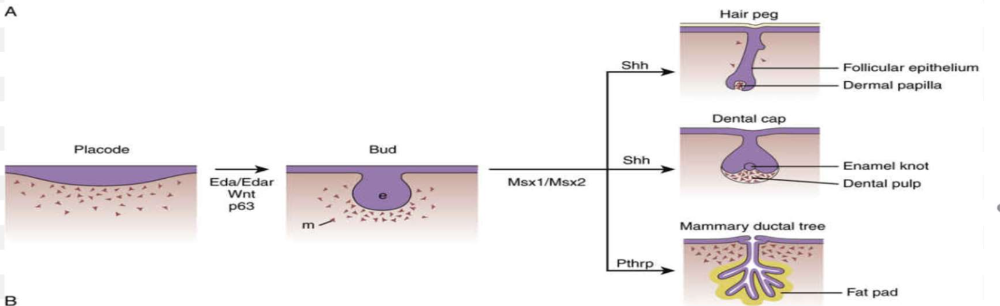

---
toc:
    depth_from: 1
    depth_to: 3
html:
    offline: false
    embed_local_images: false
    print_background: true
export_on_save:
    html: true
---

# Pathway 

## WNT
- &beta; catenin: 轉錄因子
- 抑制 pathway
  - sclerostin (SOST)
  - WISE
  - DKKs
- Inhibitor 
  - SFRP 
  - WIF1

---
- 頭頸部發育最上游
- 促進鈣化
- 促進骨生成

## BMPs

 

bone morphogenetic proteins，腹背軸，刺激表皮，腹部表現。

## SHH

(Sonic hedgehog) 左右分化，決定四肢以及腦脊髓正中線的形成

## FGF 

## TGF 

## Eda 

- NF&kappa;B

## Pathway and tooth

# 基因們整理

## 牙齒型 Field model  

- 前牙: Msx-1, 2
- 後牙: Dlx-2, Barx-1

x 

## Enamel protein 

- Enzymes (打斷 protein)
  - MMP20
  - KLK4
- Amelotin 

|Name | function |Symbol / Gene Location|
|-|-|-|
Amelogenin (90%)|主要控制厚度寬度   結合氟|AMELX(Xp22.3) AMELY(Yp11.2) |
|Ameloblastin |控制長長|AMBN(4q13.3)|
|Enamelin|-|ENAM(4q13.3)|
|-|後期鈣化| AMTN(4q13.3), ODAM(4q13.3), SCPPPQ1

## Dentin protein 

- DSPP 
  - DPP 
  - DSP
  - DGP

