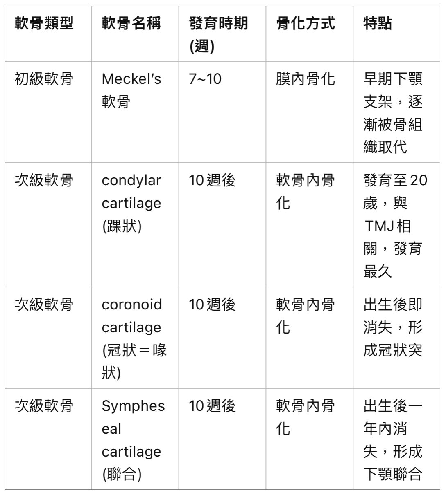
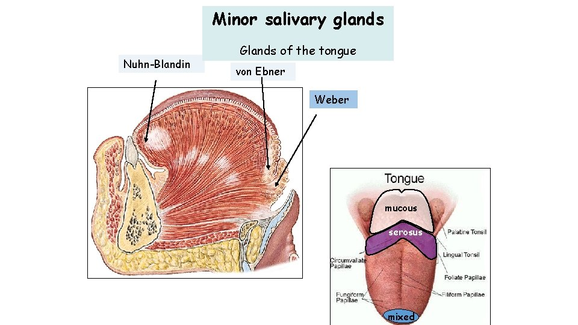

---
toc:
    depth_from: 1
    depth_to: 3
html:
    offline: false
    embed_local_images: false #嵌入base64圖片
print_background: true
export_on_save:
    html: true
---

# 頭怎麼長  

## 咽弓 

## 長臉了 

- 24d
  - 上下顎分開
- 24-28d 
  - Med. nasal process $\rightarrow$ 上顎門牙

- 26d
  - Frontal prominence

- 27d
  - Frontonasal process 
  - Odontogenic epi. 開始
- 27-29d 
  - 血管 

  
- 4w
  - 舌頭開始發育
  - Parotid gland 開始發育 (4-6w)
- 6w
  - 初級上顎的形成
    - 內鼻突&rarr; 上頷間結(intermaxillary segment)
    - 唇部(上唇人中)、上頷骨部(附 4 顆門齒)、顎部 (形成三角形原顎)
  - Odontogenic epi.連起來(37-38d)
    - 內鼻突 + 上顎凸 
  - Submandibular gland 發育
- 6-8w
  - 初級齒列發育
- 7-9w
  - 舌頭下降
  - secondary palate 開始長，前往後聚合(-3m)
  - 長下顎
- 8-11w
  - 腭架抬起、融合
- 9w
  - 抬頭(upper facial complex has lifted away from the thorax)
  - Sublingual gland, Minor Salivary Gland s
- 8-12w 
  - condylar cartilage，次級 TMJ
    - 關節腔先下再上
- 16w 
  - Maxillary sinus 開始發育

## 頭骨融合 

- 顱底

- 囪門關閉 (month)

- 下顎

- 額骨融合: 2y

## 牙 

# Enamel

## Enamel protein 

- Enzymes (打斷 protein)
  - MMP20
  - KLK4
- Amelotin 

| **蛋白名稱**         | **功能**                                                     | **基因名稱** |
|-----------------------|-------------------------------------------------------------|--------------|
| **Amelogenin** (90%)       | 疏水。協助晶體排列與成核，為琺瑯質的主要結構蛋白                  | AMELX, AMELY |
| **Ameloblastin**      | 支持琺瑯母細胞附著與功能穩定                                 | AMBN         |
| **Enamelin**          | 提供結構支架，協助晶體擴展                                   | ENAM         |
| **Kallikrein-4**      | 分解琺瑯基質蛋白以清理礦化區域                               | KLK4         |
| **Matrix Metalloproteinase-20** | 分解琺瑯蛋白，促進基質轉變                             | MMP20        |

# Dentin 

>HA: 氫氧磷灰石（Hydroxyapatite）

- Von Korff's fiber
  - type III collage
  - odontoblast 形成基質 predentin 時最先形成的

- Incremental Lines of Von Ebner
  - 礦化不足，以五天為週期的生長線(20μm)

## Dentin protein 

> DSPP gene 控制

- DSPP
  - 牙本質涎磷蛋白 dentin sialophoprotein
  - C 端為DPP，N 端為DSP，中間為 DGP1
- DPP 
  - 牙本質磷蛋白 dentin phosphoprotein
  - 酸性胺基酸
  - 促進羥基磷灰石晶體的形成與生長
- DSP
  - 牙本質涎蛋白dentin sialoprotein
  - 糖基化蛋白，信號傳導
  - 抑制 Peritubular dentin，保持 tubule 暢通
- DGP
  - 牙本質醣蛋白 dentin gllycoprotein

# Cementum 

- CAMs: 黏著分子，助於 PDL 保持未礦物質化
- matrix **gla** protein: 抑制礦化，可維持 PDL 寬度。
- 齒頸 20 - 50 &mu;m，根尖 150 - 200 &mu;m 

|類別 | 纖維來源 | 分布 | 功能特徵 |
|-|-|-|-|
| AEFC | Sharpey's fiber | 全牙根 | 原發性，垂直抵抗 |
| CIFC | Cementoblast | 牙根中下 2/3, Furcation | 修復，表面 cementoid |
| CMSC | Sharpey + Cementoblast |  ^ | -|
| AAC | 無 | CEJ 的enamel 或cementum表面呈斑狀或棘狀 | - |

# PDL

- Sharpey's fiber
  - 伸入 cementum 和 alveolar bone 
- 平均寬度 150 - 380 &mu;m，在牙根middle 1/3 最薄
  - 有功能、具咬合力牙齒的PDL 較寬
- 隨年齡上升，寬度減少
- 血管密度
  - alveolar bone 端＞cementum 端
  - 後牙＞前牙
  - 下顎＞上顎
  - 單根牙: gingival > apical > middle
- 神經 
  - free nerve ending (A): 最多，痛、機械
  - Ruffini's corpuscle (B)：根尖周圍最多，機械
  - coiled form (C): DL 中段，功能不明
  - encapsulated spindle-like ending (D): 最少，在牙根尖區域

# 唾腺 

- 神經
  - β adrenergicadrenergic（交）刺激會使蛋白質分泌
  - 無抑制神經
  - 舌下腺神經在下頷下神經節有突觸，頷下無。

- 發育: 遠端 &rarr; 近端 &rarr; 中間

- 小唾液腺 600 - 1000 個
- 每天分泌 600 - 1000 ml 唾液

## Duct 

# 黏膜 

# TMJ 

## Nerve
||||
|-|-|-|
Free nerve ending |無 capsule，廣泛分布 |痛覺 |
Ruffini's corpuscle | 有capsule，在關節囊表面| 本體覺
|Golgi tendon organ|有capsule，侷限在與關節相連的韌帶 | 張力，保護 
| Pacini's corpuscle | 有capsule（多層許旺），關節囊深層| 加速度  |

# Pathway 

β-catenin 在背側聚集

## WNT
- &beta; catenin: 轉錄因子
- 抑制 pathway
  - sclerostin (SOST)
  - WISE
  - DKKs
- Inhibitor 
  - SFRP 
  - WIF1

---
- 頭尾分化，尾部濃度高，頭頸部發育最上游
- 促進鈣化
- 促進骨生成

- 促上皮生長、角化

## BMPs
> bone morphogenetic protein
- 腹背軸，腹側表現
- 刺激間職

## SHH

(Sonic hedgehog) 左右分化，決定四肢以及腦脊髓正中線的形成

## FGF 

## TGF 

## Eda 

- NF&kappa;B

## Pathway and tooth

- SHH: 增生，Bud stage

- Pax-9: 分化，Cap stage 

# 基因們整理

- 組織的發育
  - Otx2、Msx、Dlx、Barx: 1st, 2nd somitomere
  - HOX: 3rd somitomere 後

## 牙齒
- Fgf-8: 口腔上皮表現，起始誘發外間葉長牙 (Lhx-6, Lhx-7, Pax 9)
- Lhx-6, Lhx-7: 外間葉最早與牙齒相關基因
- Pax 9: 牙胚位置決定，分化
- Lef-1: 幫助芽形期後牙齒的生長發育
- 形態決定轉錄因子
  - 前牙: 
    - Msx-1, 2 (門齒)
  - 後牙: 
    - Dlx-2 (多 cusp), 
    - Barx-1 (臼齒)

- BMP-4: 抑制 Pax9, Barx
- BMP-2, 4, 7 
  - osteoblast、cementoblast 前驅細胞的分化。
  - 促進轉錄因子 RUNX2

## Pax

| **Pax 基因** | **主要功能**                          | **相關疾病或異常**                           |
|--------------|-------------------------------------|--------------------------------------------|
| **Pax1**     | 骨骼和脊柱發育                       | 脊柱畸形、先天性骨骼發育不全                   |
| **Pax2**     | 腎臟、眼睛和中樞神經系統發育           | 腎臟發育不全、先天性腎病（如腎臟積水）、先天性失明   |
| **Pax3**     | 肌肉、神經嵴細胞分化，參與色素和聽覺系統的形成 | Waardenburg 綜合症（聽力損失、色素異常）、橫紋肌肉瘤 |
| **Pax4**     | 胰腺發育及胰島細胞（特別是β細胞）分化   | 2 型糖尿病風險增加、胰腺功能異常                   |
| **Pax5**     | B 淋巴細胞分化（免疫系統重要成分）      | 急性淋巴性白血病、B細胞功能障礙                  |
| **Pax6**     | 神經系統與眼睛（視網膜、虹膜）形成      | 無虹膜症、白內障、腦部結構發育異常                 |
| **Pax7**     | 肌肉幹細胞的維持與分化                | 與橫紋肌肉瘤相關，但具體作用未明確                 |
| **Pax8**     | 甲狀腺、腎臟和女性生殖系統的發育       | 先天性甲狀腺功能低下、甲狀腺癌                   |
| **Pax9**     | 牙齒、頭骨和顱面結構發育              | 無牙症、牙齒異常、顱面結構發育不良                 |

# 整理 

- 基質的成分
  - stellate reticulum：glycosaminoglycan
  - Dentin：mucopolyglycan
  - Pulp 的M atrixatrix：mucolpoly glycan (酸性)
  - Bone: mucopolyglycan
  - PDL： glycosaminoglycan 的硫酸皮膚素 (dermatan)

## 大小 

- 血管
  - 微血管 4-8 &mu;m 
  - 小動脈：10-15 &mu;m 
  - 大動脈：50-100 &mu;m 
  - 大小靜脈：100-150 &mu;m 
- enamel
  - 初步礦化: 8 &mu;m 
  - 生長: 4 &mu;m/ day
    - cross striation(橫紋)、Striae of Retzius
- dentinal 
  - Predentin: 10-50 &mu;m
  - 沈積: 4 &mu;m/ day
    - Incremental Lines of Von Ebner: 20 &mu;m
  - tubules
    - Pulp: 2.5 &mu;m 
- PDL 
  - 150-380 &mu;m，越用越寬，中年變窄
- 萌發 
  - 牙齒在骨內的萌發速率為1-10 µm/ 天，自萌發至口腔中則為75 µm/ 天※。

## 時間 

- turnover rate
  - 非角質化上皮: 25d
  - 皮膚: 52-75d
  - 腸道:4-14d
  - 牙齦: 41-57d

## 萌發時間 

- 乳牙一定 ABCE，D在
  - 鈣化: 2 
  - 牙冠完成、萌出、牙根完成: 3
  - 上顎脫落: 3 
  - 下顎脫落: 4

# 錯蹄怪蹄

