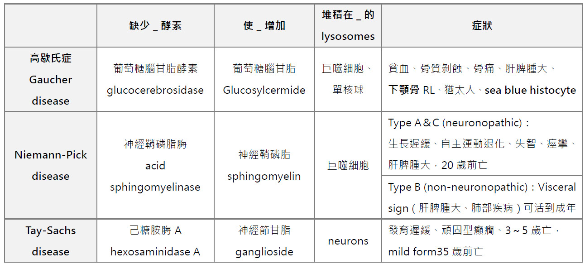

---
toc:
    depth_from: 1
    depth_to: 3
html:
    offline: false
    embed_local_images: false #嵌入base64圖片
print_background: true
export_on_save:
    html: true
---

- 直接: Ag, Ab 
- 間接: Ag
- MMP 抽血幾乎無 Ag，間接免疫螢光陰性

- EM 驗 anti dsDNA
- LP 浸潤主要是 T cell

- Hunter's glossitis: 萎縮性舌炎
- Hashimoto's thyroiditis（橋本甲狀腺炎）是最常見的甲狀腺功能低下症（hypothyroidism）原因之一，屬於慢性自體免疫性甲狀腺炎。該疾病以甲狀腺逐漸遭受免疫系統攻擊、炎症及纖維化為特徵。
- Vit. D 需要腎活化
- hypophosphatasia 尿及血液的檢查中會發現升高的phosphoethanolamine

- Agranulocytosis 
  - 無 neutrophils &rarr; NUG 
- Neutropenia
  - neutrophil< 1,500/mm3
- cyclic neutropenia
  - recurrent aphthous stomatitis
- 白血病

| **疾病**                | **PPT（凝血酶原時間）**                     | **BT（出血時間）**                     |
|-------------------------|--------------------------------------------|---------------------------------------|
| **肝病（如肝硬化）**    | 延長（因凝血因子減少，如因子 II、VII、X）   | 正常或輕微延長（嚴重時可能因血小板異常延長）。 |
| **維生素 K 缺乏**       | 延長（因維生素 K 依賴的凝血因子減少）       | 正常                                   |
| **華法林治療**          | 延長（抑制維生素 K 循環）                   | 正常                                   |
| **血小板減少症（如 ITP）**| 正常                                       | 延長                                   |
| **血小板功能障礙（如 Glanzmann's thrombasthenia）** | 正常                                      | 延長                                   |
| **遺傳性凝血因子缺乏（如血友病）** | 正常（外源性不受影響）或正常（多數為 APTT 延長）| 正常                                   |
| **DIC（瀰散性血管內凝血）** | 延長（凝血因子耗竭）                       | 延長（血小板消耗或血管受損）            |
| **尿毒症（慢性腎病）**   | 正常或延長（輕度凝血因子缺乏）             | 延長（因血小板功能異常）               |
| **Von Willebrand disease** | 正常（與凝血因子無直接關係）               | 延長（因血小板附著功能受損）            |
| **維生素 C 缺乏（壞血病）** | 正常                                      | 延長（血管脆性增加，影響止血過程）       |
| **凝血因子 VII 缺乏**   | 延長（外源性路徑特異性）                   | 正常                                   |
| **Bernard-Soulier syndrome** | 正常                                      | 延長                                   |
| **Ehlers-Danlos syndrome** | 正常                                      | 延長（血管異常導致出血時間增加）         |
| **再生不良性貧血**      | 正常或延長（凝血因子減少）                 | 延長（血小板減少）                      |
| **TTP（血栓性血小板減少紫斑症）** | 正常                                      | 延長（血小板大量消耗）                  |

- 金屬中毒
  - Plubism: 鉛
  - Burton line: 鉛
  - Argyria: 銀(記法: 單字裡有Ag)
  - Acryodynia: 汞= 肢端正 =pink disease手腳脫皮
  - erethism: 汞，興奮症
  - Chrysiasis金

- 口角炎（angular cheilitis）
  - 最常為白色念珠菌（candida albicans）的感染
  - 維生素B2

- Shell teeth 
  - 乳牙 DI
- 淺表性黏液囊腫 superficial mucocele，會在後側頰黏膜長出，苔癬樣病變有關

B) tonofibril 
