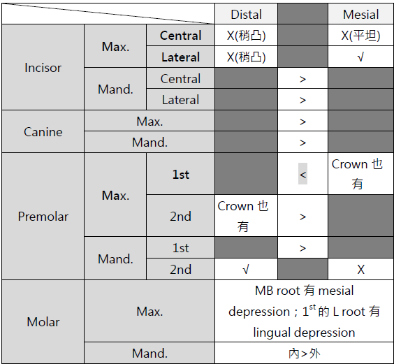
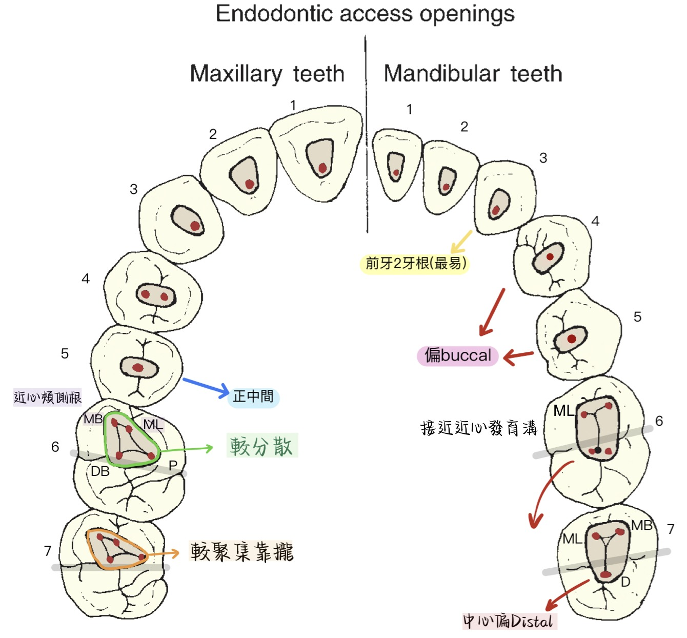
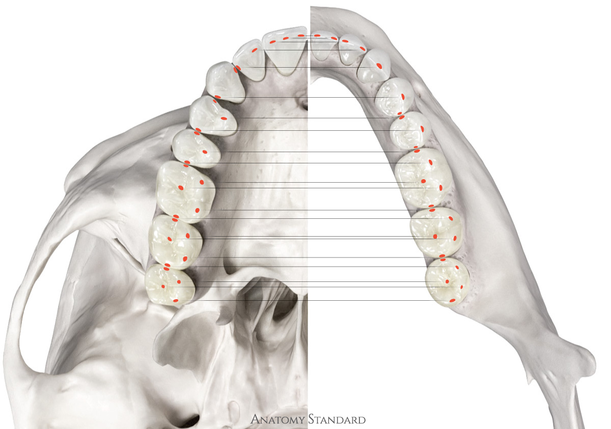

---
toc:
    depth_from: 1
    depth_to: 3
html:
    offline: false
    embed_local_images: false #嵌入base64圖片
print_background: true
export_on_save:
    html: true
--- 

- 前牙根管雙牙根: 下顎犬齒＞下顎門牙＞上顎前牙
- 上顎犬齒最常transposition
- MD>BL：
  - 乳牙：上1,2,3，下3, 4, 5
  - 恆牙：上1,2，下: 6, 7, 8

## Orifice 

## Contact point 

