---
toc:
    depth_from: 1
    depth_to: 3
html:
    offline: false
    embed_local_images: false
print_background: true
export_on_save:
    html: true
---

# 生物相容性
1. ANSI/ADA Specification No. 41(建立了牙科材料的生物性測試)
   1. Iso 10993(不只規範牙科材料)
   2. ISO 7405 (牙科材料的測試)
2. Cytotoxicity tests（細胞毒性試驗）
   1. Teflon 作為陰性(非細胞毒性)
   2. 聚氯乙烯等塑膠材料作陽性(細胞毒性)。
   3. 活性染料 
      1. neutral red 
      2. Na~2~Cr~2~O~7~
   4. 非活性染料
      1. 台盼藍(trypan blue)
      2. 碘化丙啶(propidium iodide)
3. MTT test
   1. 細胞脫氫酶評估細胞毒性
4. Ames' test
   1. 使用最廣泛的短期誘變試驗 
   2. 鼠傷寒沙門氏菌(Salmonella typhimurium) $\xrightarrow{突變}$ 葡萄糖合成組胺酸 &rarr; 缺組胺酸培養液生存
5. Usage tests
   1. Dental Pulp Irritation Tests
      1. Zinc oxide-eugenol 陰性 (無刺激)
      2. silicate cement 陽性

# 色溫

Lab color chart

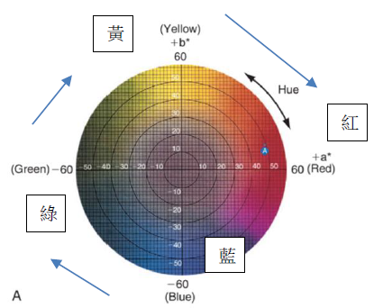

# 熱傳導、擴散
- 比熱: Dentin = GI > Enamel > composite

- 熱傳導 (Thermal conductivity，Κ)
  - 某材料做成截面積 1 cm2、厚度 1cm，兩端溫度差 1 K，每秒通過這材料的==熱量==(過程要控制在溫度梯度不變的狀態)
- 熱擴散 (Thermal diffusivity)
  - 物體表面加熱時，==溫度變化==速度
  - Enamel > zoe > Dentin = GI

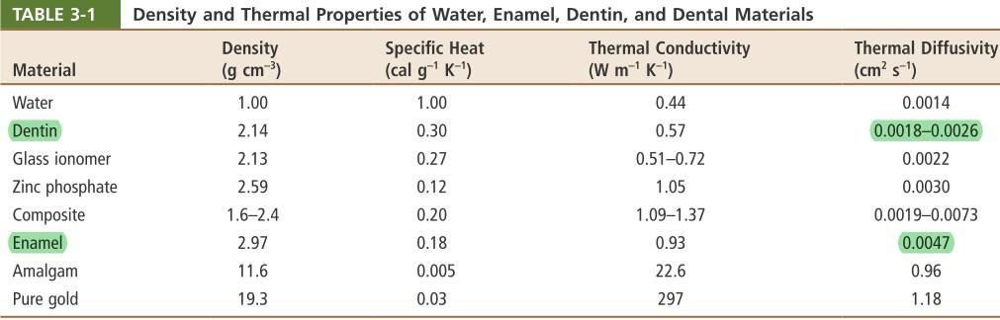

- 熱擴散 
  - 高分子材料 > composite(高分子材料與陶瓷混合而成) > 金屬 > Ti(金屬中最小) > 陶瓷

# 電

- galvanic current: 電休克
- 通常術後疼痛是因為 preparation 造成牙齒生理狀態改變，導致電流會產生疼痛因素
- 在金屬復形物上塗一層 varnish coating 可以減少 galvanic shock。就算 varnish 脫落 了，通常牙齒也恢復到正常生理狀態

- 濃差電池腐蝕 (Concentration cell corrosion)
  - 凹陷處缺氧，須由金屬提供電子，形成陽極

# 應力
- Poisson’s ratio
  - 施予拉力，而橫應變/縱應變 = Poisson’s ratio。
  - 等向性(isotropic): Poisson’s ratio = 0.5 (大部分材料 0.25~0.3)
- 脆性材料要用徑向壓縮試驗
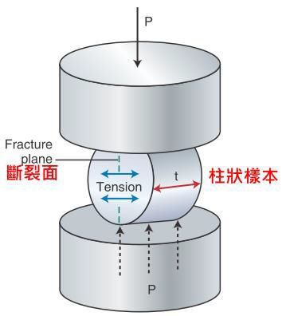

# 金屬 

- 不能熱硬化處理: Pd, Ag(沒有 order phase)
- 降低熱膨脹係數: Pb
- 提高熔點: Pb, Pt
- 緻密氧化: In, Ga, Sn, Fe, Cr
- 過敏: Cr, Be, Ni
- 合金顆粒(grain size)變小 &rarr; 使延展性上升
  - Ir, Re, Ru 

- 矯正線
  - &beta;-Ti 
  - Austenitic (Aus)
  - 鈷-鉻-鎳

## 晶格

- 滑移越多 
  - 延展好
  - 高彈性
    - 難焊接

| 晶體結構 | 滑移系統          | 原子密度       | 延展|硬度|塑性|例子                              | 
|------------|-|-|------------------|----------------|-----------------------------------|-----------------------------------|
| **BCC** (Body-Centered Cubic)    | 6   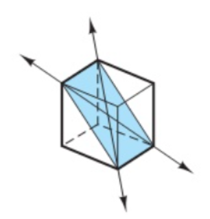       | 中 (68%) | 中(高溫)|高|中低|Fe, Cr, Mo, &beta;-Ti, Fer          | 
| **BCT** (Body-Centered Tetragonal)    | (100)與(110)面，但阻力大      | 中 | 低|極高|低|Mar                           | 
| **HCP** (Hexagonal Close-Packed)    | 3  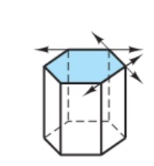  | 高 (74%) | 中低|高|中低|Zn, &alpha;-Ti, Mg          | 
| **FCC** (Face-Centered Cubic)    | 12  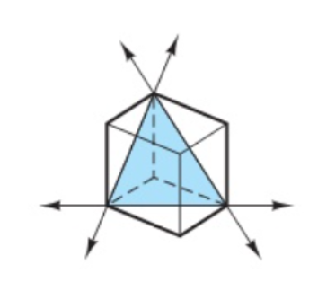      | 高 (74%) | 高|中低|高|Au, Ag, Cu, Al, Aus | 

## 熱處理 

|焠火（Quenching）| 退火(Annealing)、Bench-cooling
|-|-|
|快速冷卻|緩慢冷卻 |
|形成 BCT| 產生 Order phase 消除應力 |
|硬| 延展 |

## Au 

### Cu-Au 

- L: 液體
- &alpha;:FCC, 延展
- &beta;: AgCu、AgCu~3~ 有序晶體(ordered phase )，硬

- Type 3, 4 合金 
  - 400-500 &deg;C &rarr; 傾向&beta; phase 
  - 700-800 &deg;C &rarr; 傾向&alpha; phase 
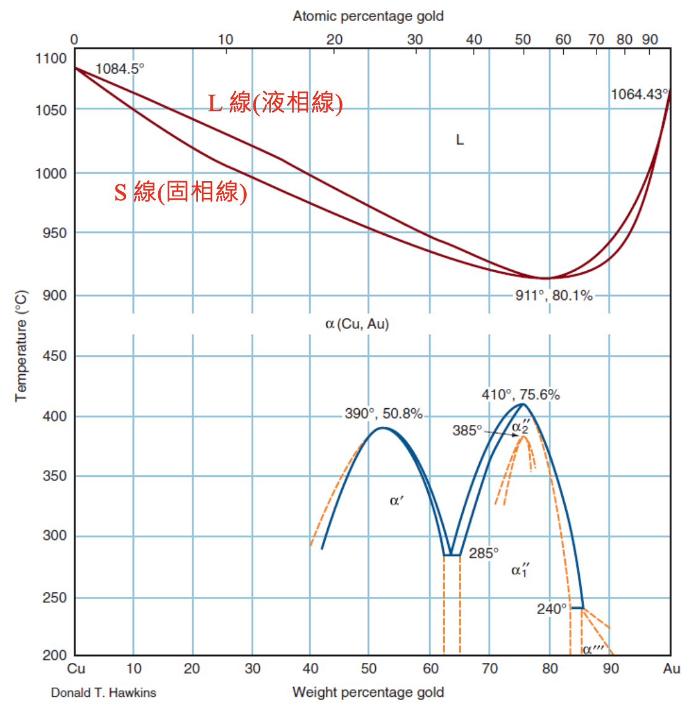

## Ti 

- 純鈦(c.p. Ti)在室溫下為六方最密堆積(HCP)，稱為α相，性質較硬，882℃ 時會變成體心最密堆積(BCC)，稱為β相，彈性、延展性較好，不適合焊接， 適用於矯正線。
- grade 1 純度高，硬度低
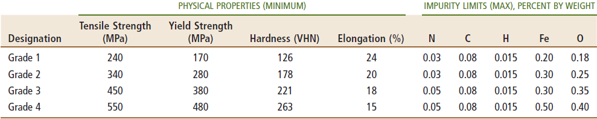

- 彈性模數低，易變形，恢復性強
  - 含Cr的 > Ti > 高貴金屬

## 鍵結到陶瓷

- 穩定的氧化層，增強和陶瓷的結合力
- 高熔點
- 熱收縮係數與陶瓷相近

## 不鏽鋼 
- 鋼+鉻(12-30%)
  - 30 % 易與碳產生碳化鉻，使結構變脆變硬，不防鏽
- Ni的含量越多，合金彈性越高
  - Ni 在其中為 FCC
- 肥粒鋼 (Fer)
  - BCC
- 沃斯田鋼 (Aus)
  - FCC
  - 304
    - 18-8合金(鉻18%，鎳8%)
- 麻田散鋼 (Mar)
  - BCT
  - 高碳

## 其他合金

- 鈦-鋁-釩(Ti-6Al-4V)合金
  - 重量百分比 6% Al與4% V
  - 鋁是α相的穩定劑
  - 釩、銅、鈀是β相的穩定劑
- Ni-Ti
  - 1-2% Co
  - 抗腐蝕
  - 受熱變為FCC，冷卻應力變BCT
    - 低溫可施加外力改變其形狀
    - 受熱恢復形狀

# Resin

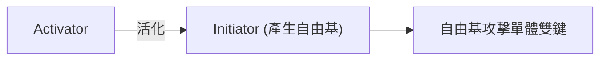

- Activator
  - tertiary amine (自聚合)
  - 藍紫光
- Initiator (產生自由基)
  - benzoyl peroxide(BPO)
  - camphorquinone (CQ，光聚合)

- 大單體 &rarr; 聚合收縮少

- 高黏度 (大分子、氫鍵)
  - Bis-GMA : 兩個雙鍵能開 &rarr; 網狀
  - UDMA
- 低黏度
  - TEGDMA
- 親水
  - HEMA
- 抑制劑 (電子接受者)
  - O~2~
  - BHT 抑制聚合(抓自由基)

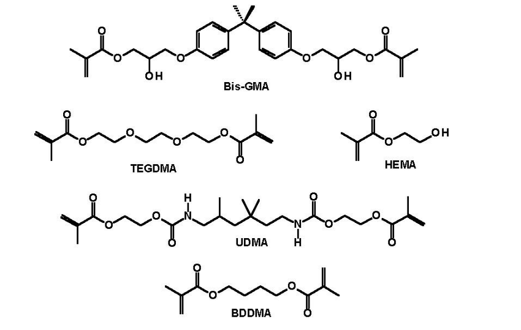

:::warning {MMPs}
- 基質金屬蛋白酶 (Matrix Metalloproteinases)
- 分解胞外蛋白質 (Collagen)
- dentin bond 老化
:::

## 定量 

- 單鍵轉換度 (Degree of conversion/DC)
  - 雙鍵打開百分比
  - Bis-GMA &sim; 50-60%

## 黏著劑 

- Adhesive: 疏水
- Primer: 親水

- 5th: 疏水差，存活短
- Self-etching: 酸蝕不足，Primer resin 需要離子化

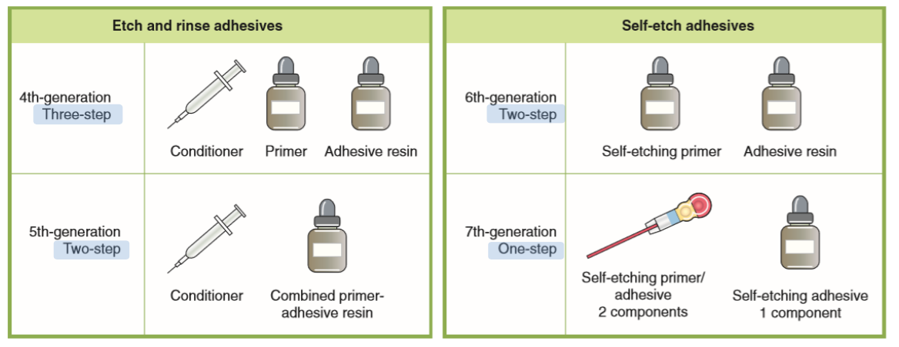

## Resin-Based Composites

- 收縮
  - Flow (5%)
  - micro (2-3%)
  - hybrid (1%)
- 彈性模數：Flow< micro < Traditional < hybrid
- hybrid 可以增加 filler 的 wt% 上限
- micro filler 會靜電聚合，filler 的 wt% 不能太高 (50%)

| |&mu;m|||
|-|-|-|-
Macro- |50||
Mid- |5|small|micro-hybrid
mini- |0.5|^|^
micro- |0.05||^
nano-|0.005|

- 自聚合
  - 三級胺較多 &rarr; 氧化變黃 &rarr; 顏色最不穩
  - 手拌 &rarr; 有氣泡
- 光聚合
  - Initiator: camphorquinone (CQ) + 三級氨
  - BHT 抑制聚合(抓自由基)
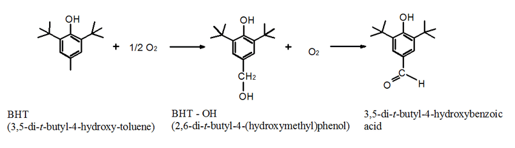
  - 燈
    - LED (440~480 nm)
    - Quartz-tungsten-halogen (QTH, 400~500 nm): UV和白光、須濾鏡、燈泡衰減
    - Plasma arc curing (PAC): 離子化氙氣產生電漿，要濾鏡
    - Argon laser (490 nm): 光強度最高

---

- activator
  - 三級氨親核攻擊
- 偶合劑(Coupling agent)
  - Organosilane
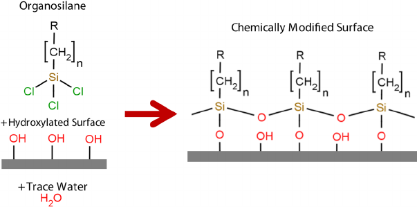

# Cements

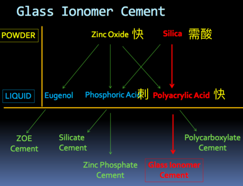

## 材料
>依據發展順序
### Zinc Oxide-Phosphoric Acid Cement (ZPC)

- 催化劑: Al^3+^
- 酸鹼中和，結晶，放熱
- 粉多 &rarr; 強度 &uarr;, Working time &darr;
- 酸刺激 pulp 
- 死白

### Zinc oxide eugenol 

- eugenol
  - 抗氧化
  - 鎮靜 pulp、止痛、緩和發炎
- 中性，螯合

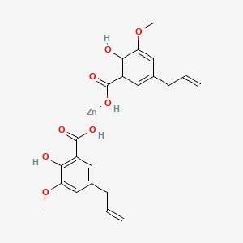

### Zinc Polycarboxylate Cement (PCC)

- 降低酸性 
- Polyacrylic acid (聚丙烯酸)
  - 螯合 Ca^2+^ 和 Enamel 鍵結
  - 反應快

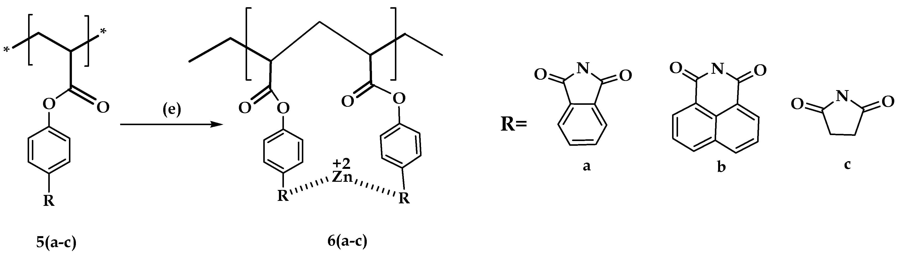

### Glass ionomer (GI)
- type I - 黏合劑，type II - 復形
- 釋放 F-，抗齲齒
- 緩劑: 酒石酸(tartaric acid) 螯合
- 玻璃包 Ca^2+^, Al^3+^，比 ZnO 需要高酸性
- 不可黏全瓷冠(因彈性模數高)
  - 用樹脂

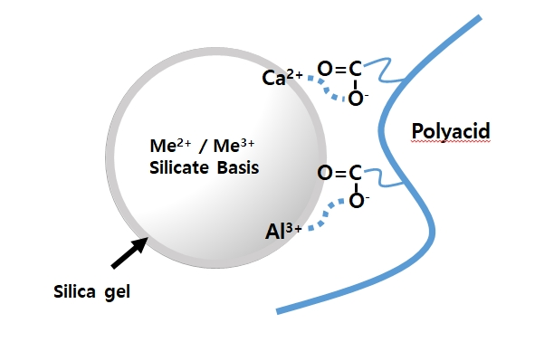

### Liner 

- 降低 pulp 刺激 
  - ZPC, GI 需要

## 定量 

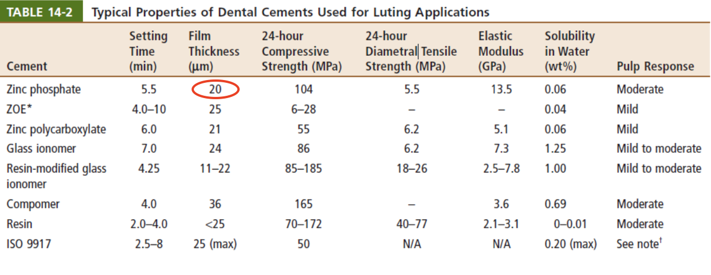

### Film thickness

- 定義: cement 夾在兩個平面之間，在 working time 最後 10 秒施力 150 N，經 10 min 硬化後，測量兩平面間的薄膜厚度。
- 薄 &rarr; solubility 小，抗壓，永久
- 標準 
  - 封黏贋復物: <25 &mu;m

### 溶解 
- ZnO, 聚丙烯酸 易溶
