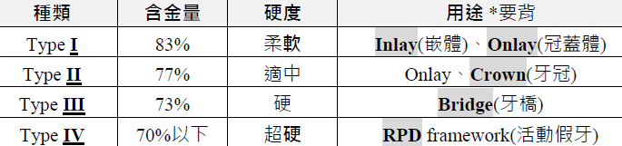

---
toc:
    depth_from: 1
    depth_to: 3
html:
    offline: false
    embed_local_images: false
    print_background: true
export_on_save:
    html: true
---
# 生物相容性
1. ANSI/ADA Specification No. 41(建立了牙科材料的生物性測試)
   1. Iso 10993(不只規範牙科材料)
   2. ISO 7405 (牙科材料的測試)
2. Cytotoxicity tests（細胞毒性試驗）
   1. Teflon 作為陰性(非細胞毒性)
   2. 聚氯乙烯等塑膠材料作陽性(細胞毒性)。
   3. 活性染料 
      1. neutral red 
      2. Na~2~Cr~2~O~7~
   4. 非活性染料
      1. 台盼藍(trypan blue)
      2. 碘化丙啶(propidium iodide)
3. MTT test
   1. 細胞脫氫酶評估細胞毒性
4. Ames' test
   1. 使用最廣泛的短期誘變試驗 
   2. 鼠傷寒沙門氏菌(Salmonella typhimurium) $\xrightarrow{突變}$ 葡萄糖合成組胺酸 &rarr; 缺組胺酸培養液生存
5. Usage tests
   1. Dental Pulp Irritation Tests
      1. Zinc oxide-eugenol 陰性 (無刺激)
      2. silicate cement 陽性

# 色溫

Lab color chart

# 熱傳導、擴散
- 比熱: Dentin = GI > Enamel > composite

- 熱傳導 (Thermal conductivity，Κ)
  - 某材料做成截面積 1 cm2、厚度 1cm，兩端溫度差 1 K，每秒通過這材料的==熱量==(過程要控制在溫度梯度不變的狀態)
- 熱擴散 (Thermal diffusivity)
  - 物體表面加熱時，==溫度變化==速度
  - Enamel > zoe > Dentin = GI

- 熱擴散 
  - 高分子材料 > composite(高分子材料與陶瓷混合而成) > 金屬 > Ti(金屬中最小) > 陶瓷

# 電

- galvanic current: 電休克
- 通常術後疼痛是因為 preparation 造成牙齒生理狀態改變，導致電流會產生疼痛因素
- 在金屬復形物上塗一層 varnish coating 可以減少 galvanic shock。就算 varnish 脫落 了，通常牙齒也恢復到正常生理狀態

- 濃差電池腐蝕 (Concentration cell corrosion)
  - 凹陷處缺氧，須由金屬提供電子，形成陽極

# 應力
- Poisson’s ratio
  - 施予拉力，而橫應變/縱應變 = Poisson’s ratio。
  - 等向性(isotropic): Poisson’s ratio = 0.5 (大部分材料 0.25~0.3)
- 脆性材料要用徑向壓縮試驗

# 金屬 

- 不能熱硬化處理: Pd, Ag(沒有 order phase)
- 降低熱膨脹係數: Pb
- 提高熔點: Pb, Pt
- 緻密: In, Ga, Sn, Fe, Cr
- 過敏: Cr, Be, Ni
- 合金顆粒(grain size)變小 &rarr; 使延展性上升
  - Ir, Re, Ru 

## Ti 

- 純鈦(c.p. Ti)在室溫下為六方最密堆積(HCP)，稱為α相，性質較硬，882℃ 時會變成體心最密堆積(BCC)，稱為β相，彈性、延展性較好，不適合焊接， 適用於矯正線。
- grade 1 純度高，硬度低

- 彈性模數低，易變形，恢復性強
  - 含Cr的 > Ti > 高貴金屬
- 鈦-鋁-釩(Ti-6Al-4V)合金
  - 重量百分比 6% Al與4% V
  - 鋁是α相的穩定劑
  - 釩、銅、鈀是β相的穩定劑

## 鍵結到陶瓷

- 穩定的氧化層，增強和陶瓷的結合力
- 高熔點
- 熱收縮係數與陶瓷相近

