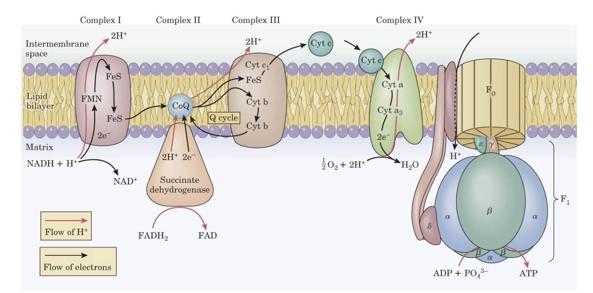
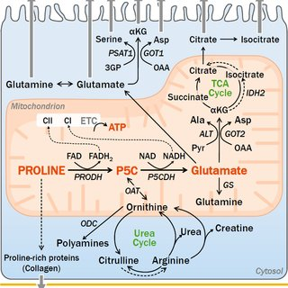
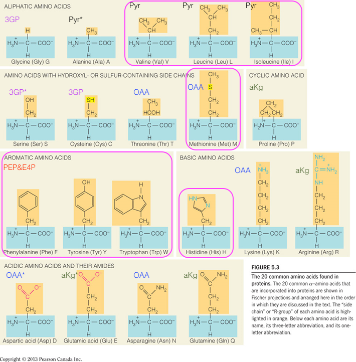
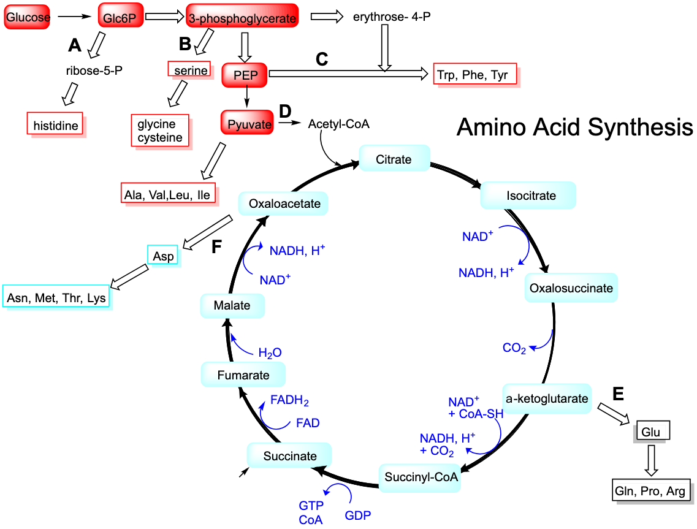
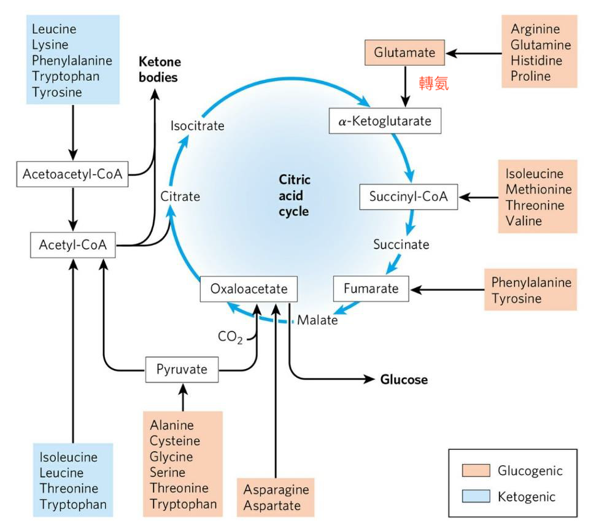
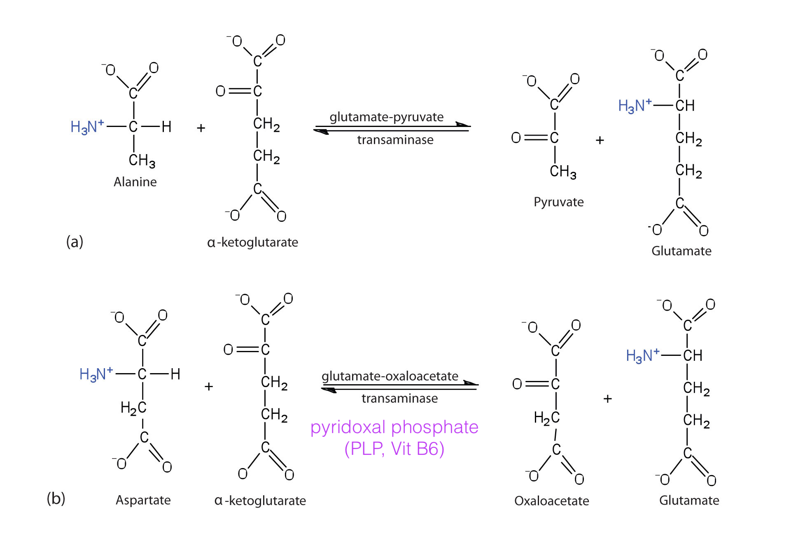
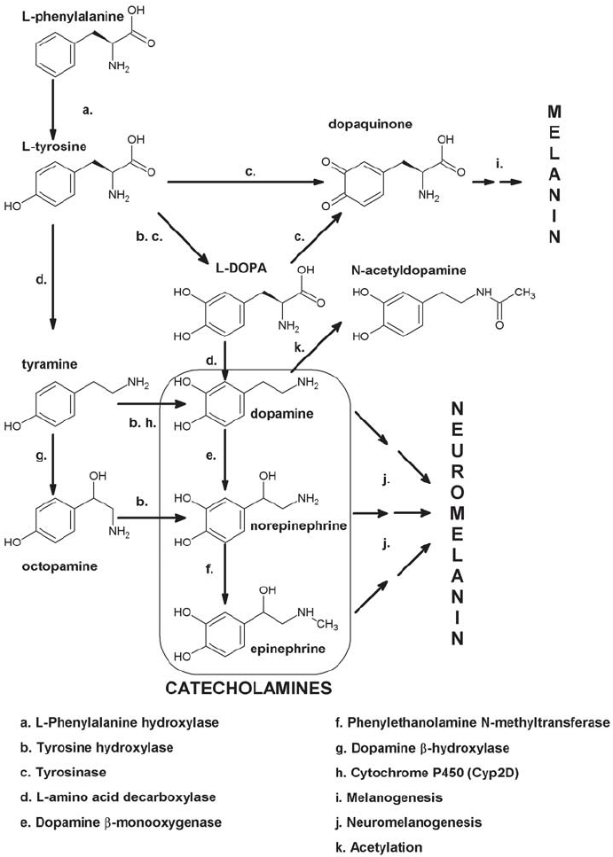
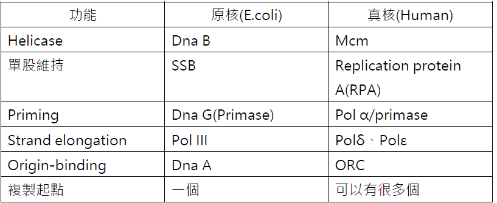
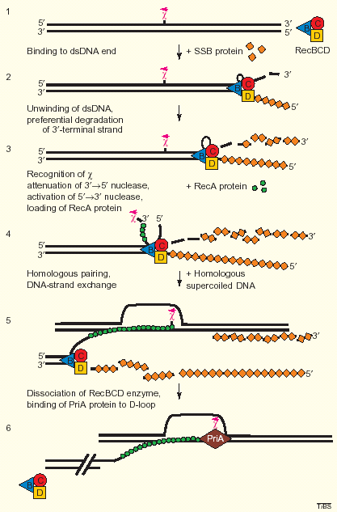

---
toc:
    depth_from: 1
    depth_to: 3
html:
    offline: false
    embed_local_images: false #嵌入base64圖片
print_background: true
export_on_save:
    html: true
---

# 糖

\picBox{

}

# 氨 

# 蛋白質 

## 合成 

- PEP and E4P 
  - 合成有苯環的
  - Phe, Tyr, Trp

## 分解 

- 3T2L(只生酮)1F (HMV, 必須)

##  轉氨

- 轉胺酶：
  - Alanine aminotransferase (ALT; glutamate pyruvate transaminase, GPT)
  - Aspartate aminotransferase (AST; glutamate oxaloacetate transaminase, GOT)

## DOPA 

# 核酸 

## 修復: RecBCD

- Holliday junction: RecA 帶著單股 DNA 入侵其他單股 DNA 

