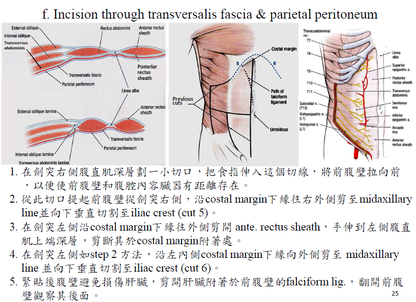
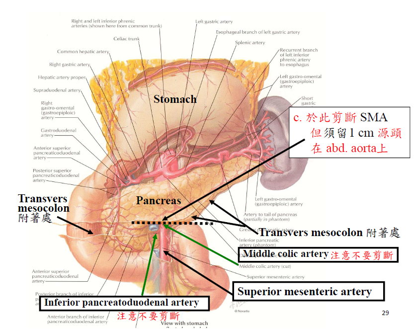

---
html:
    offline: false
    embed_local_images: false #遷入base64圖片
print_background: true
export_on_save:
  html: true
---
[回到目錄](../index.md)
# 大體實

## 09/15
1. Fascia lata

2. Saphenous opening 

4. Crural fascia

5. Superficial veins:
    - Great saphenous vein
    - Dorsal venous arch
6. Cutaneous nerves:
    - Lateral femoral cutaneous nerve
    - Anterior cutaneous branches of the femoral nerve
    - Cutaneous branches of obturator nerve
    - Saphenous nerve
    - femoral branch of genitofemoral nerve
    - Cutaneous branches of superficial fibular nerve
    - 
6. Superficial inguinal lymph nodes 
7. Horizontal group
8. Vertical group
# 0929
median umbilical fold
: pentoneum 壓 median umbilical ligament 

Medial umbilical fold
: pentoneum 壓 umbilical a.

Inf. epigastric a.
: Arcuate line 穿出到 Rectus abdominis m. 下

# 1003
## 操作
1. 

2. 剪Celiac trunk, sup. mesenteric a.
   
   
###### tags: `TMU`

