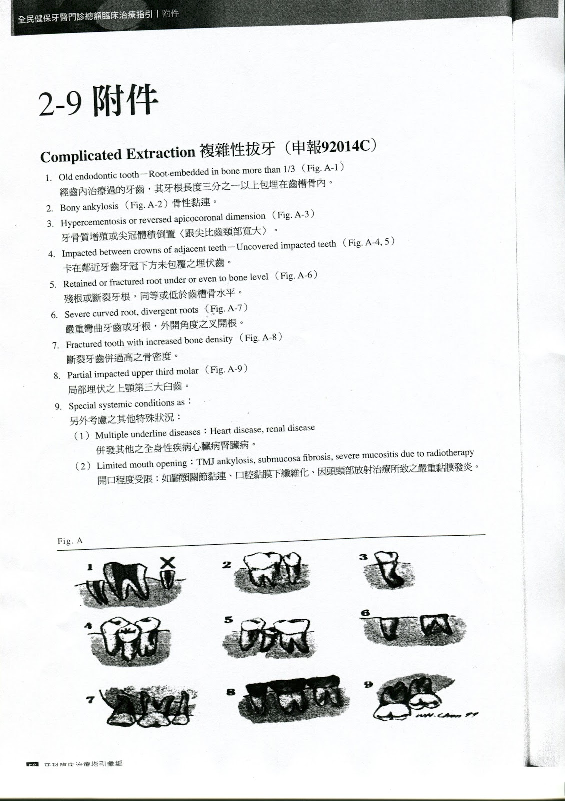

---
toc:
    depth_from: 1
    depth_to: 3
html:
    offline: false
    embed_local_images: false #嵌入base64圖片
print_background: true
export_on_save:
    html: true
---
# 健保
## Peri 

- 3601 是附屬的安全評估費： 高風險疾病（中風、洗腎等）幫病人查詢雲端藥歷並記載於病歷後

|                                  | P7302C (3m) | 3601                                 | 91090(3m) | 91089(3m) | 91004(6m) | 91018   | 92014
| -------------------------------- | ---- | ------------------------------------ | --------- | --------- | --------- | ------- | -|
| 65y                              |  &check;| -                                    | &check;   | -         | -         | -       |&check;|
| 心血管疾病患, 透析, 癌症|  &check;    | &check;                              | &check;   | -         | -         | -       |&check;|
| 抗骨鬆|  &check;    | &check;                              | &check;   | -         | -         | -       |-|
| DM                               |  &check;| &check;                              | -         | &check;   | -         | -       |&check;|
| ^                                |  ^    | 記載六個月內 HbA1C/最近一次 AC Sugar | ^         | ^         | ^         | ^       |^|
| HTN                              |   -   | &check;                              | -         | -         | &check;   | -       |-|
| 91023後                          |    -  | -                                    | -         | -         | -         | &check; |-|
|曾於同院所接受 89013C、89113C、91009B、91010B|&check;|-|
- 91015C: 已完成 91023C，1-3顆局部SRP
- 91016C: 已完成 91023C，4顆以上局部SRP
- 91018C: PI + s/c + OHI + 局部重點RP，一年後至少一顆 &geq;5mm可以繼續
- 91009B（牙周翻瓣手術-單一區域） 與 91010B（牙周翻瓣手術-大範圍）只限於「地區醫院、區域醫院、醫學中心」

- 牙統
  - 收案
  - 21: charting + pi + srp 
  - 22: last pi + srp 
  - 23: pi + re-charting
- 92014C: 65y, 全身性疾病患者, 智齒, 特殊解剖構造
