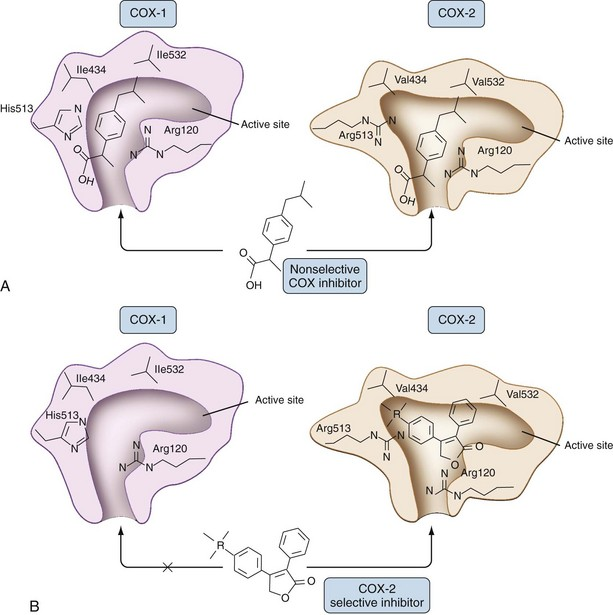
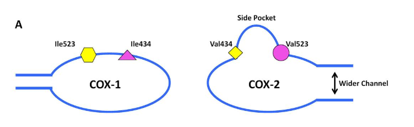
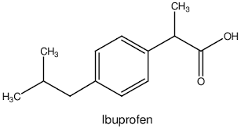

---
toc:
  depth_from: 1
  depth_to: 3
html:
  offline: false
  embed_local_images: false #嵌入base64圖片
print_background: true
export_on_save:
  html: true
---
# 用藥
## Anti 
### $\beta$-lactam
- Amoxicillin: 500mg Q8H 7days
- Curam (Amoxicillin + Clavulanic acid)
- Cephalexin
### Macrolide
- Azthromycin

| 項目 | Curam | Cephalexin | Azithromycin |
|------|----------------------------------------|------------|--------------|
| **藥物類別** | $\beta$-lactam  | | Macrolide |
| **牙科適應症** | 第一線治療大部分牙源性感染 | 輕中度感染、替代用藥 | Penicillin allergy 替代藥物 |
| **組織滲透力** | 良好 | 中等 | 極佳（組織濃度高） |
| **半衰期** | 約 1 hr || 約 68 hr |
| **成人劑量** | 875/125 mg BID 或 500/125 mg TID| 250–500 mg TID–QID | 250–500 mg QD |
| **療程** | 10d | 7–10d | 5-7d|
| **主要排泄** | 腎臟 | | 膽汁（少量腎臟） |
| **主要代謝** | Amoxicillin 幾乎不代謝  Clavulanate 部分肝代謝 | 幾乎不代謝 | 肝臟代謝 |
| **腎功能不全** | 需調整劑量 | | 通常不用調整 |
| **肝功能不全** | 小心使用 | 通常不用調整 | 小心使用 |
| **常見副作用** | 腹瀉、腸胃不適、肝功能異常 | 腸胃不適、皮疹 | 腸胃不適、QT prolongation |
| **禁忌** | Penicillin allergy、曾發生 clavulanate 相關膽汁鬱積性肝炎 | Cephalosporin allergy；立即型 Penicillin allergy 應避免 | Macrolide allergy、QT prolongation、心律不整 |
| **主要交互作用** | Warfarin、Methotrexate、Allopurinol | Warfarin | Warfarin、Digoxin、QT 延長藥物 |
| **優點** | 抗菌譜完整，牙科第一線 | 安全、價格低 | 一天一次、組織濃度高 |
| **缺點** | 腸胃副作用較多 | 厭氧菌覆蓋不足 | Streptococcus 抗藥性較高，不建議作為第一線 |

## 消炎止痛
| 項目 | Acetaminophen | Diclofenac potassium (Cataflam®) |
|------|---------------|----------------------------------|
| **藥物分類** | Acetaminophen（非 NSAID） | NSAID |
| **作用機轉** | 中樞 COX 抑制 | 抑制 COX-1、COX-2，降低 Prostaglandin 合成 |
| **消炎效果** | &cross;| &check; |
| **止痛效果** | &check; | 較佳 |
| **術後消腫** | &cross; | &check; |
| **常用劑量** | 500 mg Q4–6H PRN| 25–50 mg TID–QID |
| **Max** |  4g/day；老人或肝病 ≤3 g/day | 150 mg/day |
| **Tmax** | 30–60 min | 0.5–1 hr |
| **半衰期** | 2–3 hr | 1–2 hr |
| **代謝** | 肝臟（Glucuronidation、Sulfation；少量 CYP2E1→NAPQI） | 肝臟（CYP2C9） |
| **排泄** | 腎臟||
| **主要優點** | 胃刺激少，腎安全 | 止痛、抗發炎效果佳 |
| **副作用** | 肝毒性（過量） | GI bleeding、胃潰瘍、腎毒性、心血管風險 |
| **禁忌** | 嚴重肝病、慢性酗酒、過量使用 | NASID禁忌 |
| **臨床定位** | 第二線或輔助用藥 | 第一線牙科術後止痛消炎 |

### NASID

- COX-1
  - 血小板聚集 &darr;
  - Prostaglandin &darr;

|部位|COX1 影響||
|-|-|-|
胃|      ↓ PGE₂ → GI bleeding
腎 |     ↓ PGE₂ → GFR↓ → AKI
心  |    Na/H₂O retention → CHF、HTN
肺   |   Leukotriene↑ → Asthma
胎兒  |  Ductus closure
血小板 | TXA₂↓ → Bleeding

| 禁忌／慎用 | 機轉 | 臨床風險 |
|------------|------------------|----------|
| **GI bleeding、Peptic ulcer** |↓ PGE₂、PGI₂ → 胃黏液、HCO₃⁻ 分泌減少，胃酸傷害增加，黏膜修復能力下降 | 胃炎、胃潰瘍、胃腸道出血 |
| **CKD（Chronic Kidney Disease）** | 抑制腎臟 Prostaglandin → 入球小動脈（afferent arteriole）收縮 → 腎血流、GFR 下降 | AKI、CKD 惡化 |
| **Heart failure（CHF）** | ↓ Prostaglandin → 鈉、水滯留，腎灌流下降 | 水腫、心衰竭惡化 |
| **Hypertension** | 鈉、水滯留，且降低部分降壓藥效果 | 血壓升高 |
| **NSAID-induced asthma（AERD）** | COX 被抑制 → Arachidonic acid 轉向 Leukotriene 路徑 → LTC₄、LTD₄、LTE₄ ↑ | 支氣管收縮、氣喘發作 |
| **第三孕期** | 抑制胎兒 PGE₂ → 動脈導管（Ductus arteriosus）提早閉鎖；抑制子宮收縮 | 胎兒肺高壓、延遲生產 |
| **嚴重肝病** | 凝血功能差，加上 NSAID 增加出血風險；部分 NSAID 經肝代謝 | GI bleeding、肝毒性 |
| **出血傾向／服用抗凝血藥** | 抑制 COX-1 → TXA₂ ↓ → 血小板聚集下降；加上胃出血風險增加 | 出血時間延長、GI bleeding |
| **NSAID allergy** | 過敏或交叉反應 | 過敏、蕁麻疹、Anaphylaxis |

:::info {COX結構小知識}

COX酵素結合位是90&deg;插槽，角落有一個正電 Arginine 120，所以NASID 設計上會想辦法插一個酸根和Arginine 120 結合，流派如下： 

- 直角流派: 2,6-二氯苯基用立體阻礙夾出 90&deg;
  - 形狀最合適，結合力強，副作用大

|Diclofenac potassium|Aceclofenac|
|-|-|
|||

- 扭轉流派：兩邊的分子團可以旋轉，Profens扭進去結合位，Profen 甲基可以卡緊 COX 酵素 (lle532)

Ketoprofen| ibuprofen|
|-|-|
| |

- 扁平分子：meloxicam: 用四面體配位的水轉接
 

:::

# 類固醇

|藥物 | Dexamethasone | Methylprednisolone (Medrol) | Prednisolone |
|------|---------------|-----------------------------|--------------|
| 相對抗發炎效力 | 25 | 5 | 4 |
| 等效劑量 | 0.75 mg | 4 mg | 5 mg |
| 生物半衰期 | 36–54 hr | 18–36 hr | 12–36 hr |
| Mineralocorticoid 活性 | 幾乎無 | 幾乎無 | 少量 |
| 消腫效果 | ★★★★★ | ★★★★☆ | ★★★☆☆ |
| 牙科用途 | 智齒、植牙、口外手術 | Dosepak、術後消腫 | 較輕度術後或過敏 |
