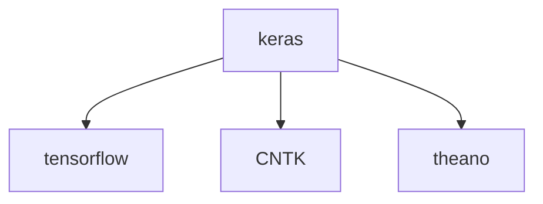
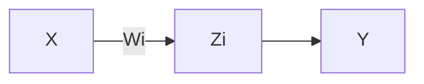
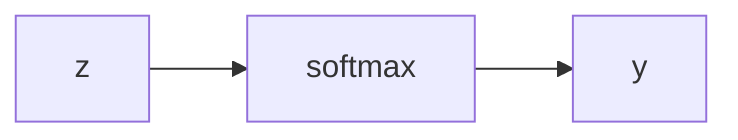
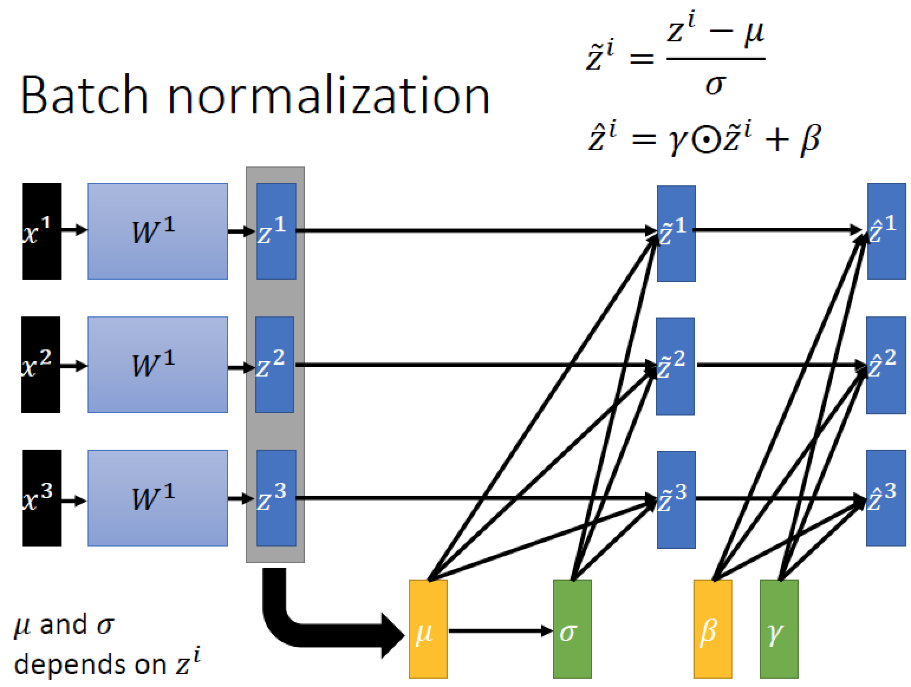
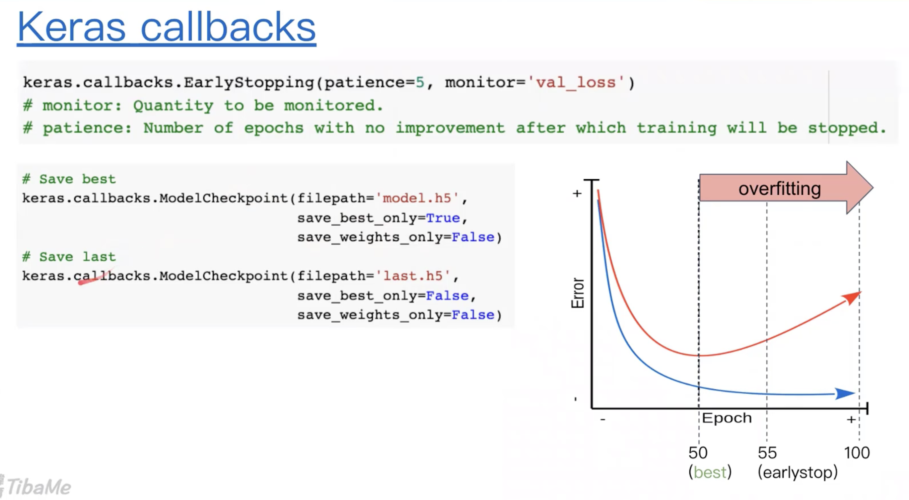
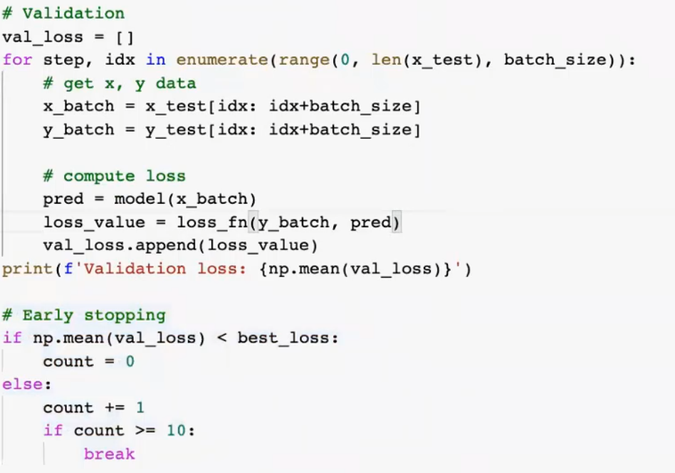
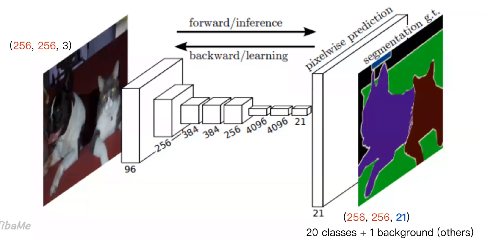
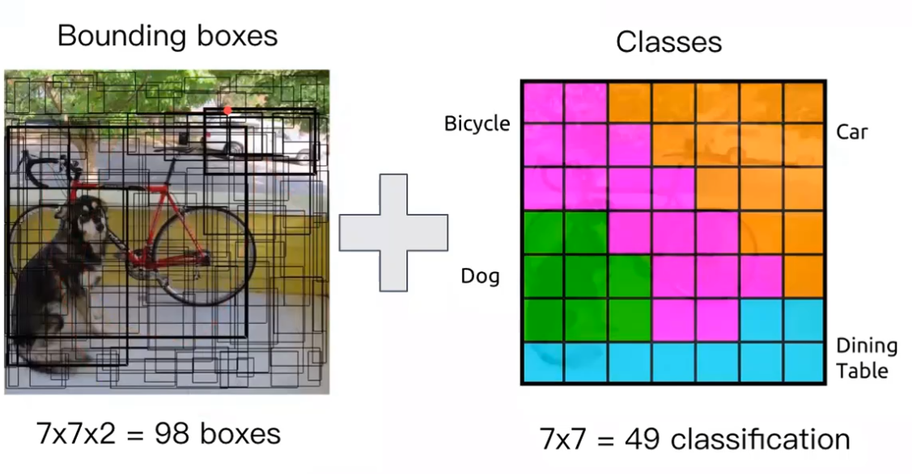
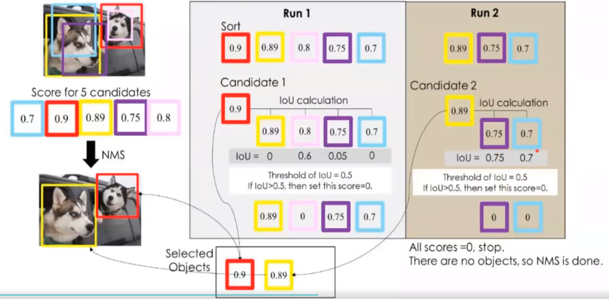
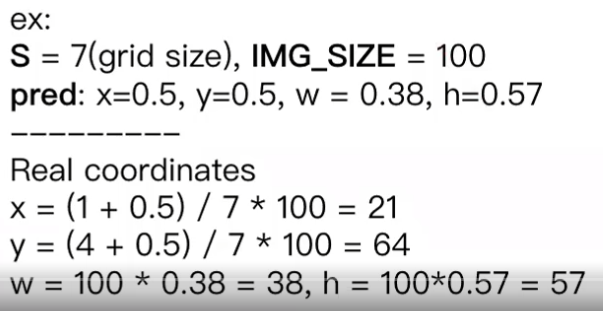

---
html:
    offline: false
    embed_local_images: false #遷入base64圖片
print_background: true
export_on_save:
  html: true
---
# Keras


# 模型


$$
\begin{array}{l}
z_0=x\\
z_i=z_{i-1}\cdot W_i+b_i\\
z_n=y=f_\Theta(x), \Theta=\{(W_i, b_i)\}\\
\end{array}
$$
## 梯度下降
每次往微分最小方向走一步
:::example{find min of f(x)}
$$
x_{new}=x_{old}-\eta f'(x_{old})\ \ (\eta:學習率)
$$
:::

## Lost function
$\hat y$: true value
$y$: prediction 
Mean square error
$$
\frac{\sum(y-\hat y)}{N}^2
$$
Mean Absolute Error
$$
\frac{\sum|y-\hat y|}{N}
$$

Binary Cross Entropy (評估二元分類)
$$
-\frac{1}{N}\sum[\hat y\log y + (1-\hat y_i)log(1-y_i)]
$$

# 分類
## 正規化

$$
softmax(h)=\frac{1}{\sum_i \exp(h_i)}\exp(h)
$$
## Multi-class
考慮n維uni cube
### Lost function
Categorical cross function
$$
-\frac{1}{N} \sum\hat y \log y
$$

# 捲積
對應位置用卷積核當係數線性組合
```python
tf.keras.layers.Conv2D(
    filters, kernel_size, strides=(1, 1), padding='valid', data_format=None,
    dilation_rate=(1, 1), activation=None, use_bias=True,
    kernel_initializer='glorot_uniform', bias_initializer='zeros',
    kernel_regularizer=None, bias_regularizer=None, activity_regularizer=None,
    kernel_constraint=None, bias_constraint=None, **kwargs
)
```
## 三劍客
### convolution 
### Batch Normalisation

### ReLU
$$
f(x)=\left\{
\begin{array}{l}
  &0 \ \ (x<0)\\
  &x \ \ (x\geq 0)
\end{array}\right.
$$
### example

```python
def conv_bn(x, filters):
    x = tf.keras.layers.Conv2D(filters=filters,Kernel_size=3, padding='same')(x)
    x = layers.BatchNormalization()(x)
    x = layers.ReLU()(x)
```

# 實作
```python
import tensorflow as tf
from tensorflow.keras import datasets, models, layers, utils, activations, losses, optimizers, metrics
import numpy as np
import matplotlib.pyplot as plt
import cv2
import os
from glob import glob
from tqdm import tqdm
from sklearn.model_selection import train_test_split
import pandas as pd
```
## 遷移學習
[模型們](https://keras.io/api/applications/)
<iframe 
  src="https://website-card-embed-demo.humblex.top/?url=https://keras.io/api/applications/" 
  style="width:100%;height:124px" frameborder="no">
</iframe>

```python
# Method 1
# clear graph
tf.keras.backend.clear_session()


#base_model
base_model = tf.keras.applications.EfficientNetB0(include_top=False, 
                                                  weights='imagenet', # None
                                                  input_shape=(IMG_SIZE, IMG_SIZE, 3)
                                                  )
x = base_model.output

# Classifier
x = layers.GlobalAveragePooling2D()(x)
x = layers.Dense(256, activation='relu')(x)
x = layers.Dropout(0.3)(x)
x = layers.Dense(256, activation='relu')(x)
x = layers.Dropout(0.3)(x)
x = layers.Dense(256, activation='relu')(x)
x = layers.Dropout(0.3)(x)
predictions = layers.Dense(3, activation='softmax')(x)

# Freeze
for l in base_model.layers:
    l.trainable = False


#建構模型
model = models.Model(base_model.input, predictions)
model.summary()

#編譯模型
model.compile(optimizer='adam', 
              loss=losses.categorical_crossentropy, 
              metrics=[metrics.categorical_accuracy])
#訓練
logs = model.fit(x_train, y_train,
                batch_size=30,
                epochs=30,
                validation_data=(x_val, y_val))
```

## Callback & Save 
[Detail](src/02-keras%20callbacks.ipynb)


### 手刻 Early stopping 


# 資料擴增(Data Augmentation)
## Imgaug
[Detail](src/03-DataAugmentation.ipynb)
https://github.com/aleju/imgaug

<iframe 
  src="https://website-card-embed-demo.humblex.top/?url=https://github.com/aleju/imgaug" 
  style="width:100%;height:124px" frameborder="no">
</iframe>

# Data Generator
> 省內存

https://www.tensorflow.org/api_docs/python/tf/keras/utils/Sequence

繼承utils.Sequence，需要實作
*   def \_\_len\_\_: number of **batches** per epoch
*   def \_\_getitem\_\_(idx): get the idx-th batch
* def \_\_on_epoch_end\_\_: called at the end of epoch
```python
class DataGenerator(utils.Sequence):
    def __init__(self, paths, batch_size, img_size, mode='train'):
        self.paths = paths
        self.batch_size = batch_size
        self.mode = mode
        self.img_size = img_size

        self.shuffle = mode == 'train' #打亂
        self.idxs = np.arange(len(self.paths)) # [0, 1, 2, ..., len(self.paths)-1]
        self.all_class = ['normal', 'bacteria', 'virus']
        self.class_map = {cls: i for i, cls in enumerate(all_class)}#類別to num
        self.num_classes = len(self.class_map)
        self.on_epoch_end()#洗牌
        # augmentation
        # self.aug = imgaug....
    def __len__(self): #讀完幾批是一個epoch
        'number of batches per epoch'
        return int(np.ceil(len(self.paths) / self.batch_size))

    def __getitem__(self, batch_index):#取資料
        # Generate idxs of the batch
        idxs = self.idxs[batch_index*self.batch_size: (batch_index+1)*self.batch_size]
        # Find list of IDs
        batch_paths = [self.paths[i] for i in idxs]
        # Generate data
        return self.__data_generation(batch_paths)

    def on_epoch_end(self):#洗牌
        if self.shuffle:
            np.random.shuffle(self.idxs)

    def __data_generation(self, paths):#準備資料
        """
        Generates data containing batch_size samples
        """
        x = np.empty((len(paths), self.img_size, self.img_size, 3), dtype=np.float32)
        y = np.empty((len(paths)))

        for i, path in enumerate(paths):
            img = cv2.imread(path)[:, :, ::-1]
            # img preprocess
            img = cv2.resize(img, (self.img_size, self.img_size))

            # # TODO: Data Augmentation
            # if self.mode == 'train':
            #     img = self.aug.augment_image(img)

            # Preprocess
            img = img / 255.
            # img = tf.keras.applications.efficientnet.preprocess_input(img)
            x[i] = img
            
            if self.mode != 'test':
                # read class label
                cls = path.split(os.sep)[-2].lower()
                if cls == 'pneumonia':
                    # get filename
                    filename = path.split(os.sep)[-1]
                    # get pneumonia subclass
                    cls_pneumonia = filename.split('_')[1] 
                    cls_idx = class_map[cls_pneumonia]
                # for normal class
                else:
                    cls_idx = class_map[cls]
                y[i] = cls_idx#y紀錄train 的類別ID
            

        if self.mode != 'test':            
            # one-hot encoding
            y = tf.keras.utils.to_categorical(y, num_classes=self.num_classes)
            return x, y
        else:
            return x
```
## 處理資料
```python
IMG_SIZE = 256
BATCH_SIZE = 64

all_class = ['normal', 'bacteria', 'virus']
# 'normal':0, 'bacteria': 1, 'virus':2

gen_train = DataGenerator(img_paths_train, BATCH_SIZE, IMG_SIZE, mode='train')
gen_val = DataGenerator(img_paths_val, BATCH_SIZE, IMG_SIZE, mode='val')
gen_test = DataGenerator(img_paths_test, BATCH_SIZE, IMG_SIZE, mode='test')

# def __len__(): batches per opech
len(gen_train), len(gen_val)

# get 1 batch
# def __getitem__(self, batch_idx)
imgs, labels = gen_train[0]
```
## fit model
```python 
model.fit(gen_train,
          validation_data=gen_val,
          epochs=10)
```
## Prediction
```python
predictions = model.predict(gen_test)
```

# 影像分割
 
放大方法: 特徵融合，擷取各層  

## 放大
- Upsampling 一模一樣
- transposed convolution


@web https://github.com/wkentaro/labelme/releases

# 即時影像偵測\

## YOLO v1
**Step 1**
49 格，分類
**Step 2**
中心在某格裡面的物件

**Step 3**
根據中心位置給框框類別

**Step 4**
NMS (選出最有可能的方框框)

### 模型 
#### 最後7x7x30
前10:兩格框

後20:類別

#### Loss function
$$
\sum_{obj,\ boxes}{\mathcal{D}(P,\hat P) }+\\
\sum_{obj,\ boxes}{(C - \hat C)^2}+\lambda _{no\_ obj} \sum_{no\_ obj,\ boxes}{(C - \hat C)^2}+\\
\sum_{obj} \sum_{c\in classes}{(p-\hat p)^2}
$$
$$
P: (x,y),\ C: confidence,\ p: possibility
$$

## Label 
@web https://github.com/heartexlabs/labelImg
>中文路徑gg

@web https://github.com/WongKinYiu/PyTorch_YOLOv4

@web https://roboflow.com/

@web https://github.com/taipingeric/yolov7

<code>
ssssss
</code>
