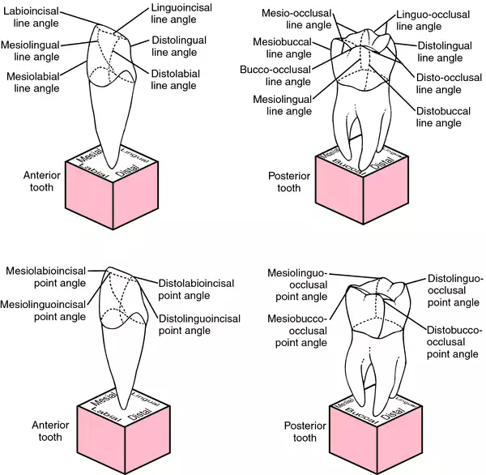
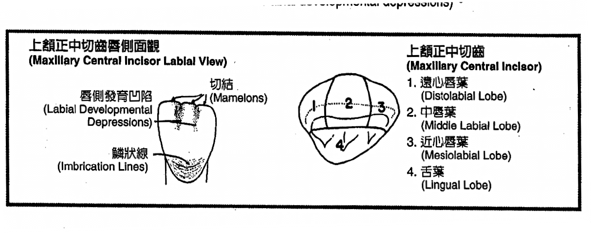
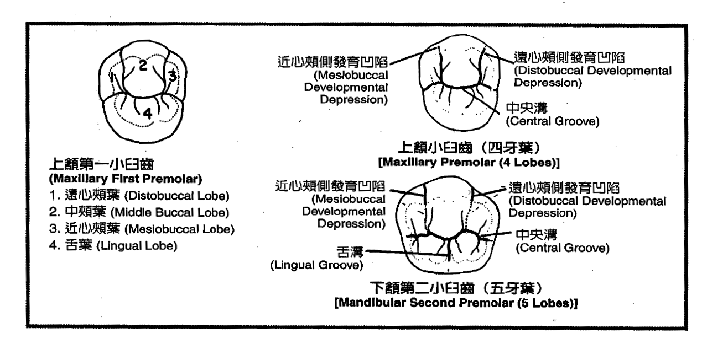
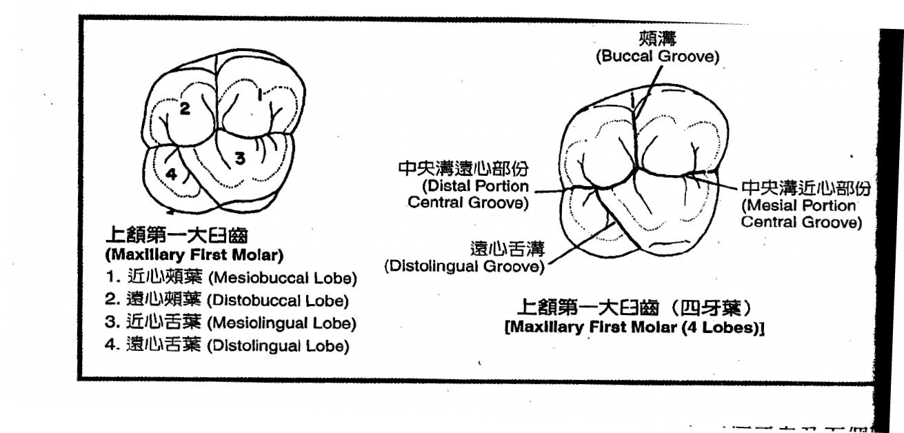
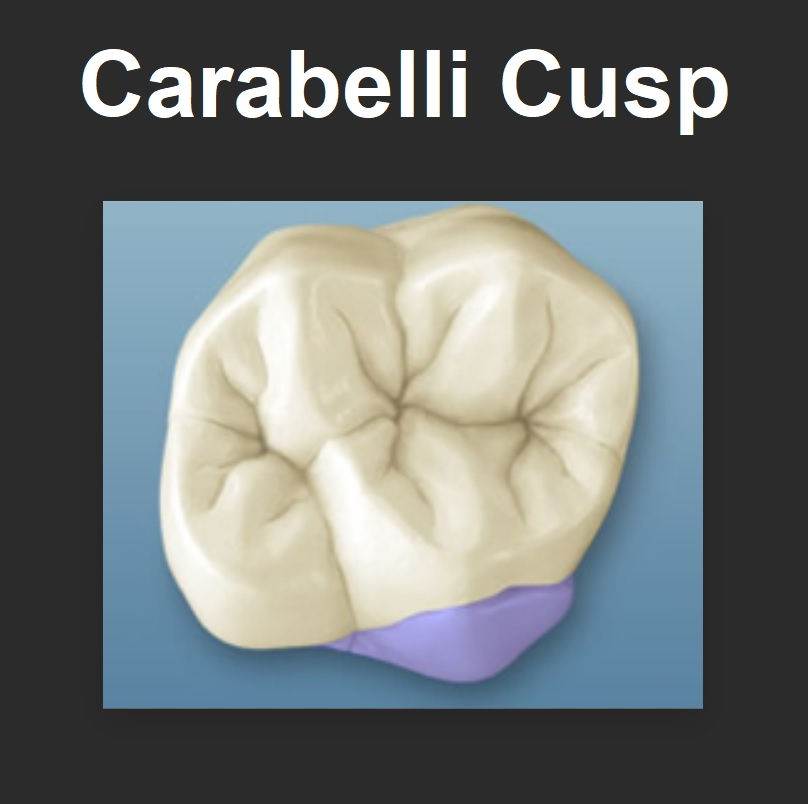

---
toc:
  depth_from: 1
  depth_to: 3
html:
    offline: false
    embed_local_images: false #嵌入base64圖片
print_background: true
export_on_save:
  html: true
---

# Tooth development from lobes
## 前牙

## Premolars

:::warning

1. 上顎一大臼→5(if carabelli cusp)
   
2. 下顎一大臼→5(have a total of 5 cusps, including distal cusp)
3. 下顎二小臼→5(when there are two lingual cusps，舌側遠心 cusps 小)
:::
