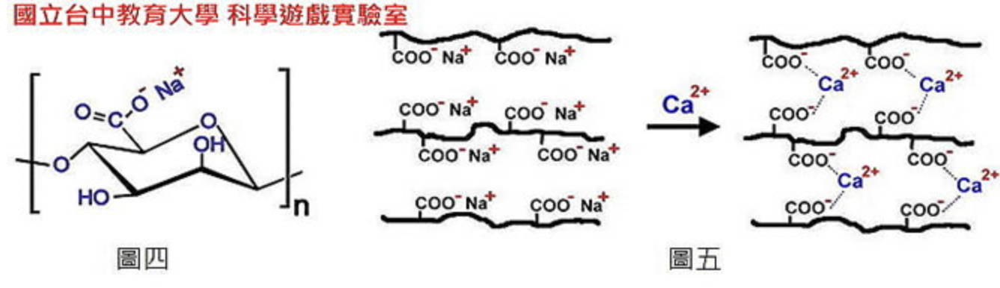

---
html:
    offline: false
    embed_local_images: false #遷入base64圖片
print_background: true
export_on_save:
  html: true
---
# 牙材
# Intro
>物化性考表格
- 聚合物熱膨高
# 印模材
## 分類
| 機轉   | 彈性           | 非彈性 |
| ------ | -------------- | ------ |
| 不可逆 | 石膏 ZOE |  藻膠 多硫橡膠 聚乙醚 縮合/加成矽膠      |
| 可逆       | 印模混合 臘               |  瓊膠(agar)      |

:::info
無under cut倒凹(ex.無牙齒)，可用非彈性
::: 
:::warning
藻膠,瓊膠>3mm
彈性印模材>2mm
:::
## 藻膠 alginate

- 藻酸鉀鹽+石膏
- Na~3~PO~4~延緩
- 水溫控制凝固
## 多硫橡膠
- PbO~2~催化
- Tio~2~填充物
- 衣服變色
- 彈性好
- 兩管(base, acceleter)，拌刀沾acceleter
:::info
$$黏稠度=\frac{撕裂應力}{形變}$$
:::

# 石膏
## Gypsum
粉末：CaSO~4~$\cdot\frac{1}{2}$H~2~O

## 凝固
即為CaSO~4~結晶
### 離子
- 加入少量離子加速結晶，過多則減緩（ eg. 2% NaCl）
- 陽離子減速

## 加速劑
- 低濃度離子

## 減速劑
- 高濃度離子
- 減少接觸
  - Glue 動物膠
  - Gelatin 明膠吉利丁
  - 硼砂

- 抓Ca^2+^
  - 酒石酸
  - 明礬
- 酸(抓SO~4~^2-^)

# Alginate
鈣離子（Ca2+）會取代納離子（Na+）的角色，並且抓住海藻酸鈉分子之間的羧酸離子，使得分子間的聯結性更強（如圖五），此交聯作用（cross-linking）使分子更為固定，流動性降低而固化（形成一種半透膜）。

