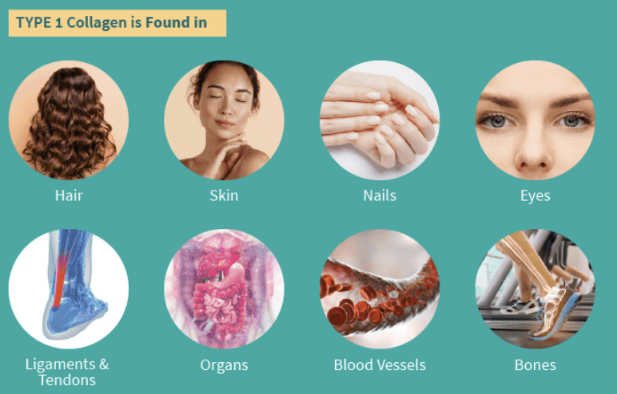
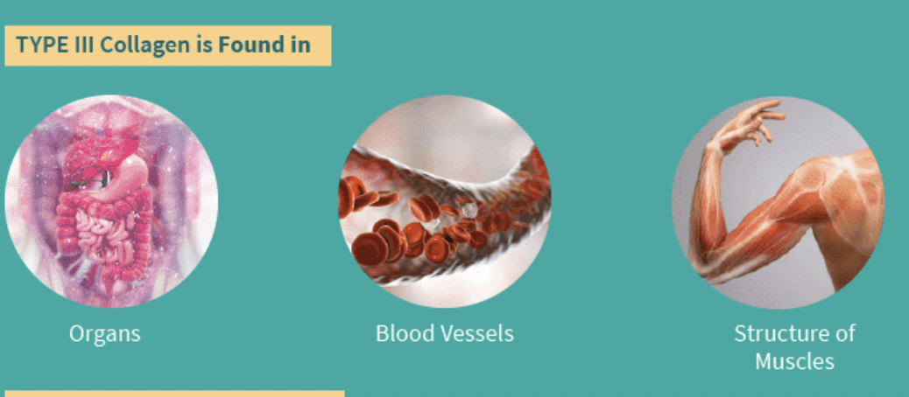
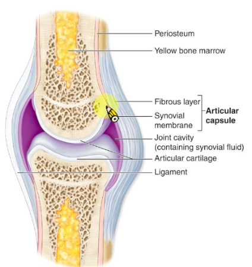
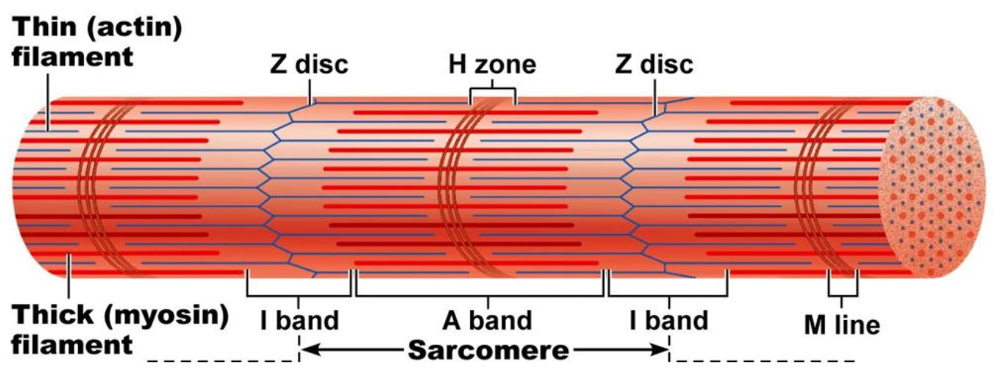
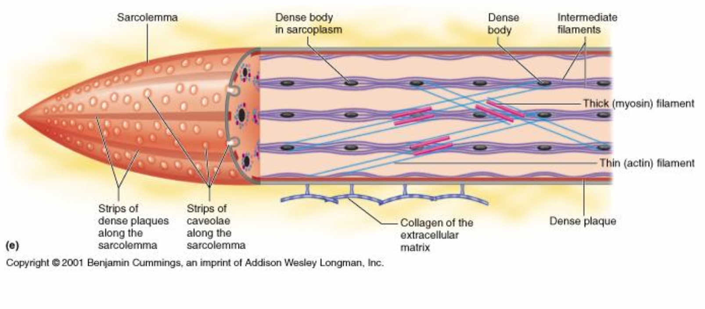
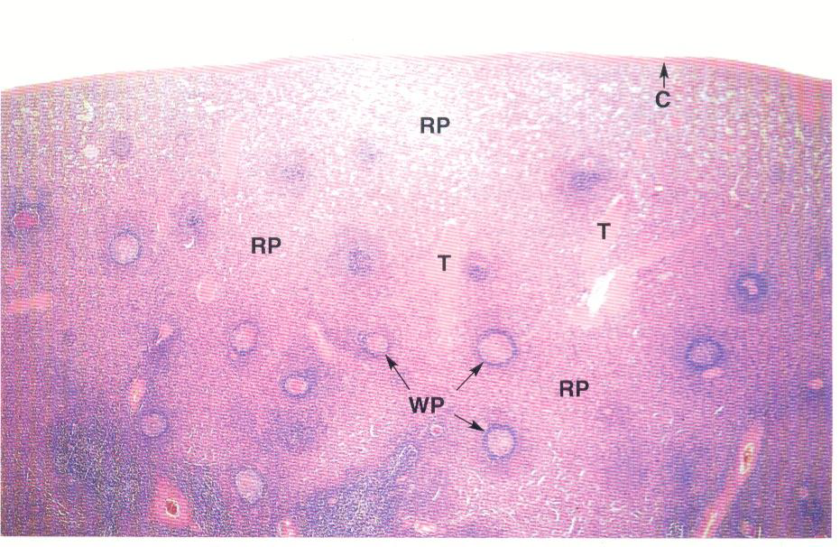
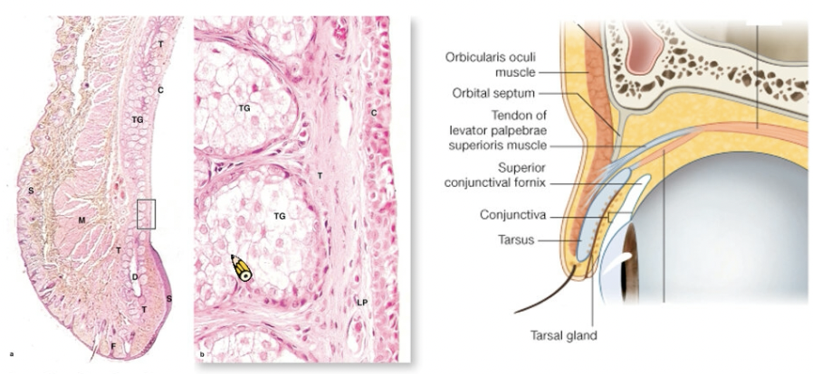
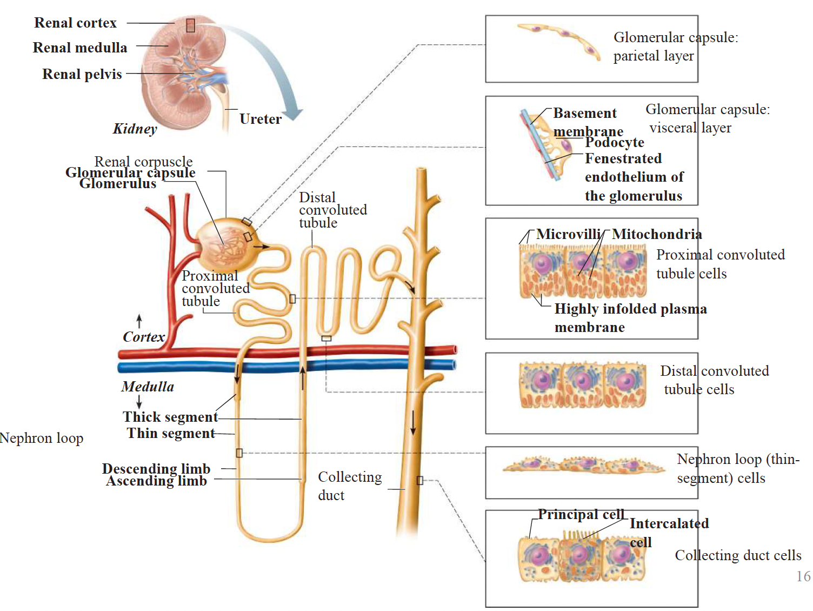

---
html:
    offline: false
    embed_local_images: false #遷入base64圖片
print_background: true
export_on_save:
  html: true
---

# 組織
# intro
> 周琇珠 學校玻片

讀ross
- x.s.橫切
- l.s.縱切
## H&E stain
> postmortem

H base blue
E acid pink
## collagen fiber stain

# Epithelium

## Apical region
### cilia
9+2

### microvilli

> stereocilia(男性生殖管內)

## Basal region
### hemidesmosome

### basement membrane

- basal lamina
- reticular lamina
#### 特化
> 上皮連上皮
- lamina densa (collagen fiber)
- lamina lucida
## Lateral surfaces
### cell junction
 

> zonula:皮帶

#### tight j.(ZO)

#### adherens j.(ZA) 拉鍊

#### desmosome(D) intermediate filament
>細胞脫水可觀察

> hemidesmosome:表皮連結締 

#### Gap j. 

## named
  $$
\rm\left[
\begin{array}{c}
\rm{Simple} \\
\rm{Stratified}
\end{array}
\right]
\left[
\begin{array}{c}
\rm{Squamous} & \rm{Cuboidal} & \rm{Columnar} 
\end{array}
\right] $$
- Pseudostratified Columnar
- Endothelium(內皮)
- Transitional (移形上皮)
  - 膀胱
- Mesothelium(間皮)
  - 提供潤滑

> 多層用最上層命名
## gland

## 玻片tips
- 細胞核的形狀
- 角質層無細胞核
- 多層扁平與結締組織呈波浪狀
- Tansitional epi. 上層呈現立方

# Connective Tissue
## 分類

> A:胚胎時期存在

## cells
- Fibroblast
    - 核大顆、長，整顆藍紫
    - 纖維整齊
- Macrophage (Histiocyte)
    - 嗜酸
- Mast call
    - 核圓、中央
    - 細胞質染 藍紫顆粒
    - 嗜鹼
    - 分泌組織胺
- Plasma
    - 橢圓細胞
    - 核偏 "clock-face"
## extracellular matrix

### collagen fibers
-  最多
-  Secreted by the fibroblasts
-  type I collagen
-  光學顯微鏡下看不到橫紋，TEM下有
-  銀染下棕色
### elastic fibers
- type II collagen
- H&E下不被染，用Orcein, Aldehyde fuchsin staining，深紫
- TEM下無橫紋

### reticular fibers
- type III collagen
- black argyrophilia(銀染黑)
- 淋巴、血球、內分泌腺

## Connective tissue proper 固有結締組織

| Dense CT | Loose CT |
| -------- | -------- |
| Fibroblast  Collegen fiber(I)           |    -      | 
## 玻片tips
- tendon 的 Fibroblast核拉長

## collagen fiber stain

# Cartilage

Perichondrium
: 軟骨膜，外層相似dense CT，內層分化

Chondroblasts
: acting 類似Fibroblast

## 分類
### Hyaline cartilage

Isogenic group
: chondrocyte 整群在中間

Lacuna
: 軟骨窩（空白），chondrocyte脫水會露出 

- 最多
- collegen(II)(和matrix折光差不多)
- lacuna 周圍較深，因為剛分泌出的proteoglycans 未和collegen(II)結合
- 因此matrix可分成perichondrim, interperichondrim region.
### Hyaline cartilag

- hyaline + elastic fiber
- 耳殼、會厭軟骨
### Fibrocartilage

- 緩衝、耐張力
- 軟骨、dense CT之間
- **無Perichondrium**
- collage(I)
- chondrocyte 排成一排
## Growth
- Appositional
- Interstitial
:::info
TEM下，合成 Fibrocartilage 的 condrocyte 有發達RER，合成hyaline,elastic有發達高基氏體
:::
# Bone
## 組成

periosteum
: 骨膜

Osteocytes
: 伸出細胞質(**Canaliculi**)，互相形成gap junction 

Osteoclasts
: 多核，roughly border 鄰骨頭(分泌H+)

Osteoblasts
: periosteum下，Cuboidal

### 鈣化

:::info
Ob 分泌collagen (I)
:::
### 侵蝕

:::info
維護Howship lacunae 酸性，侵蝕骨組織，再將Ca2+排到血液中
:::
### Extracellular matrix

-  Compact bone
    -  Lamellae (骨板)
        -  Circumferential lamellae 
        -  Concentric lamellae
        -  Interstitial lamellae
    -  Osteons (骨單位 Haversian systems)
-  Spongy (cancellous) bone
    -  Trabeculae (骨小梁)
    -  Spicules (骨小針)
:::info
Osteons
- Concentric lamellae
- Central canal (BV, LV, nf.)
- Perforating (Volkmann's) canal(橫向溝通)
- Canaliculi
- Lacunae (osteocyte)
:::
# Bone formation
> begins by 8^th^

Intramembranous ossification
: 膜內骨化

Endochondral ossification
: 軟骨內骨化

## Intramembranous ossification
> 生成扁平骨

mesenchymal cell
: 間葉細胞

## Endochondral ossification
### Interstitial growth

:::info 
初級骨化中心向內骨化
:::

- resting 
  - hyaline cartilage 內小細胞
- proliferation
  - 變大、排成串
  - 有絲分裂
- hypertrophic
  - 停止分裂，最大
- calcification
  - 鈣化（看起來模糊）
- ossification
  - 形成管道（血管）

Epiphysis
: 生長板

### Appositional growth
> 加粗
需要 Osteoclast 加大骨髓腔
:::info
老化
- Ca^2+^流失
- 不分泌基質
:::
## 關節

:::info
Synovial membrane
**type A**
- from Macrophage
- 大圓

**type B** 
- from mesenchymal cell
- 分泌潤滑
- 細扁
:::
## 波片
https://www.histologyguide.com/

# Blood
## 白血球

## Platelet
> from Mk cell(一半以上來自肺部)
## 發育
**胚胎時期**

# Muscle
> from 中胚層
## Skeletal m.
### formation
mesenchymal cell $\rightarrow$ skeletal muscle

### CT

1. epimysium (Deep fascia) = surrounds the whole muscle 
2. perimysium = surrounds fascicles

fascicles
: 數十肌肉細胞束

3. endomysium = separates individual muscle cells

### Myofibrils

**Dark**: A band
**Light**: I band

### 細胞質
myoglobin
: O~2~結合蛋白

SER(sarcoplasmic reticulum)
: 存Ca^2+^

### 細胞膜

T tubule
: 細胞膜凹陷在AI junction，傳遞電位

### 分類
- Slow(red)
  - myoglobin 豐富
- Fast(white)

## Cardiac m.

## Smooth m.

## Summary
|                          | Skeletal m.|Cardiac m.         |Smooth m.|
| ------------------------- | ---| ------------------ | --- |
| 核                        |多| 1-2                | 1|
|玻片特徵| 細胞核在邊緣，疏鬆| 心間盤| 長條細胞核|
| 纖維                      |橫紋|橫紋           | 無橫紋 Dense body
| 細胞質                    | myoglobin|mitochondria       | -|
| sarcoplasmic reticulum | tubule triad|tubule no triad | no |
| T-tube                         |AI junction|  Z-line        | no |
|傳遞|- |gap j.| caveolae (Ca^2+^)|

# 心血管

## Epicardium
脂肪層外

## Myocardium

:::info {Purkinje fibers}
- Myocardium 的Actin, Myosin纖維被神經纖維(Myofilament)取代
- 比心肌細胞大
- 位於 Subendothelial 
- 淺色，看不到fiber

> 白色空泡
> 

> 黑色:心肌 白色: Purkinje fiber
> 
:::
## Endocardium
Simple Squamous Epithelium

## 血管

 
### tunica intima(內皮)
1. endothelial
   - basal lamina(基底膜)上
2. Subendothelial
   - Loose CT
3. Internal elastic lamina

### tunica medial
- 包含平滑肌+彈性纖維
### tunica adventitia
1. fibroblasts
   - type I
1. vasa vasorum(血管滋養管)
  
### 分類
|                               | >                     | >              | intima                       | >       | >             | media                      | >               | adventitia   |
|--------------------------------|-----------------------|----------------|------------------------------|---------|---------------|----------------------------|-----------------|--------------|
|                               | endothelium           | subendothelial | internal elastic membrane | elastin | smooth muscle | externa  elastic lamina | fibroelastic CT | vasa vasorum |
| Elastic a.                     | 有 防凝血, Microphages | 有              | 不明顯                          | ==多==       | 多             | 薄                          | 薄               | 有            |
| Muscular a.                    | 有                     | 有              | ==明顯==                       | 有       | 4-40          | 厚                          | 厚               | 少            |
| Small a./ Arterioles        | 有                     | 有              | 有                            | 無       | ==1-2==             | 無                          | 薄               | 無            |
| Capillaries/ Postcapillary v. | 單層                    | 無              | 無                            | 無       | pericyte      | 無                          | 無               | 無            |
| Muscular v.                    | 有                     | 無              | 無                            | 無       | ==1-2==             | 無                          | 薄               | 無            |
| Medium v.                      | 有                     | -              | 無                            | 少       | 少             | 無                          | 有               | 有            |
| Large v.                       | 有                     | 有              | 不明顯                            | >       | >             | 薄                          | 厚               | 有            |
:::tip
玻片動脈內無血球
:::
#### Elastic arteries
特殊染色彈性纖維

:::info{彈性動脈內皮}

:::
#### Muscular arteries
透明帶: Elastin 圓核:Smooth m. 扁核:Fibroblast

#### Small arteries and Arterioles
elastin可見，外圍是1-2層平滑肌細胞

#### Capillaries

- continuous 
- fenestrated 
  - 內皮細胞不含核的部分很薄
  - 有許多貫穿細胞直徑一般為60～80nm孔洞
  - 胃腸粘膜(lamina propria)
  - 某些內分泌腺(Endocrine gland)
  - 腎血管球(Kidney’s glomerulus)等處
- sinusoid(竇狀)
  - 管腔較大
  - 脾、某些內分泌腺
#### Venules

#### Medium/ Large Veins
have valves
>vasa vasorum

## 淋巴管
細胞用疊的，間格大

# Lymphatic System

Cisterna chvli
: 消化道淋巴匯集
## Lymph node
- Capsule
- Afferent $\rightarrow$  Subscapular sinus  $\rightarrow$ Trabecular sinuses  $\rightarrow$ Medullary sinuses $\rightarrow$ Efferent

### Epithelium reticular cell 

### High endothelial venule (HEV) 
血管，淋巴細胞鑽出到germinal center 活化

## Structure
### Lymphatic nodules
:::warning 
In all lymphoid organ except the thymus
:::
#### Secondary nodule
>形成抗體

GC: Germinal center (產生抗體, B cell)
MnZ: Mantle zone(T cell)
粉紅色: Reticular cell

### Tonsil
- Pharyngeal tonsil
  - Pseudostratified ciliated columnar epithelium
  - 

- Palatine tonsils
  - 軟顎下
  - CT包覆
- Tonsilar fossa
- Lingual tonsils
  - 舌頭後上
  - Stratified Squamous nonkeratined epithelium 
- Crypts

nonkeratined 
: 非角質化

### Mucosa associated lymphoid tissue(MALT)
位於黏膜層

### Aggregated lymphatic follicles(Peyer’s patches)
位於消化器官

### Thymus 
- 只有 efferent lymph vessel
- 無 lymphatic nodules
- 胸骨與主動脈弓之間 
- CT(Capsule and Trabeculae)

:::tip
明顯分頁

:::
#### Cortex
- Immature T cell
- epithelium reticular cell
  - 保護、訓練 T cell
  - desmosome
:::info{Blood-thymus barrier}

:::

#### Medulla
- 顏色較淡
- epithelium reticular cell
:::info{Hassall’s corpuscles}
圍成同心圓的reticular cell

:::

### Spleen
- fibrous capsule>trabeculae
- reticular fiber
- white pulp( Secondary lymphatic nodule)
- red pulp (other)

####　White/red Pulp 
- central a. 被 T cell 包覆（Periarterial lymphatic sheath）
- Secondary lymphatic nodule

:::info{Central artery}

:::
## Lymphocyte
### NK cell
- 細胞較大
- 細胞核腎形

# Nerve tissue

Cell body
- 核大，核仁明顯
- rich rER & free ribosomes(called Nissl body)
- dendrite
- Axon
- Axon hillock(看不到nissl body)

## Synapses

## Structural class 
- bipolar
- multi polar 
- pseudounipolar

## supporting cell
**CNS**

### Oligodendrocyte
  - 富含脂質
  - 形成多個myelin sheath

> 周圍空一圈
### Astrocyte
- 代謝、營養
- BBB（blood–brain barrier ）

### Microglial
- 巨噬
:::tip
圓圓小顆
:::
### Ependymal cells

- 腔室內緣cilia

# Eye 

## 非瞳孔
- Conjunctiva(結膜)

**tunica fibrosa （纖維膜）**
- sclera(鞏膜)
  - 平行的 collagen fibers

**tunica vasculosa （血管膜）**

- choroid
    - 含黑色素吸光
    - Bruch's membrane(基底膜)
    - 含血管，供應retina

## 瞳孔
**tunica fibrosa （纖維膜）**
  - cornea （角膜）
    - 可能會有色素沉澱(pigmented)

**tunica vasculosa （血管膜）**

- ciliary body
  - process+epithelium+muscle
  - 製造 Aqueous(房水)
- iris(虹膜)

**tunica nervosa**
  - retina 
    - pigmented layer
    - Neural layer
  -  optic nerve & ora serrata

## Cornea

由外而內
- corneal epithelium
- Bowman's membrane
- stroma
  - 充滿collagen fiber
- Descemet’s membrane
- endothelium
 
## Lens 

ciliary body 伸出 zonular fibers 連接lens

## Retina 
外而內
1. pigmented epithelium
   - 色素細胞吸收光線
2. segment layer of rods and cones
    - visual cell 的棒棒們
3. external limiting membrane 
    - Muller cells
---
**Visual cells(rods, cones)**

1. outer nuclear layer
    - visual cells細胞核

2. outer plexiform layer
     - 樹突

---
**Bipolar neurons**

6. inner nuclear layer
    -  horizontal (橫走，整合)

     - Bipolar neurons
   - Amacrine cells (橫走，整合)
7. inner plexiform layer
     - 突觸

---
**multipolar ganglion**

8. ganglion cell layer
   - multipolar ganglion cells

9. nerve fiber layer
     - ganglion cell 軸突
---
**Basal lamina**

- inner limiting membrane
  - Muller cells

:::info{Optic disk}

:::

## Tarsal plate 
分泌黏性

## lacrimal apparatus

# Ear 

>Co:耳蝸

## tympanic membrane
- outer : stratified squamous epi.
- between : collagen fibers, elastic fibers, fibroblast
- inner : simple cuboidal epi.

## Middle ear
simple cuboidal epi. 組成
### 傳聲

1. Oval/vestibular window (卵圓窗)
---
*Auditory ossicles*

2. Malleus
2. Incus
3. Stapes
---
5. Cochlear/round window(圓窗)(多餘聲波)

## 耳蝸
- scala vestibuli(vestibular canal)
  - 外淋巴液  
- scala media(cochlear duct)
  - 內淋巴(duct外側壁的stria vascularis分泌)
- scala tympani(tympani canal)
  - 外淋巴液

# Integument

| |Thick |Thin|
|--|--|--|
|Layer| 5|4|
|Sweet g.|有|有|
|hair follicles|無|有|
|sebaceous g.|無|有|
|stratum lucidum 透明層|有|無|

## Layers
### Epidermis
- stratum corneum
- stratum lucidum
- stratum granulosum
  - 細胞核不明顯
  - 顆粒染色
  - 準備細胞凋亡
-  stratum spinosum
   -  細胞間脊狀連接(Desmosome)
- stratum basale (germinativum)
  - 立方狀

:::info{Cell of Epidermis}
1. Keratinocytes (角質化)
2. [Melanocytes](#melanocytes) (黑色素)
3. [Langerhans cell](#langerhans-cell) (免疫)
4. Merkel cell (神經性 )
:::
### Dermis
- Papillay layer
  - Loose CT
  - [Meissner’s corpuscles](#meissners-corpuscles) (輕壓)
- Reticular layer
  - Dense CT
  - [Pacinian corpuscles](#pacinian-corpuscles) (重壓)
  - hair follicles, sebaceous g., sweat g.

 

## Nerve supply

## Hair 

1. Infundibulum
2. Isthmus
3. Inferior segment

## Lab
### Langerhans cell

### Meissner’s corpuscles

### Pacinian corpuscles

### Melanocytes

### Sweet g.
==Duct cell 是複層鱗狀==

# Respiratory
## Nasal cavity

- Non-keratinized  Stratified Squamous Epi.
-  Pseudostratified ciliated columnar epithelium with goblet cells

### Olfactory epithelium
- Basal cell: stem cell 
- Olfactory neurons: bipolar; Nuclei lie

## Larynx
- 聲門上：Stratified squamous nonkeratinized epithelium
- 聲門下：Pseudostratified ciliated columnar epithelium

:::info{軟骨類型}

| Cartilage   | Type                 |
| ----------- | -------------------- |
| Epiglottic | elastic              |
| Thyroid    | hyaline             |
| Arytenoid  | elastic,  hyaline |
| Cricoid    | hyaline              |
| C-shape     | hyaline              |
:::

## Trachea

- Basement membrane 厚
- Goblet cells: 分泌黏液
## Terminal bronchiole

- Clara cell: 無纖毛，圓頂，取代 Goblet cells

## Alveolar ducts
- 無軟骨
- Type II alveolar cell 立方狀，分泌表面張力素
- Dust cell 在 Pore

## Pleura

>M simple squamous mesothelium 
A alveoli 
V blood vessel
L lymphatics

## 整理

## Lab 
### Olfactory epithelium

## Trachea

## Lung

# 消化系統

## Oral cavity
###　Mucosa
- Lining mucosa
- Masticatory mucosa
  - 耐磨(Kerayinized)
  - 上顎、牙齦
- Specialized mucosa
  - 感覺

### 味蕾

### 唾腺
- secretory acini
  - Mucous acini
    - 透明
    - 分泌粘液（糖蛋白）
  - Serous acini
    - 嗜酸，紅
    - 分泌物較稀薄,含唾液澱粉酶。

:::info{Serous semilunar}

:::
- ducts
  - Intercalated duct
    - Simple cuboid epi.
  - Striated duct
    - 粒線體明顯
    
  - Excretory duct
    - 多層扁平

#### Parotid
- Intercalated duct 發達

#### Submandibular
- Striated duct 發達

#### Sublingual
- Excretory duct 發達

## 牙齒

### Enamel
- Ameloblast 分泌 Enamel 最後消失

### Dentin
- Odontoblast 分泌 type I collage fiber, GAG，鈣化包住自己
- 形成 Dentinal tubules

### Periodontium
- Cementum
- Periodontal ligament/ Sharpey fibers (collagen fibers )
- Alveolar bone with the associated gingiva

## Lab 

# 泌尿系統
## Renal
- Proximal convoluted tubule (PCT)
  - 嗜酸
- Proximal straight tubule (PST)

- Thin segment
- Distal convoluted tubule (DCT)
- Distal straight tubule (DST)

## Ureter
- Mucosa
- Muscularis
  - 三層
- Adventitia (外膜)

## Urinary bladder
- Detrusor m. (逼尿肌)

## Urethra
內而外
1. Transitional epi.
2. Stratified/ Pseudostratified columnar epi.
3. Stratified squamous epi.

### Intraepithelial gland 
>S:sinus 
M:mucosa (Intraepithelial gland )

### Littre gland

# 生殖系統

## Testes

- 約250 個小葉 
- TA: Dense irregular 

### Seminiferous tubules 

- Tunica (lamina) propria
  - ==Myoid cell==
    - 收縮
    - 細長
- Wave of the seminiferous tubule
  - 分區成熟

#### Sertoli cell (St)
- 支持細胞
- 長核，淡染
- 核仁明顯(Karyosome)
- 血睪障壁(blood-testis barrier)，阻擋免疫

#### Spermatogenic cell
細胞質會一直黏在一起

- Spermatogonia (SA, SB)
  - 貼在 basal lamina
- Primary spermatocyte (S1)
  - 花核，最大
- Spermatid (S3)
  - early
  - late
- Spermatozoa (S4)

### Interstitium
#### Leydig cell
- 核大淡染，核仁明顯
- 數顆聚集

## Intratesticular Ductus

### Rectus tubule $\rightarrow$ Rete testis

- 柱狀 $\rightarrow$ 立方 $\rightarrow$ 扁平

### Efferent Ductule
- 高矮細胞出頭，管壁波浪

## Epididymis

- Pseudostratified epi
- Stererocilia
  - microvilli
  - 抑制受精能力
- Halo cell
  - 核深染，格格不入

## Duct deferens

- 厚 smooth m.
- 高矮細胞出頭，管壁波浪

 
## Ampulla of Ductus Deferens

- 肌肉層漸薄

## Ejaculatory Duct (ED)

- 肌肉層消失

## Seminal Vesicle

- 60%-70% 精液
- 多層次分支

## Prostate Gland

- Peripheral zone 
  - 佔最多
  - 直腸診斷
- Transitional zone 
  - BPH (良性攝護腺肥大症)
- ==Prostatic concretions (CA)==
  - 年輪狀，填在線體裡面

## Penis
 

- Tunica albuginea (Deep fascia)
- Trabecular
  - corpus cavernosum 實心部分
- ==Penile Urethra==
## Lab 
:::warning{考試要寫分層}
- Adventitia
- Outer longitudinal
- Circular layer
- Inner longitudinal 
:::

 

# 女性生殖系統

## Ovary
- Germinal epithelium
  - Simple cuboid
- Tunica albuginea
  -  Dense CT
- Cortex
- Medulla

>不成熟者靠外圍，較小

### Ovarian follicles
#### Primordial
- follicle cells 包圍 ==只有一層 Simple squamous==
  

#### Primary follicle
- ==Simple cuboid 包圍==
- 多層稱為 Stratum granulosum (顆粒層)，細胞改稱 Granulosa cell
- Zona pellucida (透明帶)
- Cortical granules
  - 精子進入後釋放激素，引發cortical reaction，破壞 zona pellucida 上的受體

#### Secondary (Aantral) follicle
- 出現空隙
  Theca internal (TI)
  - 內分泌
  - LH receptor
- Theca external (TE)
  - 收縮，擠出卵
 

#### Mature (Graafian) follicle
- Cumulus oophorus (CO)
- Corona radiata (CR)
  - 排卵時丟出

#### Atretic follicle (AF)
>壞掉的
 
- Granulosa cell 掉落到空腔

- Zona pellucida (透明帶) 明顯 ，像洩氣氣球
  

### Corpus luteum
- Theca lutein cell (TLC)
  - 源於 Theca internal
  - 深染，小顆密集
- Granulosa lutein cell (GLC)
  - 源於 stratum granulosum

### Corpus albicans

### 分裂

## lab 

### Atretic follicle

### Corpus luteum 

## Uterine tube 
- Mucosa
  - Ciliated columnar epithelium (CC)
  - Peg cell (PC 分泌)
  

## Uterus
- Epithelium
  - Ciliated columnar epithelium
  - 凹陷形成 Endometrium gland
- Endometrium
  - Functional layer
  - Basal layer
- Myometrium

