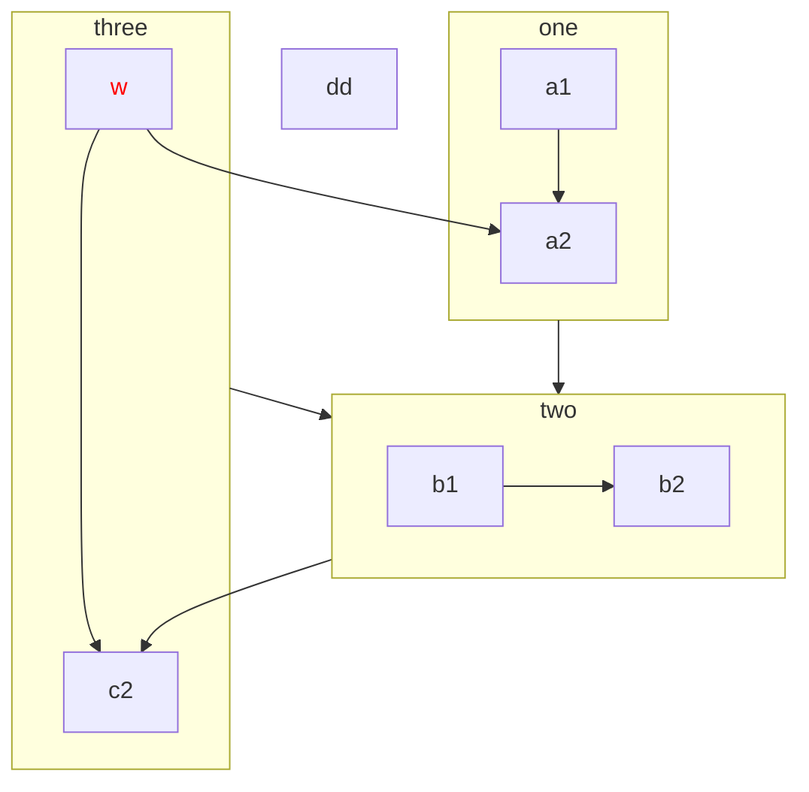
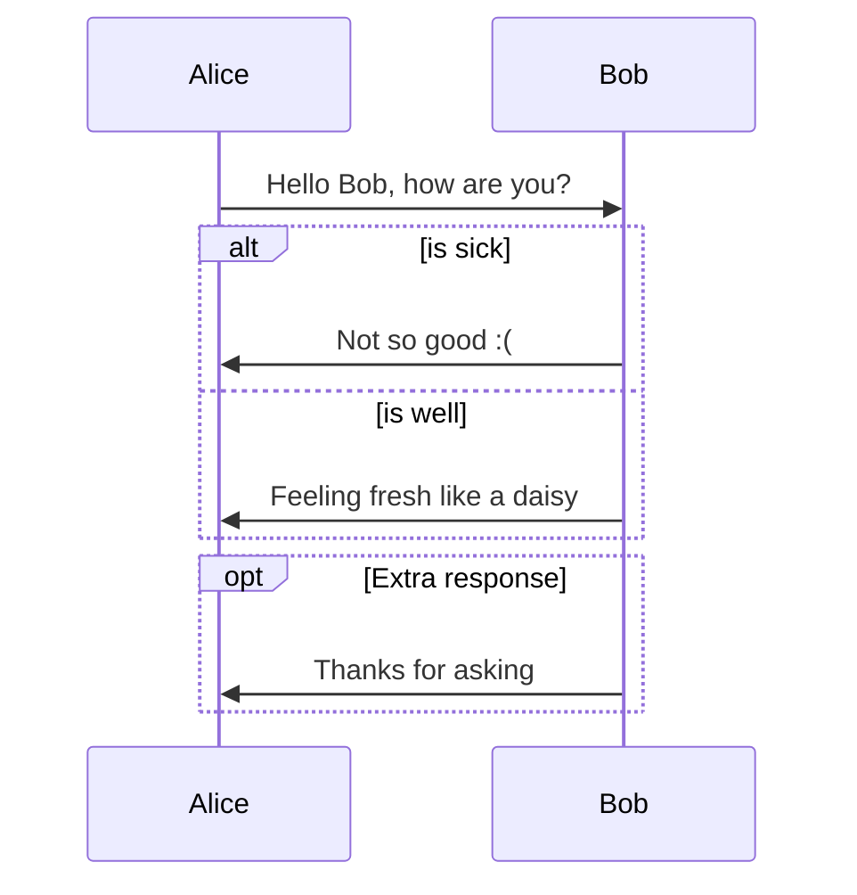
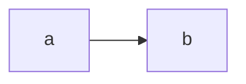

---
html:
    offline: false
    embed_local_images: false #遷入base64圖片
print_background: true
export_on_save:
  html: true
---
[回到目錄](../index.md)
# test

# h1

## h2

### h3

#### h4

a~b~^c^ *d* **e** ***f*** ==g== ~~h~~ [^tag] <kbd>i</kbd>
[^tag]: aaa

*[HTML]: Hyper Text Markup Language
HTML

## math

$$
\frac{1}{2}
$$

## alert

:::note
no T
:::
:::info
info1
werfl2
jj3
jpj4
:::
d
:::warning
warning
nilj
kpo
:::

:::danger
{qq}
danger
ff
:::

:::question
:::

:::example
$$
-\frac{1}{12}=1+2+3+4...
$$
:::
:::success
:::
:::failure
:::
:::spoiler
sa

- fwfwe
- fgwerg
  :::

:::spoiler
sa

- fwfwe
- fgwerg
  :::

> fcwf

term
: definition

# mermaid





# table


| n | k |   |
| --- | --- | :-: |
| j | j |   |
| s | s |   |
|   |   |   |


| a | b | c |
| --- | --- | --- |
| a | > | 1 |

> |a|2

# Exe

```python{cmd}
a = 1
b = 2
print (a+b)
```

```bash{cmd}
ls
```

```gnuplot {cmd=true output="html"}
set terminal svg
set title "Simple Plots" font ",20"
set key left box
set samples 50
set style data points

plot [-10:10] sin(x),atan(x),cos(atan(x))
```

```python {cmd=true matplotlib=true numpy=true}
import matplotlib.pyplot as plt
import numpy as np
import math
#變數
x = np.arange(0, 10*math.pi, 5)
#p,q,A
p = 2*np.sin(x* 2)-1
q = np.cos(x/6)+1
A = 2*p+q
# 繪圖
plt.plot([1,2,3],[1,2,3], '-r')
#plt.title("Question 1")
#plt.plot(x, p,'--k')
#plt.plot(x, q, '--b')
plt.plot(x, A, '-r')
plt.show()
```

# fig


:::spoiler



:::

# latex

```tikz
\draw[gray, thick] (-1,2) -- (2,-4);
\draw[gray, thick] (-1,-1) -- (2,2);
\draw[red, thick] (1,-1) -- (2,2);
\filldraw[black] (0,0) circle (2pt) node[anchor=west]{Intersection point};
```

# C++

```C++{cmd}
#include<iostream>
using namespace std;
int main(){
    cout<<"1";
}
```

### f

dwef

ffffffwefff


[klnm](test.md)
<i class="fa fa-browser"></i>

<i class="fa fa-camera-retro" style="color: #F00;"></i>

# website
@web https://www.youtube.com/watch?v=89PNZUuaqoU


@left
這是左邊

@right
這是右邊
- 1
- 2

<hr>

# test
111
222
333
4

# nt  
- Duodenum
  - C 字型