---
html:
    offline: false
    embed_local_images: false #遷入base64圖片
print_background: true
export_on_save:
  html: true
---
[回到目錄](index.md)
# 口解實

## 骨頭
- bregma
- lumbda


## 翻皮

- **Lesser occipital n**. :C2
- **SCM上方**
    - lesser occipital <span class="n">n.</span> (耳後)
    - great articular <span class="n">n.</span> (耳下)
    - transverse cervical <span class="n">n.</span> (脖子)
    - supraclavicular <span class="n">n.</span>
    - external jugular <span class="v">v.</span>(from angle of mandible)
- Accessory <span class="n">n.</span> (C3,C4，進入斜方下)
- **Upper group**
    - risorius 
    - zygomaticus major
    - zygomaticus minor(I. at anguli)
    - levator labii superioris
    - levatoe labii superioris alaeque nasi
    - levator anguli oris 
- **Lower group**
    - depressor anguli oris
    - depressor labii inferioris
    - mentalis
### 步驟
1. 粉筆切線
    - 皮不能掉
2. 下刀2mm
    - Frontalis m. 
    - Platysma m.

# 0922

## Nerve


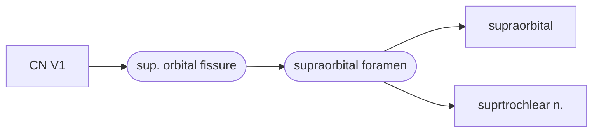

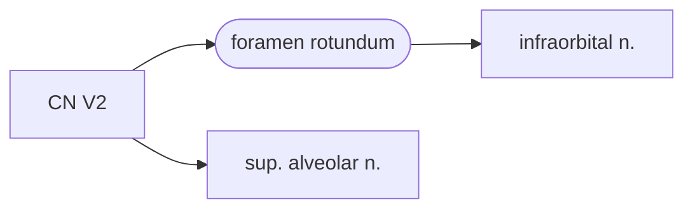
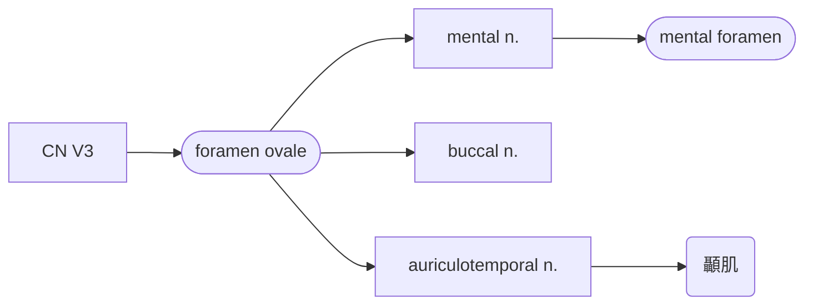


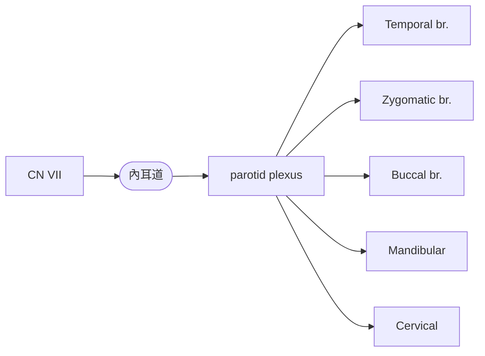

graph LR
a[CN IX]
b[Lesser occipital]
a-->b
```
## Artery

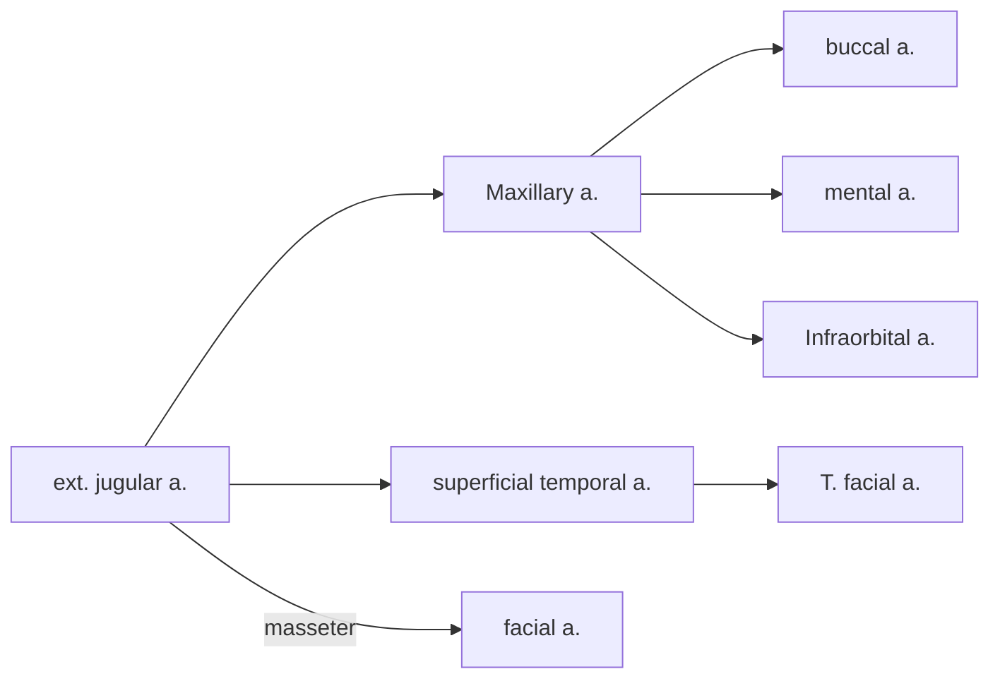
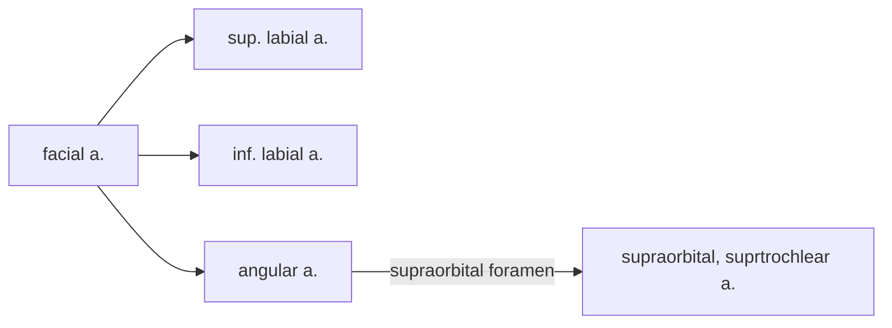
## Vein


## Carotid triangle


# 0929
## Temporal region 
Temporal fossa
: temporalis m.

Infratemporal m.
: medial/ lateral pterygoid
## TMJ
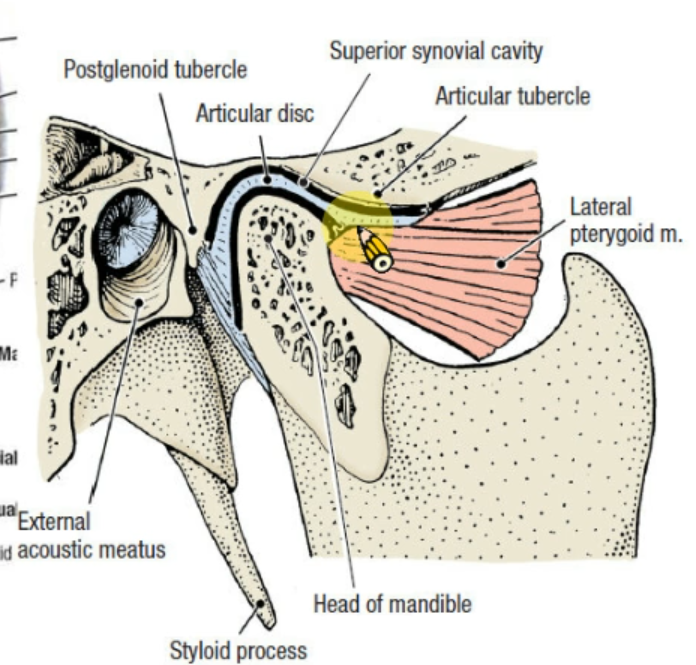
###### tags: `TMU` `二上`
## Thyroid and parathyroid gland
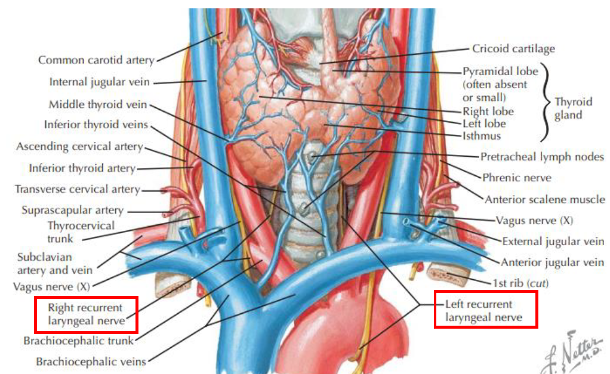
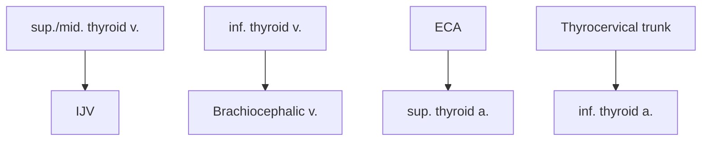
## root of neck
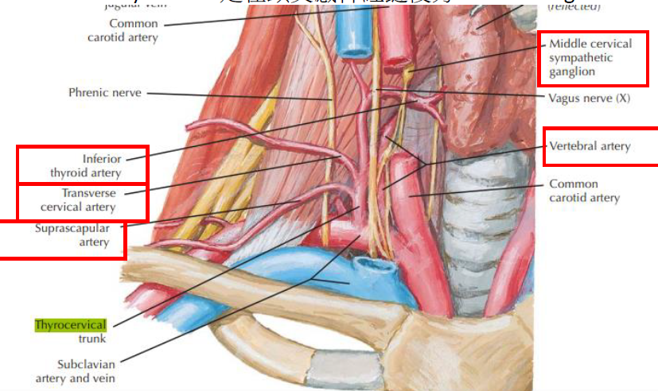
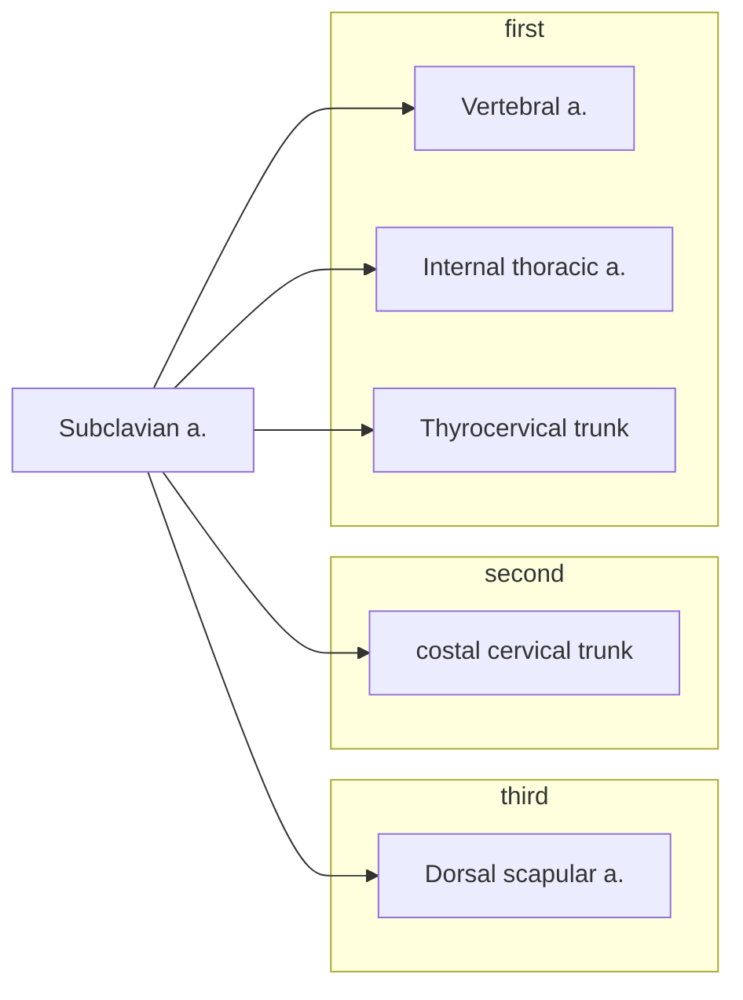
Vertebral a.
: 進入C6橫突孔

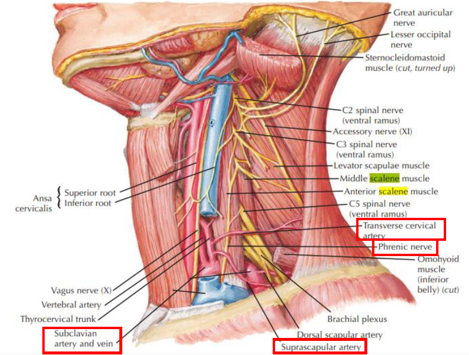
interscalene triangle
: Ant. scalene, Mid scalene 之間，包含brachial plexus, subclavian a.

# 1016
## Infratemporal fossa
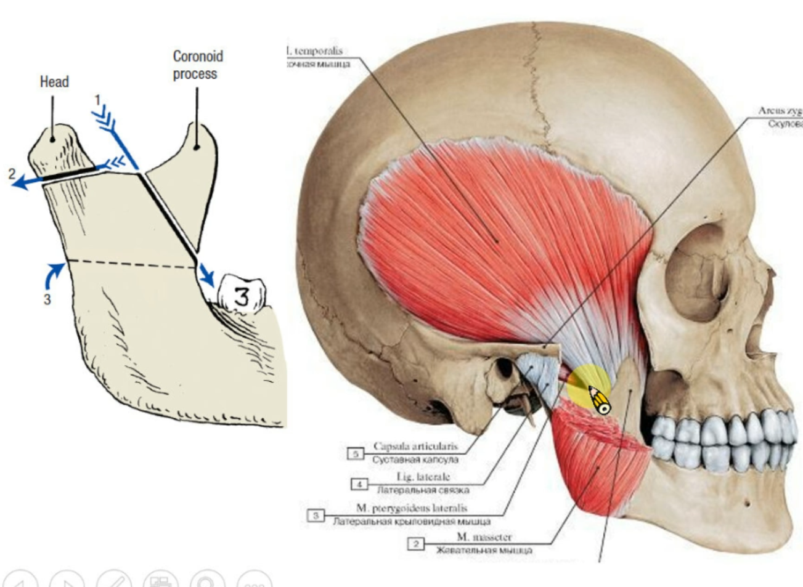
::: info
掀開Temporalis m. 可看到Deep temporal a./n.
:::
 
## Maxillary a.
.png)

## Pterygoid m.
**lateral**
- Ant.
  - greater wing of sphenoid bone
  - lateral plate of sphenoid bone
- Post.
  - Articular disk of TMJ

**medial**
- Sup.
  - Maxilla
  - pterygoid process
- inf.
    -   of mandible
# Review
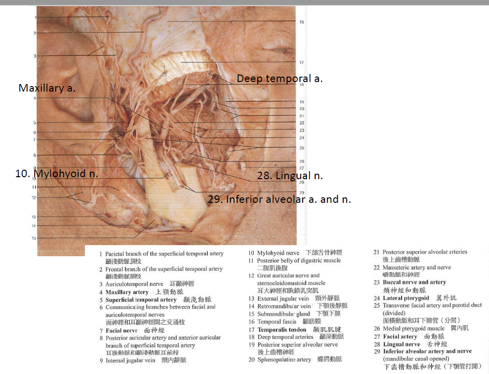
