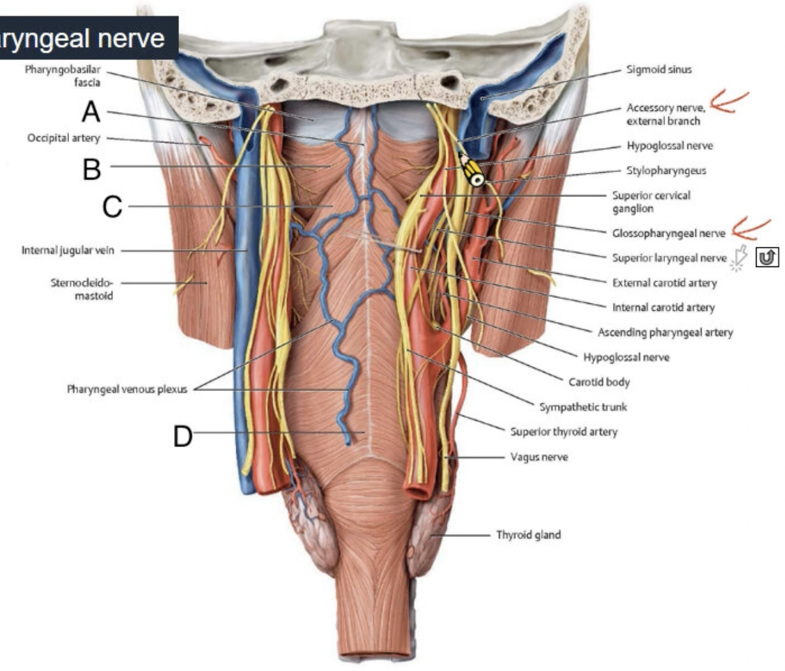

# Review

***

:::spoiler
1. Middle scalene muscle
2. Anterior scalene muscle 
3. Dorsal scapular nerve
4. Transverse cervical artery
5. Phrenic nerve
6. Brachial plexus
7. Dorsal scapular artery
8. Suprascapular artery
9. Thyrocervical artery
10. Lung
11. Inferior cervical sympathetic ganglion
12. Longus colli muscle
13. Vertebral artery
14. Vagus nerve
15. Inferior thyroid artery
16. Middle cervical sympathetic ganglion
17. Recurrent laryngeal nerve 
:::

***

***

**Digastric m.**
| 位置 | 走向 | 名稱         |
| ---- | ---- | ------------ |
| 深   | 前   | Lingual a.   |
| 淺   | 前   | Facial a.    |
| 深   | 後   | Occipital a. |

# Pelvis
Bob