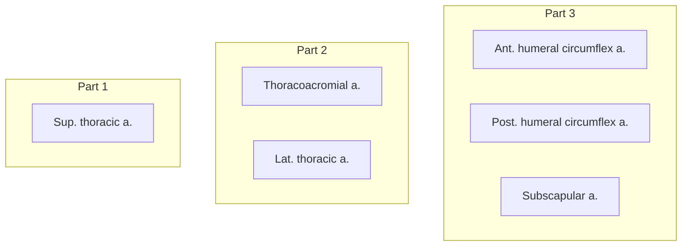
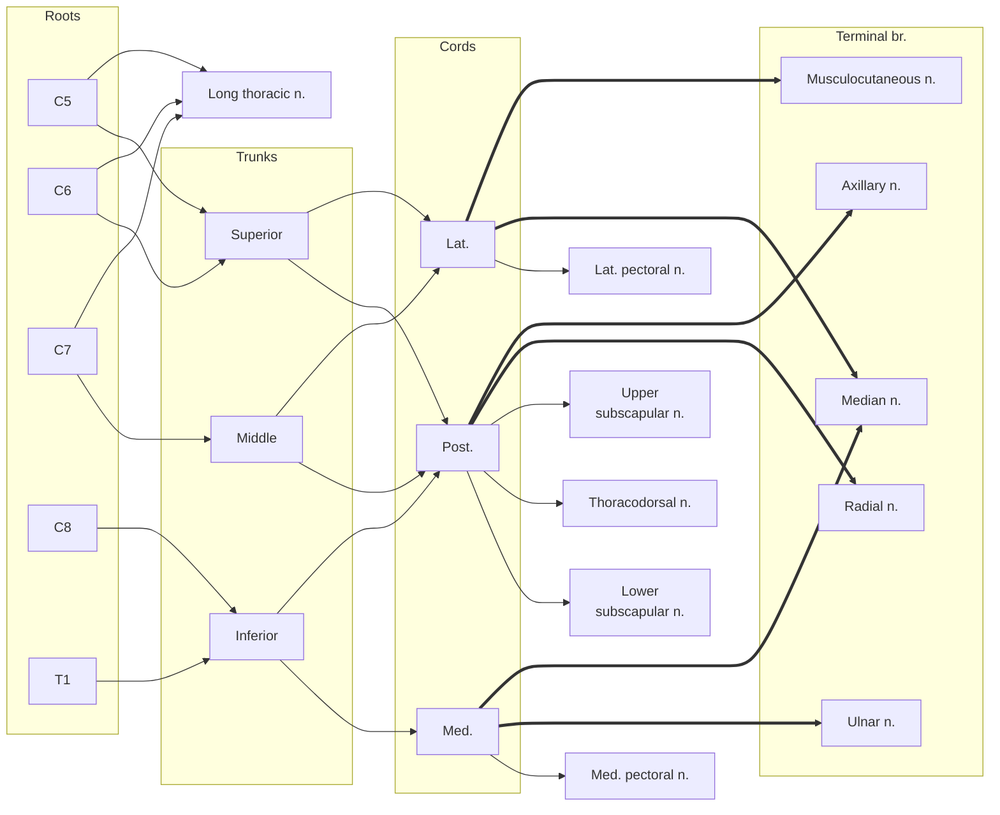
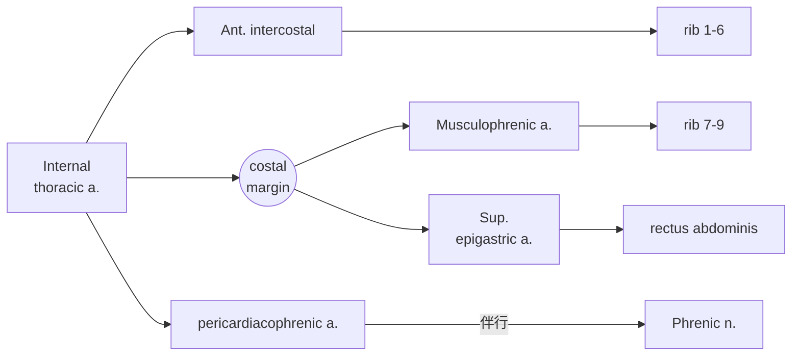
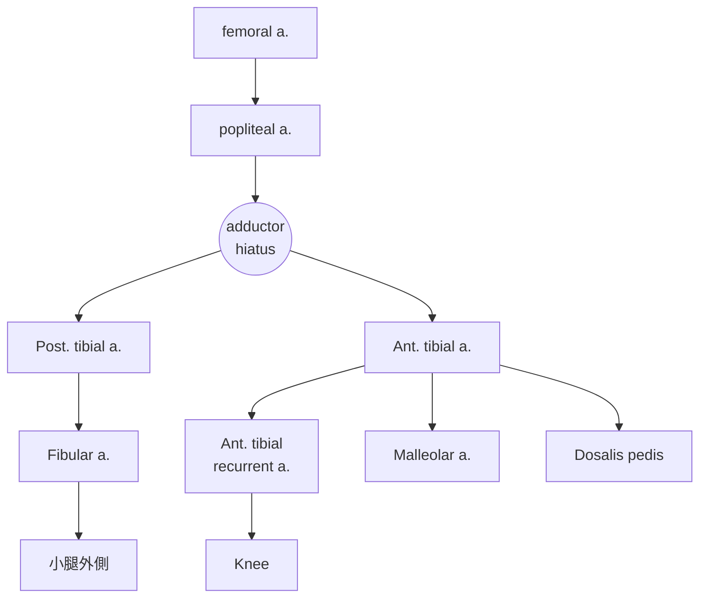
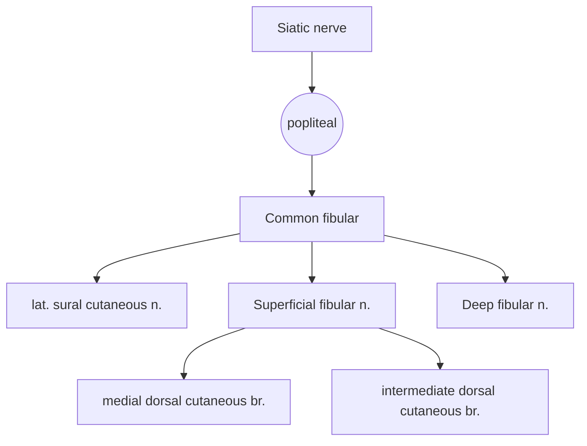

---
html:
    offline: false
    embed_local_images: false #遷入base64圖片
print_background: true
export_on_save:
  html: true
---
[回到目錄](index.md)
*[Mid.]:Middle
*[Med.]:Medial

# 骨學
## 脊椎 
### thoracic vertebrae 

### Lumbar vertebrae 

## Sternum
- [ ] jugular notch
- [ ] manubrium
- [ ] sternal angle
- [ ] xiphoid process
:::spoiler

:::
## Clavicle
看Groove分左右
- [ ] Trapezoid line
- [ ] coronoid tubercle
:::spoiler

:::
## Ribs
- [ ] Costal tubercle
- [ ] Costal groove
- [ ] Articular facets
- [ ] Floating ribs

:::tip
- 1st, 2rd, 11th, 12th的facet 只有一個
- 1st 的上1表面凹凸不平（Subclavian a./v. grooves, Ant./ Mid. scalene)
- 下緣有costal groove 較扁
:::

:::spoiler

:::

## Scapula
- [ ] Coracoid process
- [ ] Acromion
- [ ] Suprascapular notch
- [ ] Glenoid process

## Pelvis
:::info{性別差異}

:::
### Ilium
- [ ] Greater sciatic notch
- [ ] Iliac crest
- [ ] Ant. sup. iliac spine
### Pubis
- [ ] Pubic symphysis
- [ ] Pubic crest
- [ ] Pubic tubercle

### Ischium
- [ ] Ischial spine

## Upper limbs
### Humeral
- [ ] lesser tubercle
- [ ] Intertubercular groove
- [ ] greater tubercle
---
- [ ] Deltoid tuberosity
---
- [ ] Med. epicondyle of humerus 
- [ ] trochanter
- [ ] coronoid fossa
- [ ] Lat. epicondyle of humerus
- [ ] Olecranon fossa

### Ulna
分辨左右看radial notch
- [ ] coronoid process
- [ ] Olecranon
- [ ] radial notch
- [ ] styloid process
### Radius
- [ ] radial tuberosity
- [ ] ulnar notch
- [ ] styloid process

### carpi
- [ ] pisiform bone

## Lower limbs
### Femur
上端往外往後繞：
- [ ] Lesser trochanter
- [ ] Intertrochanteric line
- [ ] Greater trochanter
- [ ] Intertrochanteric crest
---
下端內而外繞：
- [ ] Adductor tubercle
- [ ] Med. epicondyle
- [ ] Med. condyle
- [ ] Patellar surface
- [ ] Intercondylar notch （背面）
- [ ] Lat. condyle
- [ ] Lat. epicondyle
---
- [ ] Fovea capitis
- [ ] Gluteal tuberosity

:::spoiler

:::
### Patella
- [ ] Base
- [ ] Apex
- [ ] facet for lat. /med. condyle of femur

# 上肢

# Axilla

## Axillary a.
- [ ] Axillary a.
- [ ] Axillary v.
- [ ] Sup. thoracic a.
- [ ] Thoracoacromial trunk
  - [ ] Clavicular br.
  - [ ] Acromial br.
  - [ ] Deltoid br. (Cephalic v. 伴行)
  - [ ] Pectoral br.
- [ ] Lat. thoracic a.
- [ ] Subscapular a.
  - [ ] Circumflex scapula a.
  - [ ] Thoracodorsal a.
- [ ] Ant./Post. circumflex humeral a.
  - axillary n. 伴行
- [ ] Brachial a.

:::spoiler

:::
## Brachial plexus
- [ ] Long thoracic n.(前距肌表層)
- [ ] lateral cord
  - lateral pectoral nerves
- [ ] medial cord
  - medial pectoral nerves(穿過 pectoralis minor)
  - medial cutaneous nerve of the forearm
  - medial cutaneous nerve of the arm
- [ ] posterior cord
  - subscapular nerves (x3)
- [ ] musculocutaneous n.
- [ ] median n.
- [ ] ulnar n.
- [ ] axillary n.(穿出Quadrangular)
- [ ] radial n.
:::tip
- Cords 在 Pectoralis minor下
- M型

- Post. cord 走在 Subscapular m. 後面

:::

:::spoiler

:::
# Arm

## Muscle
- Biceps brachii m.
  - [ ] Long head
  - [ ] Short head (到喙突)
  - [ ] Bicipital aponeurosis (斷)
- [ ] Coracobrachialis m.
- [ ] Brachialis m.(musculocutaneous n.躺在上面)

## Nerve
- [ ] Musculocutaneous n.$\rightarrow$
- [ ] Lateral cutaneous nerve of the forearm
- [ ] Median n.
- [ ] Ulnar n.
- Post. cord
  - [ ] medial cutaneous n. of the forearm

## Artery
- [ ] Brachial a.(Median n.伴行，到Cubital fossa 分支)
- [ ] Radial a.
- [ ] Ulnar a.
- [ ] Deep a. of arm
  - [ ] Radial collateral a. $\rightarrow$ Radial recurrent a.
- [ ] Sup. ulnar collateral $\rightarrow$ Post. ulnar recurrent
被 medial epicondyle of humerus 隔開
- [ ] Inf. ulnar collateral$\rightarrow$ Ant. ulnar recurrent
:::spoiler

:::

:::info{Cubital fossa}

==Medial epicondyle of humerus==
:::

# Forearm

## Muscle 

第一層由內而外
- [ ] Flexor carpi ulnaris m.
- [ ] palmaris longus m.(斷)
- [ ] Flexor carpi radialis m.(斷)
- [ ] Pronator teres m.
- [ ] Brachioradialis m.
---
第二層由內而外
- [ ] Flexor digitorum profundus m.
- [ ] Flexor digitorum superficialis 
- [ ] Flexor pollicis longus m.
---
最深
- [ ] Pronator Quadratus

## Artery/ nerve
- [ ] Ulnar a./ n.
  - [ ] Common interosseous a./ n.(深層，鑽入屈指深, 屈拇長之間)
    - [ ] Post. a.
    - [ ] Ant. a./n.
  - [ ] Dorsal br. of ulnar a./ n.
*--------- pisiform bone ------------*
  - [ ] Deep br. of ulnar a./ n.
- [ ] Median n.
- [ ] Radial a.
- [ ] Radial n.
  - [ ] Deep br.
  - [ ] Superficial br.

## Vein
- [ ] Basilic v.
- [ ] Median cubital v.
- [ ] Cephalic v.
:::spoiler

:::
## Carpi

由外而內：
- [ ] Tendon of abd. pollicis longus m.
- [ ] Redial a.
---
Carpal tunnel
- [ ] Tendon of flexor carpi radialis
- [ ] Median n.
- [ ] Tendon of palmaris longus m.
- [ ] Tendons of flexor digitorum superficialis(斷)
- [ ] Tendons of flexor digitorum profundus(斷)
---
- [ ] ulnar a./ n. (Carpal tunnel 外)
- [ ] Tendon fo flexor carpi ulnaris 

:::spoiler

:::

# Palm 

## Thenar
- [ ] Thenar m.
  - [ ] Abd. pollicis brevis m.
  - [ ] Flexor pollicis brevis m
  - [ ] Opponens pollicis m.
- [ ] Hypothenar m.
  - [ ] Abd. digiti minimi m.
  - [ ] Flexor digiti minimi brevis m.
  - [ ] Opponens digiti minimi m.
## Superficial
- [ ] Palmaris brevis m.
- [ ] Palmar aponeurosis
:::spoiler

:::
---
- [ ] Flexor retinaculum (斷)
- [ ] Tendons of Flexor digitorum superficialis 
- [ ] Tendons of Flexor digitorum profundus(穿出 superficialis的tendons)
- [ ] Median n.
  - [ ] recurrent br.
  - [ ] Common digital n.
- [ ] Superficial palmar arch
  - [ ] common palmar digital a.
$\rightarrow$common palmar digital br. $\rightarrow$proper palmar digital br.
  - [ ] proper palmar digital a.
- [ ] Superficial br. of ulnar n.
  - [ ] palmar br.
- [ ] Deep br. of ulnar n./ Palm br. of ulnar a.(過==pisiform m.== 後分支)

## Deep
- [ ] add. pollicis muscle
- [ ] Deep palmar arch
- [ ] Lumbrical m.(附在 profundus)
- [ ] Palmar interosseous muscles
- [ ] Dorsal interosseous muscles
:::spoiler

:::

# 胸淺層

- [ ] Pectoralis major/ minor
- [ ] Serratus anterior m.
- [ ] Cephalic v.
- [ ] Subclavian m. (鎖骨下 $\rightarrow$ 1st rib)

## 乳房
- [ ] Nipple
- [ ] Areola
- [ ] Suspensory lig.(片狀)
- [ ] Lactiferous sinus(乳暈下方囊狀,duct末端)
- [ ] Lactiferous duct

# Ant. thoracic wall

## Vessels
- [ ] internal thoracic a .
- [ ] pericardiacophrenic a.(斷)
- [ ] intercostal a.
- [ ] musculophrenic a.
- [ ] sup. epigastric a.
- [ ] collateral a.

:::spoiler

:::

## Nerve
- [ ] Intercostal n.
  - [ ] Intercostobrachial n. (T2)
不分Ant./Post.
:::spoiler

> ICBN indicates intercostobrachial nerve
> LTN, long thoracic nerve
> LPN, lateral pectoral nerve
> MBCN, medial brachial cutaneous nerve
> MPN, medial pectoral nerve.
:::

## Muscle 
- [ ] external intercostal m.
- [ ] internal intercostal m.
- [ ] innermost intercostal m.
- [ ] transversus thoracis m.

:::tip
肋骨中段才有Innermost
:::
:::spoiler

:::

# Thoracic cavity
 

## Structure
- R. lung
  -  sup. lobe
  - middle lobe
  - inferior lobe
- L. lung
  - sup. lobe
    - lingula
    - cardiac notch
  - inf. lobe
- costodiaphrag-matic recess
:::spoiler

:::info{costodiaphrag-matic recess}

:::
:::
## CT
- Parietal pleura（黏在前胸壁上）
  - [ ] costal
  - [ ] mediastinal
  - [ ] diaphragmatic

- [ ] Fibrous pericardium
- Serous pericardium
  - [ ] Parietal pericardium
  -  Pericardial cavity
  -  Visceral pericardium（黏在心臟上）
- [ ] Ligamentum arteriosum
:::spoiler 

:::
## Vessels
- [ ] Ascending aorta
- [ ] Aortic arch
- [ ] Brachiocephalic trunk
- [ ] L. common carotid a. v.
- [ ] L. subclavian a. v.
- [ ] SVC
- [ ] IVC 
- [ ] Pulmonary trunk
  - [ ] Pulmonary a.
- [ ] Pulmonary v.
## Nerve
- [ ] Vagus n.
- [ ] Recurrent laryngeal n.
- [ ] Phrenic n.
(走在心臟外側)

# Posterior Mediastinum

## Nerve
- [ ] esophageal plexus
- [ ] L./R. vagus n. (伴隨 esophagus進腹腔)
- [ ] L./R. Sympathetic trunk
  穿過diaphragm
  - [ ] Greater splanchnic n.
  - [ ] Lesser splanchnic n.
- [ ] Intercostal n.
## Vessels
- [ ] Thoracic aorta
- [ ] IVC
- [ ] Azygos arch
- [ ] Azygos v.
  - [ ] Accessory hemiazygos v.
  - [ ] Hemiazygos v.
- [ ] post. intercostal a./v.
:::info{Azygos system}

:::

## Others

- [ ] Trachea
  - [ ] Primary bronchus(右側較短、直)
  
- [ ] Thoracic duct (壓在esophagus 右後方，Azygos v., thoracic aorta 之間)

# Diaphragm

## 上表面
- [ ] Phrenic n.
- [ ] pericardiacophrenic a./ v.
- internal thoracic a.
  - [ ] Musculophrenic a./v. (供應diaphragm)
  - [ ] sup. epigastric a.
- thoracic aorta
  - [ ] Sup. phrenic a./ v. (供應diaphragm)

:::spoiler 

:::
## 下表面
### Structure
- [ ] Lat. arcuate ligament 
  - 包 Quadratus lumborum m.
- [ ] Med. arcuate ligament
  - 包 psoas major
- [ ] Left crus (to L2)
- [ ] Median arcuate ligament
- [ ] Right crus (to L3)
- [ ] central 

### Vessels
- Phrenic n.
- Intercostal n.
- [ ] Inf phrenic a.

:::spoiler 

:::

# 下肢

# Abdominal

## Muscles
- [ ] external oblique m.
  - [ ] inguinal ligament
  - [ ] superficial inguinal ring
- [ ] internal oblique m.
- [ ] transversus abd. m.
  - [ ] deep inguinal ring
- [ ] rectus abdominis m.
  - [ ] tendinous intersection
  - [ ] rectus sheath
    - [ ] anterior layer
    - [ ] posterior layer
  - [ ] arcuate line
:::info{tendinous intersection}

:::
## Vessels
Rectus abdominis下
- [ ] Lat. umbilical fold
- [ ] sup. epigastric a./ v.
- [ ] inf. epigastric a. & v.
::: spoiler

:::

### Abdominal aorta
- [ ] Celiac trunk
- [ ] Sup. mesenteric a.
- [ ] Inf. mesenteric a.

## Nerve
- [ ] T7-11 intercostal n. (10:肚臍)
- [ ] subcostal n. (T12)
- [ ] iliohypogastric n. (L1)
- [ ] ilioinguinal n. (L1)

:::spoiler

:::

# Urogenital triangle
## 男性
- [ ] Bulbospongiosus muscle(球狀海綿體肌)
- [ ] Ischiocavernosus muscle(坐骨海綿體肌)
- [ ] Superficial transverse perineal m.
- [ ] Internal pudendal a./ Pudendal n.
---
- [ ] corpus cavernosum(陰莖海綿體)
- [ ] corpus .(尿道海綿體)
- [ ] Dorsal a./ n. of penis
- [ ] Deep dorsal v./a./n. of penis
:::spoiler

:::
## 女性
- [ ] Ischiocavernosus muscle(坐骨海綿體肌)
- [ ] Deep branch of perineal n./ a.
- [ ] Superficial branch of perineal n./ a.

# Thigh

## CT
- [ ] Fascia lata
- [ ] Crural fascia
- Inguinal ligament

## Muscle

### 前側、外側
- [ ] Iliopsoas
  - [ ] Psoas major
  - [ ] Iliacus
- [ ] Tensor fasciae latae
  - [ ] Iliotibial Band
- [ ] Sartorius
- Quadriceps femoris
  - [ ] Vastus lateralis
  - [ ] Rectus femoris
  - [ ] Vastus medialis
  - Vastus intermedius
### 內側
- [ ] Gracilis m.
- Adductor
  - [ ] longus(斷)
  - [ ] magnus
  - [ ] brevis
- [ ] Pectineus m.(斷)
- [ ] Obturator ext. m. 

:::tip
Anterior body of pubis是gracilis, longus, brevis的Origin
:::

:::spoiler

:::
## Vessels
- [ ] Femoral a./ v.
- [ ] Deep Femoral a.
- [ ] Medial circumflex femoral a.(Pectineus 後)
- Lateral circumflex femoral a.(Rectus femoris m.下)
  - [ ] Ascending
  - [ ] Transverse
  - [ ] Descending
- [ ] Perforating br.
- [ ] Great saphenous v.

:::spoiler

:::
## Nerve
- [ ] Obturator n. (支配Adductor)
  - [ ] Ant. br.
  - [ ] Post. br.
- [ ] Femoral n. 
  - [ ] Saphenous n.
- Cutaneous nerves:
  - Lat. femoral cutaneous n.
  - Ant. cutaneous br. of the femoral n.
  - Cutaneous br. of obturator n.
  - Cutaneous br. of superficial fibular n.
:::tip
Obturator nerve的 Ant./Post.被brevis分開
:::

:::spoiler

:::

# Limb

## CT
- [ ] crural fascia
- [ ] superior retinaculum
- [ ] inferior retinaculum
- [ ] superior fibular retinaculum
- [ ] inferior fibular retinaculum
:::spoiler

:::
## Vessels 
- [ ] Great saphenous v. (繞到膝蓋後再繞到前側)
- [ ] Ant. tibial a.
- [ ] Ant. tibial recurrent a.
- [ ] Ant. med. Malleolar a.
- [ ] Ant. lat. Malleolar a.
- [ ] Dosalis pedis a.
- Post. tibial a.
- Fibular a.

:::spoiler

:::

## Nerve
- [ ] Saphenous n.
- [ ] Common fibular n.
- [ ] late. sural cutaneous n
- [ ] superficial fibular n.
  - medial dorsal cutaneous br.
  - intermediate dorsal cutaneous br.
- [ ] Deep fibular n. (Ant. tibial a.伴行)
  - [ ] Recurrent br. of deep fibular n.

:::tip
common fibular n. 傳到 Fibularis longus下再分支
:::

:::spoiler

:::
## Muscle
- [ ] Fibularis longus m.
- [ ] Fibularis brevis m.
- [ ] Fibularis tertius m.
- [ ] Extensor hallucis longus m
- [ ] Extensor digitorum longus m.
- [ ] Tibialis ant. m.

:::spoiler

:::

# Dorsum
## 表層
- [ ] Greater saphenous v.
- [ ] Small saphenous v.
- [ ] dorsal venous arch
- [ ] Superficial Fibular n.
:::spoiler

:::
## 深層 
由內而外(Extensor retinaculum之下)
- [ ] Tibialis anterior tendon
- [ ] Extensor hallucis longus tendon
- [ ] Ant. tibial a./ v.
- [ ] Deep fibular n.
- [ ] Extensor digitorum longus tendons
- [ ] Fibularis tertius tendons

:::spoiler

:::

## Artery/ Nerve
- Ant. tibial a./ Deep fibular n.
  - [ ] Med. tarsal a.
  - [ ] Lat. tarsal a./ Lat. br. of deep fibular n.
- [ ] Dorsalis pedis a.
  - [ ] Arcuate a.
- [ ] Dorsal metatarsal a.
- [ ] Dorsal digital a.
## Muscle
- [ ] extensor digitorum brevis
- [ ] extensor hallucis brevis

:::spoiler

:::
